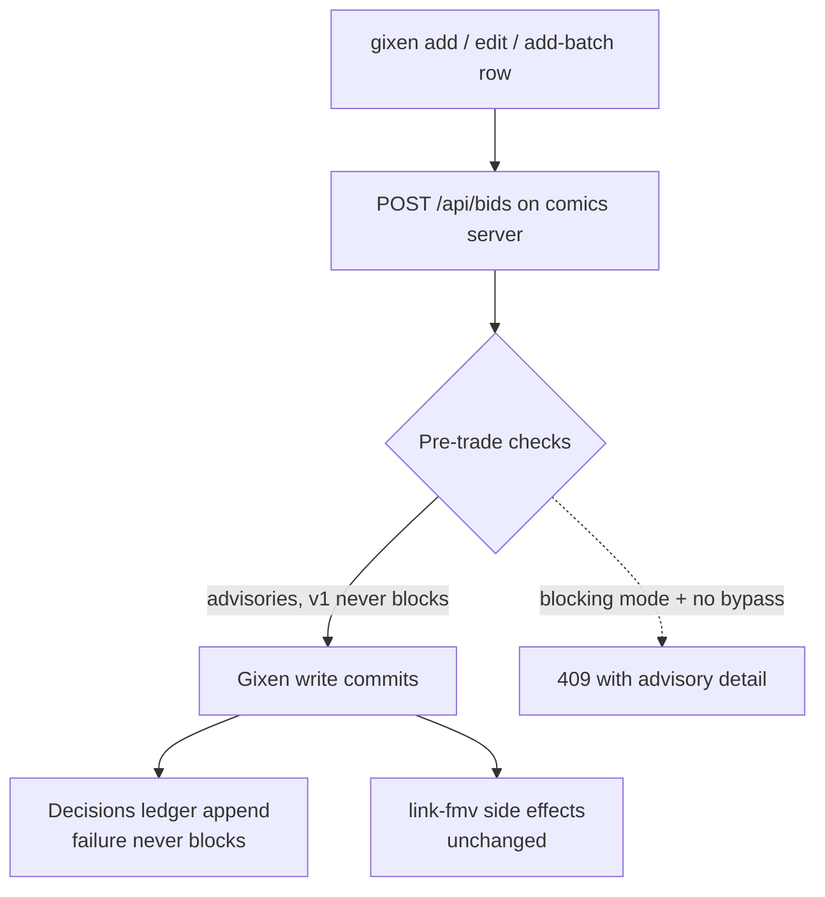

# Capital-Commitment Layer at Order Entry (BUI-609)

## Summary

Put a policy layer at the moment money commits: every `max_bid` write on the comics server passes a set of pre-trade checks (over-FMV, stale FMV, unpriced entry, ungrouped duplicate comic, aggregate PENDING exposure), advisory-only at first, and appends an immutable decisions row recording what the system knew when the bid was accepted. The flat 80%-of-FMV-high fallback cap becomes the same rung-based discount the comic-fmv path already applies.

---

## Problem Frame

The pipeline quantifies uncertainty exhaustively — grade panels with confidence tiers, comp counts, FMV ranges, seller-reliability signals — and then discards all of it at the one moment that matters financially. `gixen add`'s only validation on `max_bid` is a Decimal parse (`packages/gixen-cli/cli.py:323-327`). The FMV link happens *after* the add commits (`cli.py:367`), and its failure is non-blocking, so a snipe can enter unpriced without anyone noticing. The `fmv.confidence` and `fmv.comps` columns are populated at pricing time and never consulted at bid time.

Today the approval moment is protected by vigilance: the skill prose says "compare against FMV", "use 80%", "pick an unused group". The repo has already learned what happens to prose-enforced discipline on this path — BUI-168's mid-batch failure semantics had to be mechanized into `add-batch` because an LLM-followed loop drifted. Bid policy is the same class of problem, at higher stakes: it is the difference between "the agent followed the prose" and "the system won't silently pass an out-of-policy bid." (SEC 15c3-5 — pre-trade risk checks at order entry — is the working analogy.)

---

## Key Decisions

- **Enforcement lives at the server choke point, not the CLI.** Every real flow already routes through `POST /api/bids`: single adds in server mode, every `add-batch` row (server-mode-only by design), and edits. The server is also the only place that can see aggregate exposure and existing live snipes atomically (it already serializes writes under `_api_lock`). The CLI's role is rendering advisories and carrying the bypass flag. Direct-Gixen mode (server unreachable) is documented as unenforced — there is no FMV or exposure data available to check against in that mode, and it is already the degraded single-item fallback.

- **Advisory-first, blocking opt-in per check.** v1 blocks nothing: every check emits advisories that render at the approval point and land in the ledger. Blocking mode is a later per-check config flip, and even then an explicit per-invocation bypass flag commits the snipe anyway — recorded, never silent. A money path earns trust incrementally; a false-positive block at auction deadline is worse than a missed advisory.

- **Extend the existing rung ladder; do not invent a continuous formula.** `bid_factor()` in `apps/fmv/src/fmv_math.py` already implements the discount family: 0.80 base, 0.70 / 0.60 rungs driven by combined grade/comp confidence, with the BUI-318 interpolated cap. The "Kelly-style" ambition from ideation is realized as *rung demotions* on new inputs (comps count, FMV range width, grade range width), each with a measured threshold — not a new continuous function. Four consecutive FMV pool-shape signals were falsified on measurement (BUI-578/582/592/590); this history argues for few, coarse, measurable inputs.

- **The ledger is append-only and never gates the trade.** A decisions row per accepted snipe write records the FMV inputs consulted, computed cap, advisories raised, and any bypass. A ledger write failure logs loudly and the snipe proceeds — the audit trail must never become a new way to miss an auction.

- **Checks fire on every `max_bid` write, not just creates.** The BUI-67 upsert (re-add of a live item modifies in place), `gixen edit`, and each `add-batch` row all move money exposure and all pass the same check point. Same-item re-adds are already safe against duplication by the upsert; the duplicate check targets the case the upsert cannot see — a second *comic* copy on a different item_id outside a shared bid group.

- **Comic identity moves to add time.** Pre-trade FMV checks need `comic_id`/`grade` before the Gixen write, but today they travel only in the post-add `link-fmv` call. The add payload grows optional comic-identity fields; the post-add link remains for back-compat and for the linking side effects.

---

## Requirements

**Pre-trade checks**

- R1. Every `max_bid` write on a live snipe — create, upsert-modify, edit, and each `add-batch` row — passes one policy check point on the comics server before the Gixen write commits.
- R2. A bid linked to an FMV row raises an over-FMV advisory when `max_bid` exceeds N × the row's `high` (N configurable, proposed default 1.0), naming the ratio and the FMV row.
- R3. A bid linked to an FMV row raises a recomputed-cap advisory when `max_bid` exceeds the discount cap recomputed from the stored FMV inputs at write time.
- R4. An FMV row whose `updated_at` is older than K days raises a staleness advisory naming its age (K configurable, proposed default 30 days).
- R5. A write carrying no comic identity, or whose FMV resolution fails, raises an unpriced-entry advisory — the silent link failure becomes visible at the commit moment.
- R6. A write for a comic that already has a live snipe on a different item outside the new snipe's bid group raises a duplicate-comic advisory naming the existing item and its group. Same-item re-adds keep the BUI-67 upsert behavior and raise nothing.
- R7. A write that takes projected aggregate PENDING exposure past a configured ceiling raises an exposure advisory with the projected total. Exposure is group-aware: ungrouped snipes sum; a bid group contributes only its largest `max_bid`.
- R8. No check mutates the bid: nothing rewrites `max_bid`, and status classification is never touched.

**Bid-cap discount**

- R9. The flat 80%-of-FMV-high fallback in the snipe-add skill is replaced by the rung-based factor family the comic-fmv path already applies, so manually-set and brief-derived bids shade by the same rules.
- R10. New discount inputs (comps count, FMV range width, grade range width) act only as demotions to an existing rung (0.70 or 0.60), each behind a threshold set from measurement — no new continuous formula and no new FMV-quality advisory-flag class.

**Decisions ledger**

- R11. Every write passing the check point appends one decisions row: FMV inputs consulted (or their absence), grade and confidences when supplied, computed cap and the rule that set it, requested `max_bid`, every advisory raised, any bypass acknowledgment, and the executing source.
- R12. Ledger rows are append-only; corrections append, never update.
- R13. A ledger write failure never blocks or delays the snipe; it logs loudly server-side.

**Rollout and override**

- R14. v1 is fully advisory — no check blocks. Blocking is per-check opt-in via config, off by default.
- R15. In blocking mode, an explicit per-invocation bypass flag commits the snipe anyway and stamps the bypass into the decisions row.
- R16. Advisories render at the point of approval: `gixen add`/`edit` output, per-row status in `add-batch` results, and the skills' approval gates.

**Coverage**

- R17. Comic identity and grade travel in the add payload so checks run pre-trade; the post-add link call keeps working unchanged.
- R18. Direct-Gixen mode stays available and unchanged; enforcement exists only where the comics server is in the path, and this boundary is documented.

---

## Key Flows

- F1. Clean add
  - **Trigger:** `add-batch` row with linked FMV, `max_bid` within cap, exposure under ceiling.
  - **Steps:** Check point passes silently; Gixen write commits; ledger row appends; link side effects run.
  - **Outcome:** Row reports added with no advisories; ledger holds the full decision context. **Covers R1, R11.**
- F2. Out-of-policy add, advisory mode
  - **Trigger:** `max_bid` of $150 against a linked FMV high of $100.
  - **Steps:** Over-FMV and recomputed-cap advisories raise; snipe commits anyway; advisories render in the CLI output and the `add-batch` row status; ledger records them.
  - **Outcome:** The user sees the challenge at the approval moment; nothing was blocked. **Covers R2, R3, R14, R16.**
- F3. Out-of-policy add, blocking mode with bypass
  - **Trigger:** Same bid after the over-FMV check was flipped to blocking in config.
  - **Steps:** Without the bypass flag the write returns a 409 carrying the advisory detail; re-run with the bypass flag commits and the ledger row carries the bypass.
  - **Outcome:** Overrides exist, are explicit, and are audited. **Covers R14, R15, R11.**
- F4. Edit raises exposure
  - **Trigger:** `gixen edit` raising a live snipe's `max_bid` past the aggregate ceiling.
  - **Steps:** The edit passes the same check point; the exposure advisory raises with the projected group-aware total.
  - **Outcome:** Edits cannot slip past policy that adds enforce. **Covers R1, R7.**

---

## Acceptance Examples

- AE1. **Covers R6.** Given a live PENDING snipe on item A linked to comic X in group 2, when a new add for item B links to comic X with group 2, then no duplicate-comic advisory raises (grouped copies are the sanctioned BUI-363 pattern).
- AE2. **Covers R6.** Same setup, but the new add carries group 0 — the duplicate-comic advisory raises naming item A and group 2.
- AE3. **Covers R7.** Given ungrouped PENDING snipes of $100 and $50 plus a group holding $200 and $180 snipes, projected exposure is $100 + $50 + $200 = $350, not $530.
- AE4. **Covers R5.** Given an add with `comic_id` whose FMV lookup finds no row, the snipe commits, the unpriced-entry advisory raises, and the ledger row records FMV inputs as absent.
- AE5. **Covers R13.** Given the ledger table is locked or the write throws, the snipe still commits and the response contains no error visible to Gixen scheduling; the failure is logged server-side.
- AE6. **Covers R1.** Given a re-add of an already-PENDING item with a higher `max_bid`, the upsert-modify path runs the checks against the new amount before Gixen is told to modify.

---

## Scope Boundaries

- **The WON-inference and all status classification stay ungated** — the layer touches order entry only. This is the documented BUI-146 exclusion; nothing here may add a condition to how outcomes are classified.
- **No silent bid rewriting.** The layer challenges; it never adjusts `max_bid` on its own.
- **No new FMV-quality advisory signals.** Rung demotion inputs shade the bid; they must not become a fifth pool-shape flag (four were falsified on measurement).
- **Direct-Gixen enforcement is out.** The fallback path has no data to check against; it stays a documented gap, not a build target.
- **Portfolio/exposure analytics beyond the single ceiling check are out** — that is survivor 6 (comps data flywheel) territory.
- **Nothing is enforced on Gixen's side.** Gixen is a vendor black box; the choke point is our server.

---

## Dependencies / Assumptions

- The comics server is in the path for every real flow: `add-batch` is server-mode-only and `/comic:buy` uses it; single adds and edits route through it whenever `COMICS_SERVER_URL` is set.
- `fmv.updated_at`, `fmv.confidence`, and `fmv.comps` are populated by the existing FMV writers and usable as check inputs (verified in `plugins/gixen-overlay/src/gixen_overlay/db.py`).
- The FMV tables are overlay-owned while `bids` is host-owned; the check point needs both. The existing `gixen.plugins` hookspec family is the assumed mechanism for letting the overlay contribute comic-aware checks without inverting the plugin dependency.
- The rung ladder currently lives in `apps/fmv` (non-workspace, unreachable by server imports); recomputing the cap server-side implies a second implementation whose drift risk needs an explicit answer.

---

## Outstanding Questions

**Deferred to planning**

- Exact defaults and config surface for N (over-FMV multiple), K (staleness days), and the exposure ceiling; all three must be operator-tunable without a deploy.
- How the rung-demotion thresholds for comps count and range widths get measured before they ship (the falsification history demands measurement-first).
- The core-vs-overlay split: which checks live in gixen-cli proper (exposure, duplicate-group — bids-only data) versus the overlay via a new pre-add hook (FMV-aware checks), and the hookspec shape.
- Single source of truth for the discount rungs given `apps/fmv` cannot be imported by workspace code — duplicate-with-canary, extraction, or having the brief carry its computed cap for the server to verify.
- Ledger table home (overlay vs host), row schema, and retention.
- Bypass flag shape: CLI flag name, per-row field in `add-batch` rows JSON, and how the skills' approval gates surface it.
- Whether dashboard-originated edits exist as a separate write path that must route through the same check point.

---

## Sources / Research

- `packages/gixen-cli/cli.py:287-327` — verified premise: `max_bid`'s only validation is the Decimal parse; `cli.py:367` — FMV link fires after the add.
- `packages/gixen-cli/server/main.py:1628` — `POST /api/bids` upsert choke point under `_api_lock`.
- `apps/fmv/src/fmv_math.py:613-675` — `bid_factor()` rung ladder (0.80/0.70/0.60), BUI-51 opt-in semantics, BUI-318 interpolated cap.
- `plugins/gixen-overlay/src/gixen_overlay/db.py` — `fmv` schema: `low`, `high`, `comps`, `confidence`, `flag_reason`, `updated_at`.
- `.claude/commands/comic/snipe-add.md` — the flat 80% fallback formula and the existing confidence-haircut note; BUI-363 bid-group rules.
- `docs/ideation/2026-08-01-repo-improvements-ideation.md` — survivor 5 (basis, rationale, downsides) and the falsified pool-shape signal history.
- External: SEC 15c3-5 pre-trade risk checks; Kelly fractional sizing as the uncertainty-shading analogy.
