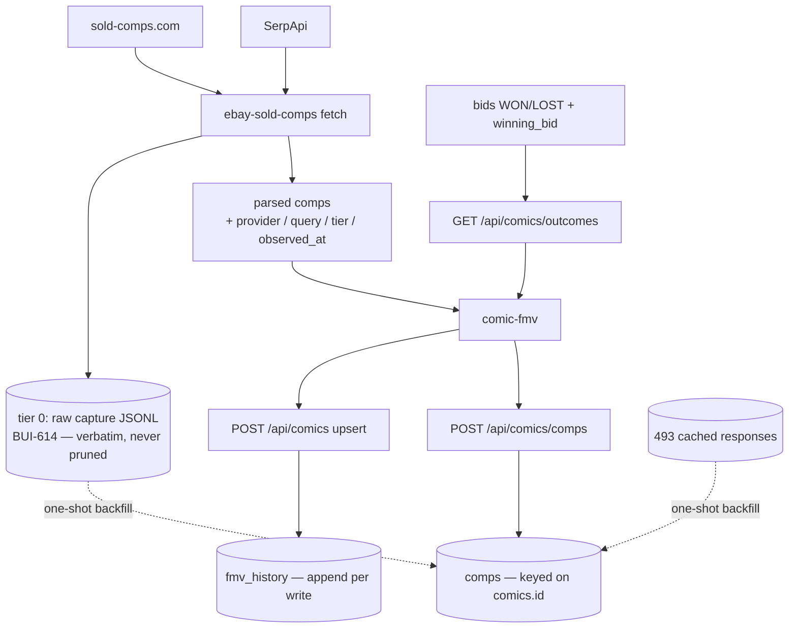

# Comps Data Flywheel (BUI-610)

## Summary

Stop discarding the sold-comp data we pay for. Every comp the pipeline parses for a book it
prices becomes a durable row keyed on `comics.id`; every FMV write appends a history row
instead of overwriting its predecessor; the resolved auctions that are our own comps stop
being destroyed by the completed-bids sweep. The 493 provider responses already cached on the
Mini are imported once so the ledger starts with real data. FMV computation is byte-identical
to today — this project writes the archive, it does not read it back into a price.

---

## Problem Frame

The `fmv` table keeps `low`, `high`, and `comps` — where `comps` is an **integer count**, not
the comps. `UNIQUE(comic_id, grade)` plus an upsert means every recompute destroys the values
it replaces. Across 796 fmv rows the pipeline has resolved 3,973 comps and retains none of
them, and no book has more than one FMV reading on record. sold-comps.com and SerpApi are
scraping-dependent providers over a data source eBay has structurally closed (BUI-545); the
data we buy from them is the one asset in this pipeline that cannot be re-acquired later.

Three measurements taken 2026-08-03 against the live Mini set the shape of the work:

1. **The third-party comps are recoverable right now but only just.** `~/.cache/ebay-sold-comps`
   holds 493 responses carrying 16,820 comp items (20 MB), and BUI-614's tier-0 capture appends
   every future live response verbatim. The cache is TTL-evicted at 7 days and digest-keyed, so
   it overwrites and expires; today's contents are a window, not an archive.
2. **First-party comps are already built — and already being destroyed.** BUI-286 shipped
   `GET /api/comics/outcomes` and comic-fmv already merges our own resolved auctions into the
   pool labeled `source: "first_party"`. But `get_first_party_outcomes` admits only
   `status IN ('WON','LOST')`, and `POST /api/purge` sweeps **every** completed bid to the
   `REMOVED` tombstone in one call (`server/main.py:2939-2956`). 542 resolved bids feed the pool
   today; **89 are already gone** — `REMOVED` rows that still carry a `winning_bid` and a
   primary FMV link, invisible to the query, 96 of 97 with no BUI-371 marker, i.e. swept after
   completing rather than cancelled before ending. Their prior status was never recorded, so
   they are not recoverable. This is the BUI-381 lesson repeating on a different table: a
   ledger that lives only in `bids` is one purge away from empty.
3. **The stated blocking dependency does not exist.** BUI-610's first open question defers
   comp-row keying to the Collection Identity Spine's `metron_id` direction. The Spine plan
   (BUI-611) puts *"the overlay's SQLite `comics` table is out"* in its Scope Boundaries and
   lists extending its doctrine there as deferred follow-up; it also measured `metron_id`
   present on **11 of 2843** collection rows (0.4%) and defers re-keying to a spike that may
   return "not worth it". The two projects touch different stores. Comps key on `comics.id`,
   the anchor `fmv` already uses, and nothing here waits on the Spine.

---

## Key Decisions

- **Two tiers, and only the upper one has opinions.** Tier 0 is BUI-614's raw append-only
  capture: verbatim provider responses, no identity, no parsing, never pruned. Tier 1 is the
  ledger: parsed comps keyed on `comics.id`, carrying provider, query, tier, and observation
  time. Tier 1 holds exactly what the pipeline treated as a comp — same parse functions, same
  hard-excludes — so a ledger row and a pool row are the same object. Anything tier 1's
  judgment drops is still in tier 0, which is why tier 0 must never be pruned.

- **The ledger is written by the pricing path and read by nobody in it.** comic-fmv posts comps
  after its existing `POST /api/comics` upsert, where `comic_id` is already in hand. FMV math is
  untouched. Pricing from stored comps during a provider outage is the obvious next step and is
  deliberately *not* in this project: it would be a ninth money-path failure mode — a stale
  price wearing a fresh price's face — and it deserves its own measurement and soak.

- **An archive that fails silently is worse than no archive.** Ledger write failure never fails
  an FMV run, but it is never quiet either: the refusal lands in `rejected_writes` (BUI-601) and
  the run summary counts it, so a run cannot end looking clean while its comps went nowhere.
  This is the add-batch summary lesson applied to a write nobody watches.

- **Identity is recorded or absent, never guessed.** A comp row may carry a NULL `comic_id` —
  a backfilled response whose book could not be resolved unambiguously stays in the ledger as
  market data rather than being attached to a plausible book. Measured on the 493 cached
  responses: quoted-phrase recovery resolves **412 uniquely (83.6%)**, 31 ambiguous, 50
  unresolved. The obvious alternative — regenerate each comics row's query with `build_query`
  and match exactly — was measured and is *worse*: **270 (54.8%)**, because tiers 2–4 mutate
  the query (drop the year, add a grade label, swap the masthead). That is a falsification
  recorded before the unit is written, not after.

- **First-party durability is a column, not a second ledger.** `mark_bids_purged` erases the
  knowledge that a row was WON or LOST while leaving `winning_bid` and the FMV link intact. The
  minimal fix is for the sweep to record the status it is replacing, so the outcomes query can
  admit tombstoned-but-previously-resolved rows. A parallel `first_party_comps` snapshot table
  modeled on `group_wins` was considered and rejected for v1: it duplicates data that already
  exists, and its own sync would be a new thing that can fail green.

- **History appends at the server choke point, not in comic-fmv.** Every FMV writer — comic-fmv,
  its CGC-proxy re-upsert, a hand edit — passes through `POST /api/comics`. Appending there
  catches all of them; appending in the runner catches one.

---

## Requirements

**The comp ledger**

- R1. Every comp the pipeline parses for a book it prices is persisted with its price, sold
  date, parsed grade, buying format, listing link, and eBay product id, keyed on `comics.id`.
- R2. Persistence is idempotent per (provider, product id, comic): re-observing a comp updates
  last-seen bookkeeping and never rewrites the recorded market fact.
- R3. A re-observation whose price or sold date disagrees with the stored row is counted and
  logged, not silently reconciled — two different answers must never collapse into one.
- R4. A comp row may exist with no `comic_id`; identity is recorded when unambiguous and left
  absent otherwise, never inferred.
- R5. A ledger write failure never fails an FMV run, and never passes silently: it is persisted
  as a rejected write and counted in the run summary.
- R6. FMV computation and output are byte-identical to today. Nothing in the pricing path reads
  the ledger.

**Provenance**

- R7. Each comp records the provider that returned it, the exact query string and tier that
  surfaced it, and whether that response came from a live fetch or the response cache.
- R8. A comp's observation time is when the underlying provider response was fetched, not when
  the FMV run happened — a cache hit must not backdate to now or forward-date to the run.

**First-party comps**

- R9. A resolved auction's own outcome survives the completed-bids sweep: purging a WON or LOST
  bid must not remove it from the first-party comp pool.
- R10. First-party comps keep their current merge treatment and the wins-only deflation guard
  unchanged; this project changes their durability, not their semantics.

**FMV history**

- R11. Every write to an `fmv` row appends a history row recording the values written, the
  writer, and the time — corrections append, never update.
- R12. A history append failure never blocks the FMV upsert; it logs loudly.
- R13. The 796 existing `fmv` rows are seeded into history once, stamped as a backfill and
  timestamped from `fmv.updated_at` rather than from the backfill run.

**Backfill and retention**

- R14. The 493 cached provider responses and the tier-0 capture file are imported into the
  ledger once, parsed by the same functions the live path uses and stamped as backfilled.
- R15. The backfill reports how many responses resolved to a unique comic, how many were
  ambiguous, and how many were unresolvable — a silent partial import is a failed import.
- R16. The tier-0 capture rotates by size into compressed segments and is never pruned.

**Read surface**

- R17. Comp rows and FMV history are readable over provider-neutral endpoints filtered by comic
  identity, grade, and recency.

---

## Key Flows

- F1. Priced book, live fetch
  - **Trigger:** `comic-fmv` prices a book; both provider tiers return.
  - **Steps:** comps are stamped with provider/query/tier/observed-at as they are parsed; the
    FMV upsert returns `comic_id`; the comps post lands; the upsert appends a history row.
  - **Outcome:** the pool that produced the price is on disk beside the price. **Covers R1, R7, R11.**
- F2. Recompute of a book priced before
  - **Trigger:** the same book is re-priced a month later.
  - **Steps:** comps already seen bump their last-seen bookkeeping; new comps insert; the fmv
    row is overwritten as today but the prior reading survives in history.
  - **Outcome:** two FMV readings and a growing comp set for one book. **Covers R2, R11.**
- F3. Ledger write refused
  - **Trigger:** the comps post returns 4xx/5xx.
  - **Steps:** the FMV run continues and prices normally; the refusal is persisted; the run
    summary reports a non-zero comps-write failure count.
  - **Outcome:** the price is unaffected and the gap is visible. **Covers R5, R6.**
- F4. Completed-bids purge
  - **Trigger:** `POST /api/purge` sweeps every completed bid to the tombstone.
  - **Steps:** the sweep records the status it replaces; the outcomes query admits tombstoned
    rows whose prior status was WON or LOST.
  - **Outcome:** the first-party pool is unchanged in size after a purge. **Covers R9.**

---

## Acceptance Examples

- AE1. **Covers R2/R3.** Given a comp already stored at $42.00 for product id 12345, when the
  same product id is observed again at $42.00, the row's seen count increments and no field
  changes; when it is observed at $50.00, the stored price stays $42.00, a conflict is counted,
  and the disagreement is logged.
- AE2. **Covers R4/R15.** Given a cached response whose quoted phrase matches two comics rows,
  its comps import with `comic_id` NULL and the backfill's ambiguous count includes it.
- AE3. **Covers R5.** Given the comps endpoint returns 500 for one book in a 20-book run, all 20
  books price normally, the summary reports 1 comps-write failure, and a rejected-writes row
  exists for the refused call.
- AE4. **Covers R8.** Given a book whose provider response is served from a 3-day-old cache
  entry, its comps are stored with an observation time of the cache entry, not of the run.
- AE5. **Covers R9.** Given 542 resolved bids feeding the first-party pool, when the completed
  purge runs, the pool still returns the same comps for a book that was WON.
- AE6. **Covers R6.** Given the full test corpus of cached responses replayed through the
  pricing path before and after the change, every computed FMV band is identical.
- AE7. **Covers R11/R13.** Given a book with an FMV set on 2026-06-01 and recomputed on
  2026-08-05, history holds two rows — the first stamped as backfilled at the original
  `updated_at`, the second at the recompute.

---

## Scope Boundaries

- **No portfolio view in this project.** Measured: 172 WON bids carry both a cost basis and a
  priced FMV link, against 2,191 owned collection rows of which 256 (11.7%) have `price_paid`.
  A mark-to-market view over 8% coverage would mislead more than it informs. Filed as follow-up.
- **No degraded-mode pricing from stored comps.** The outage-resilience payoff is real and is
  deliberately deferred; it changes the money path and needs its own falsification story.
- **No new FMV-quality or pool-shape signal.** Seven consecutive pool-shape signals were
  Canceled on measurement (BUI-578/582/592/590/594/597/622). The ledger is an archive; it must
  not grow an advisory.
- **First-party comp semantics are untouched.** The merge, the labeling, and the wins-only
  deflation guard stay exactly as BUI-286 shipped them.
- **Status classification stays ungated.** The sweep change records what it replaces; it does
  not alter what any status means or when it is written.
- **The Collection Identity Spine is not a dependency and not a target.** No collection-store
  row, no `metron_id`, no matcher normalization is touched.

---

## Dependencies / Assumptions

- `comics.id` is a stable identity anchor for comps because `fmv` already anchors on it; the
  Spine plan explicitly excludes the overlay `comics` table from its scope.
- BUI-614's capture is deployed (`ebay-sold-comps` reports the merged HEAD SHA on the Mini) but
  the capture file does not exist yet — no `comic-fmv` run has happened since deploy. The
  backfill therefore leans on the 493-file cache for its initial corpus.
- Both providers echo the query in their response (`search_parameters._nkw` for SerpApi on 344
  files, `keyword` for sold-comps.com on 149), so a cached response is self-describing enough
  to resolve a book from.
- eBay product ids are a shared namespace across both providers (verified in BUI-545), so
  (provider, product id) dedupe works cross-provider without translation.
- The overlay DB is the right home: the repo's convention is that the server owns data and
  `apps/*` reach it over HTTP, and at 16,820 rows the volume is unremarkable for SQLite.

---

## Outstanding Questions

**Deferred to planning**

- Whether slab comps (the tier-4 CGC pass) share the comps table with a pool discriminator or
  stay out of the ledger entirely.
- Whether the tier-0 capture rotation threshold is size-based, count-based, or time-based, and
  where rotated segments live.
- Whether `fmv_history` appends on every upsert or only when a value changed — always-append is
  simpler and honest about "we re-measured and nothing moved", but a `--force` sweep writes 796
  rows per run.
- Whether the backfill runs on the Mini against the live DB or against a restored copy first.

**Deferred to follow-up projects**

- Degraded-mode pricing from stored comps during a provider outage.
- `/api/comics/portfolio` — cost basis versus current FMV — and the cost-basis backfill it needs.
- Whether the 89 already-lost first-party comps can be recovered from any other durable
  evidence; on current evidence they cannot, and the plan records that rather than guessing.

---

## Sources / Research

- Verified premise: `plugins/gixen-overlay/src/gixen_overlay/db.py:40-53` — `fmv` keeps
  `comps INTEGER` (a count) under `UNIQUE(comic_id, grade)`; the upsert destroys priors.
- First-party comps already shipped: `plugins/gixen-overlay/src/gixen_overlay/routes.py:214`
  (`GET /api/comics/outcomes`), `db.py:1751` (`get_first_party_outcomes`, status filter
  `IN ('WON','LOST')`), `apps/fmv/src/fmv_runner.py:754` (`_fetch_first_party_outcomes`, the
  wins-only deflation guard, `source: "first_party"`).
- The destruction path: `packages/gixen-cli/server/db.py:1275` (`mark_bids_purged`, WON/LOST →
  `REMOVED`), called from `packages/gixen-cli/server/main.py:2939-2956` over every completed bid
  in one sweep; `server/fallback.py:157` already names the hazard in prose.
- Live measurements (Mac Mini, 2026-08-03): 661 comics, 796 fmv rows (663 priced, 3,973 comps
  summed), 641 bids (191 WON / 351 LOST / 99 REMOVED), 542 resolved bids with `winning_bid`,
  89 REMOVED rows with `winning_bid` + a primary FMV link, 613 `bid_fmvs` links, 172 WON bids
  with cost basis and a priced FMV link; 2,843 collection rows (2,191 owned, 256 with
  `price_paid`, 71 with `gixen_item_id`).
- Cache corpus: 493 responses / 16,820 comp items / 20 MB in `~/.cache/ebay-sold-comps`; median
  32 items per response, max 200, 22 empty.
- Backfill resolvability measured both ways: quoted-phrase recovery 412 unique / 31 ambiguous /
  50 unresolved; `build_query` forward-generation and exact match 270 unique / 11 ambiguous /
  212 no-match.
- Tier-0 capture: `apps/ebay/src/sold_comps.py:67-79` (`CAPTURE_DIR`/`CAPTURE_PATH`), `:243`
  (`_capture_raw_response`, called at `:954` and `:1077` after `_cache_put`, live fetches only);
  BUI-614's closing comment records ~40.3 KB/response and no rotation.
- Comp shape and provenance gap: `sold_comps.py:1274` (`parse_comp`), `:1298`
  (`parse_comp_sold_comps`), `:1564` (`queries_used` carries provider/tier/cached at the *book*
  level; individual comps carry none of it).
- Ingest site: `apps/fmv/src/fmv_runner.py:998-999` — `_upsert_fmv` then `_extract_ids` yields
  `comic_id`/`fmv_id`.
- Append-only precedents in the same DB: `rejected_writes` (BUI-601), `heartbeats` +
  `JOB_CONTRACTS` (BUI-602), `group_wins` (BUI-381, the purge-durability precedent).
- Dependency check: `docs/plans/2026-08-03-001-feat-collection-identity-spine-plan.md` (BUI-611,
  branch `hsukenooi/bui-611-collection-identity-spine-plan`) — Scope Boundaries exclude the
  overlay `comics` table; `metron_id` measured on 11 of 2843 rows.
- `docs/ideation/2026-08-01-repo-improvements-ideation.md` — survivor 6 (basis, rationale,
  downsides) and the dead-end exclusions honored here.
- External: camelcamelcamel per-product price-history partitioning; Card Ladder portfolio
  valuation; CLZ+CovrPrice as the paid-tier comparison.
