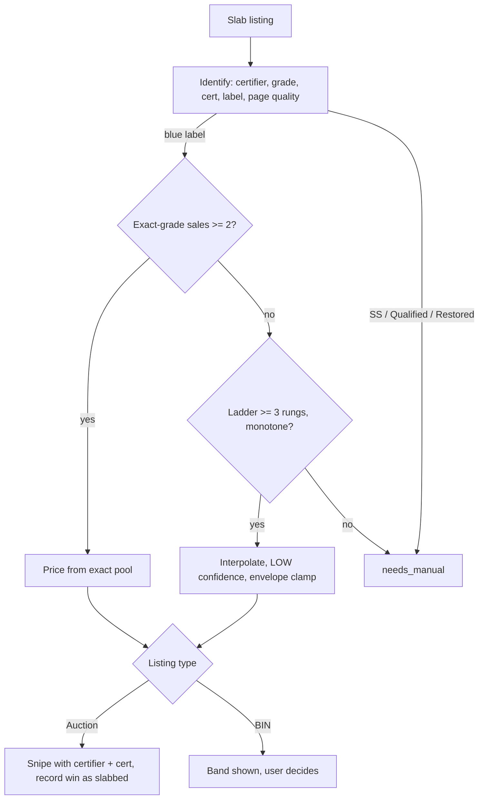

# CGC Slab Support in the Buy Workflow

## Summary

Extend the buy workflow to certified (slabbed) comics: identify reads the certifier, grade, cert number, label, and page quality off the listing; photo grading is skipped; FMV prices blue-label slabs from slab sales, interpolating across grades when the exact grade is thin; auction wins record into the collection as slabbed with their grade and grading company; Buy It Now slabs stop after FMV for a manual decision.

---

## Problem Frame

The pipeline is raw-only by construction. Every sold-comps query excludes CGC and CBCS listings, the scan tools drop any title containing "cgc", the grader agent assumes a loose book, and record-win writes every win as un-slabbed. A slab pasted into `/comic:buy` today is either rejected or priced from the raw market at its numeric grade, which understates it by roughly half on vintage keys.

Higher-priced books are mostly slabs, and mostly Buy It Now. In a 2026-09-19 spike over eight real slab listings, seven were BIN and every vintage book had exactly one eBay sale at its exact grade in the 90-day window sold-comps.com can see. The window is eBay's, not the provider's, so it cannot be widened. A design that requires a deep exact-grade pool prices nothing vintage.

The slab plumbing already exists as a side path: the CGC-proxy rescue fetches slab sales, separates them from raw, builds a grade ladder, and stores them in the comps ledger. It runs slab-to-raw only. Nothing lets a slab be the subject of a price.

---

## Key Decisions

- **Exact grade first, ladder fallback.** A slab prices from same-label, same-certifier sales at its exact grade when two or more exist. Otherwise the price is read off neighboring grades with the existing ladder interpolation, capped by the envelope clamp, at LOW confidence. Below three rungs, or when the ladder is not monotone around the target, the book is `needs_manual`. Chosen over curve fitting (smooths real cliffs between 9.6 and 9.8) and over inverting the raw pipeline (the raw-to-slab factor was measured unusable, BUI-714).

- **No scheduled comp collection.** The comps ledger stores every slab sale each pricing run sees, so a book deepens as it is worked. A recurring fetch over the wish list was considered and dropped: it spends provider quota on books that may never be bought, and the ledger's passive fill covers the books that matter.

- **Blue label only in v1.** Signature Series, Qualified, and Restored slabs are identified and labeled but never priced; they punt to manual. Their pools are thinner than blue and their comps are hard-excluded from the raw path today for good reason.

- **CGC and CBCS are separate pools.** CBCS trades below CGC at the same grade. A CBCS target with no CBCS sales punts to manual rather than borrowing CGC prices.

- **Page quality is part of the identity.** White versus off-white pages moves vintage slab prices enough to matter. The target's page quality is parsed from the listing and comps are preferred at the same page quality; when none exist the wider pool is used and the mismatch is noted on the row.

- **Buy It Now stops after FMV.** The pipeline identifies, grades if raw, and prices. It does not propose an offer, place one, watch the listing, or record the purchase. The user decides and buys by hand.

- **Auction path keeps the existing bid rungs.** Gixen needs a max bid, so a certified auction gets the standard 0.80, 0.70, or 0.60 factor driven by comp confidence alone. An interpolated slab price always lands at 0.60. The user overrides at the approval gate as today.

- **Flipped slabs are accepted as a known error.** The same physical slab resold within the window counts twice. Comps carry no cert number, so v1 cannot dedupe it.

---

## Requirements

**Identification**

- R1. Identify emits certifier (CGC, CBCS, or none), numeric grade, cert number, label (Universal, Signature Series, Qualified, Restored), and page quality for a slab listing, from item specifics first and the title second.
- R2. A title such as "CGC AA SS 4.5" or "2003 CGC 9.4" yields the numeric grade, not the bare word "CGC".
- R3. A certified grade carries a distinct grade source so downstream steps can tell it from a seller-stated or photo-assessed grade.
- R4. Seller-scan and wishlist-sellers surface slab listings instead of rejecting them, with the certifier and grade visible in the match.

**Grading**

- R5. A certified book skips photo grading and enters FMV with high grade confidence.
- R6. Raw books in the same batch still grade as today.

**Pricing**

- R7. A blue-label slab is priced only from slab sales of the same certifier and label, never from the raw pool.
- R8. With two or more sales at the exact grade, the band comes from that pool with the standard confidence rubric.
- R9. With fewer than two, the band is interpolated from neighboring grades at LOW confidence, bounded by the envelope clamp, and marked interpolated on the row.
- R10. With fewer than three ladder rungs, or a non-monotone ladder around the target, the row is `needs_manual` with a reason naming which condition failed.
- R11. Comps are preferred at the target's page quality; when none exist the row says so.
- R12. A slab comp whose price sits far below its grade rung and whose listing text names a second printing or facsimile is dropped from the pool and reported on the row.
- R13. Every slab comp a run sees is stored in the comps ledger in the slab pool.
- R14. A Signature Series, Qualified, or Restored target is `needs_manual` with the label as the reason.
- R15. A raw book's pricing is unchanged by any of the above.

**Bidding and recording**

- R16. A certified auction snipe carries certifier and cert number on the bid, and its FMV link resolves to the slab price, not a raw row at the same numeric grade.
- R17. Pre-trade policy checks evaluate a certified bid against its slab band.
- R18. A certified bid is excluded from the seller-grade-deviation statistic.
- R19. Record-win writes a certified win as slabbed, with its grade and grading company, so the LOCG export carries them.
- R20. A Buy It Now slab renders its band and confidence and stops. No max bid, offer, or watch.

---

## Key Flows

- F1. Auction slab through `/comic:buy`
  - **Trigger:** User pastes an auction URL for a CGC 7.0 blue-label vintage key.
  - **Steps:** Identify shows certifier, grade, cert, label, page quality. Collection check runs as today. Grade step is skipped. FMV finds one exact-grade sale, interpolates from 6.5 and 7.5 at LOW confidence, proposes a 0.60 max bid. User approves or overrides. Snipe lands with certifier and cert. On win, record-win writes the slabbed row.
  - **Covered by:** R1, R3, R5, R9, R16, R19.

- F2. BIN slab
  - **Trigger:** User pastes a Buy It Now slab URL.
  - **Steps:** Identify, collection check, FMV. The table shows the band, confidence, and whether it was interpolated. The flow ends.
  - **Covered by:** R20.

- F3. Signature Series slab
  - **Trigger:** A listing whose title or specifics show a Signature Series label.
  - **Steps:** Identify marks the label. FMV returns `needs_manual` with the label as the reason. No band, no bid.
  - **Covered by:** R14.

---

## Acceptance Examples

- AE1. **Covers R2.** Given the title "Amazing Spider-Man #50 CGC AA SS 4.5 OWW 1967", identify emits grade 4.5, certifier CGC, label Signature Series, page quality off-white to white.
- AE2. **Covers R8.** Given Ultimate Fallout #4 CGC 9.8 with six exact-grade sales, the band comes from those sales without interpolation.
- AE3. **Covers R12.** Given two of those six at $215 whose listing text says "Second Printing", both are dropped and the row reports two printing drops.
- AE4. **Covers R9, R10.** Given Fantastic Four #48 CGC 7.0 with two exact sales, the band uses them; given Batman #227 CGC 4.5 with one, the band is interpolated from 4.0 and 5.5 at LOW confidence.
- AE5. **Covers R7.** Given a CBCS 9.8 target with zero CBCS sales and eleven CGC 9.8 sales, the row is `needs_manual`, not priced from CGC.
- AE6. **Covers R17.** Given a certified bid on a book that also has a raw FMV row at the same numeric grade, the over-FMV check compares against the slab band.

---

## Success Criteria

- The eight 2026-09-19 spike listings identify with the correct certifier, grade, and label. Six blue-label ones get a band or an explicit manual punt naming the reason. The Signature Series one punts on label.
- No slab is ever priced from the raw pool, and no raw book's price changes.
- A snipe on a certified auction lands with certifier and cert number on the bid and verifies as fully linked.
- A recorded slab win appears in the LOCG export with Slabbing, Grading, and Grading Company filled.

---

## Scope Boundaries

- Pricing Signature Series, Qualified, or Restored slabs.
- Proposing, placing, or tracking Best Offers; watching BIN listings for price drops.
- Getting a hand-made BIN purchase into the collection. The user adds it in LOCG directly.
- GPA, GoCollect, Heritage, or CGC cert-lookup integrations. GoCollect and the cert lookup both refuse plain fetches.
- Scheduled slab comp collection over the wish list.
- Deduping a flipped slab across sales.

---

## Dependencies / Assumptions

- sold-comps.com stays the sold-listings provider. It returns slab sales when the graded exclusion is dropped, with no grade or certifier field, so both are parsed from titles as today.
- The 90-day window is eBay's and cannot be widened through the provider.
- The comps ledger and its slab pool exist and are written by the pricing path.
- The ladder interpolation and envelope clamp from the CGC-proxy tier are reusable for slab targets without the vintage-year gate, since this is direct pricing, not a proxy.
- The second-printing guard needs listing text per suspect comp, which costs eBay Browse API calls, not provider quota.

---

## Outstanding Questions

**Deferred to Planning**

- The grade window for the exact pool: whether 9.6 and 9.8 sales on moderns are ever pooled, or the exact tier is strictly exact.
- What "far below its rung" means for the printing guard, and whether the guard fetches text for every comp or only price outliers.
- How page quality is encoded on comps parsed from titles, given inconsistent seller notation.
- Where certifier lives in the FMV identity so a slab and a raw row at the same numeric grade never collide.
- Whether policy exposure thresholds need raising once slab bids enter.

---

## Sources

- 2026-09-19 spike: eight slab listings fetched with `ebay-sold-comps --include-graded`; findings in the session memory note `project_cgc_slab_spike_2026_09_19.md`.
- `docs/conventions/fmv-math-spec.md` section 7a and `CONCEPTS.md` "CGC Proxy" for the existing ladder math and its guards.
- `docs/solutions/best-practices/fmv-7a-cgc-proxy-not-safely-automatable.md` and `docs/solutions/best-practices/modern-cgc-proxy-factor-is-unmeasurable.md` for why the raw-to-slab inversion is rejected.
- `docs/brainstorms/2026-08-03-comps-data-flywheel-requirements.md` for the ledger and its slab pool.
- `apps/ebay/src/sold_comps.py` (graded exclusion, slab detection), `apps/fmv/src/fmv_math.py` (ladder, clamp), `apps/ebay/src/comic_identity.py` (scan-tool slab reject), `packages/locg-cli/src/locg/commands.py` (record-win slab fields).
