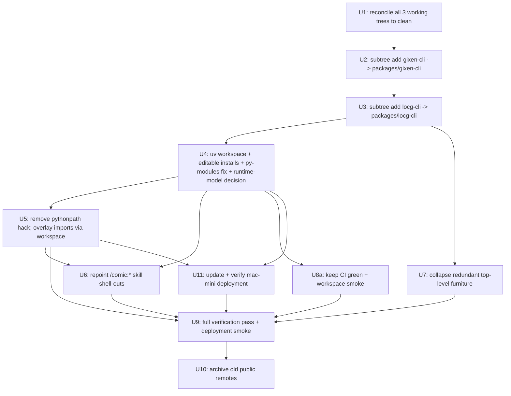

# refactor: Merge gixen-cli and locg-cli into the comic-pipeline monorepo

## Summary

Merge two sibling repos — `gixen-cli` (83 commits) and `locg-cli` (53 commits) — into `comic-pipeline` (55 commits, the host that keeps its identity and history), each landing under `packages/` with its own `pyproject.toml` and seam intact. A root **uv workspace** with editable installs replaces the machine-specific `pythonpath` hack and the fragile private cross-repo imports, making the gixen-overlay → gixen-cli coupling a normal intra-repo dependency. The `/comic:*` skills' absolute-path shell-outs are repointed at the in-repo packages. The old public GitHub repos are archived with a "moved" pointer. Package behavior is unchanged throughout — this is a structural move, not a rewrite.

## Problem Frame

The three repos are already coupled like a monorepo but split like independent projects, paying the costs of both and the benefits of neither:

- `plugins/gixen-overlay/pyproject.toml` hardcodes `pythonpath = ["src", "/Users/hsukenooi/Projects/gixen-cli"]` — a machine-specific absolute path committed to version control. Works only on one Mac.
- `plugins/gixen-overlay/src/gixen_overlay/routes.py` imports **private** helpers from gixen-cli (`from server.main import _ensure_fresh_sync, _iso_to_relative, _spawn_fallback_task` and `from server.db import get_bid_by_item_id`). An upstream rename breaks the plugin at import time, silently, because the two repos can't change atomically.
- The `/comic:*` skills shell out to `~/Projects/gixen-cli/cli.py` and `locg` by absolute path, so they assume a fixed sibling-repo layout.

The original reason for separation — open-sourcing gixen-cli and locg-cli as standalone tools — is no longer binding: **both public repos have zero users**, and distribution can still happen later via `git subtree split` / PyPI from the monorepo. Merging makes the rename-drift class of cross-repo fragility *atomically changeable and CI-guarded* — a rename and its caller now land in one commit, caught by one CI run — while keeping extraction a `subtree split` away. (It does not *eliminate* the coupling: the overlay still reaches into gixen-cli's private helpers; the merge makes that visible and safely changeable rather than silent. The `src/` restructure that would dissolve it stays deferred.)

**Immediate trigger (why now):** the seam-drift bug class is actively recurring — e.g. the `purged-snipes-shown-as-won` display bug and the collection-check false-negative class both trace to coupled-but-separate components drifting. That's the justification for spending this refactor now rather than continuing to defer it behind feature/bug work.

**Origin:** No upstream brainstorm doc — planned directly from the user's request and a live grounding pass over all three repos (2026-06-01 session).

## Scope Boundaries

**In scope:**
- History-preserving merge of `gixen-cli` and `locg-cli` into `comic-pipeline` under `packages/`.
- Root uv workspace + editable installs to resolve cross-package imports.
- Removing the hardcoded `pythonpath`; converting private cross-repo imports to dependency imports.
- Repointing `/comic:*` skill shell-outs to the in-repo package locations.
- Collapsing redundant top-level repo furniture (per-repo `CLAUDE.md`, `LICENSE`, `.github/`, `CONTRIBUTING.md`, `SECURITY.md`, `CODE_OF_CONDUCT.md`). Per-package `CHANGELOG.md` is kept (see KTD5).
- CI restructure + an optional repo-wide test entry point.
- Archiving the old public GitHub remotes with a pointer.
- Verification checklist + rollback path.

**Non-goals (this is not what the work changes):**
- No change to any package's runtime behavior, public CLI surface, or DB schema.
- No merge of runtime/DB data (`gixen.db`, `db.sqlite`); those are gitignored local state.
- No dissolving of package boundaries into one mega-package — the seams stay.

### Deferred to Follow-Up Work
- **U8b — full per-package CI test matrix** (run every package's pytest + ezship vitest in CI, solving Playwright browser provisioning and the `-m "not integration"` selection). The merge only needs CI to *not break* (U8a); standing up a full matrix is a DX improvement, not a correctness requirement for the structural move. A repo-wide aggregate test entry point (`scripts/test.sh`) rides along here.
- **Publishing artifacts** (PyPI / public subtree mirror for gixen-cli or locg-cli) — possible later via `git subtree split`; not part of this merge.
- **Restructuring gixen-cli's flat-root modules** (`cli.py`, `gixen_client.py`, `ebay_bidder.py`) into a `src/` package — desirable long-term hygiene that would namespace the generic top-level modules. The merge does NOT require it: the minimal `py-modules` packaging fix in U4 (see KTD2) unblocks imports + the console script without it. Note clean re-extraction of gixen-cli (the publishing optionality below) likely *does* want this restructure first, so the optionality is preserved but not entirely free. Tackle as its own refactor if/when it earns priority.
- **BUI-49 / BUI-50** (PURGED semantics + the false-"won" fix) — unrelated in-flight work; merge should not entangle them.

---

## Key Technical Decisions

### KTD1 — Layout: nest under `packages/`
`packages/gixen-cli/` and `packages/locg-cli/`, alongside the existing `apps/` and `plugins/`. Signals "vendored sub-packages with their own boundary," keeps the repo root clean, and keeps `git subtree split` trivial. (User-confirmed.)

### KTD2 — Imports: root uv workspace + editable installs (+ required `py-modules` fix)
Add `[tool.uv.workspace]` at the repo root with `members = ["apps/*", "plugins/*", "packages/*"]`. Each package is editable-installed into one shared environment so imports resolve everywhere without `sys.path` manipulation.

**The editable install alone is NOT sufficient — a packaging fix is a required prerequisite** (doc-review feasibility finding, verified by building the wheel): gixen-cli's `pyproject.toml` declares `[tool.setuptools.packages.find] include = ["gixen*", "server*"]`, so `gixen` and `server` install as packages — but `server/main.py` itself does `from gixen_client import …` and `import ebay_bidder`, and those flat modules (`cli.py`, `gixen_client.py`, `ebay_bidder.py`) are **excluded** by that include glob. They are absent from the built wheel. The overlay's `from server.main import …` therefore raises `ModuleNotFoundError: No module named 'gixen_client'` under a plain editable install. The same exclusion breaks the `gixen = "cli:cli"` console script (`No module named 'cli'`).

Today this works *only* because the overlay's `pythonpath` puts the gixen-cli **repo root** on `sys.path`, exposing the flat modules — which the editable install does not reproduce.

**Required fix (lands in U4, validated before U5):** add the flat modules to gixen-cli's packaging:

```toml
# packages/gixen-cli/pyproject.toml
[tool.setuptools]
py-modules = ["cli", "gixen_client", "ebay_bidder"]
```

This makes both `from server.main import …` and the `gixen` console script resolve under the workspace install. Validated in U4 by `uv run gixen --help` succeeding and `python -c "import server.main"` succeeding.

**Caveat (logged, deferred):** `server`, `gixen`, and now the flat `cli`/`gixen_client`/`ebay_bidder` are generic top-level names occupying the global import namespace — fine for this single-consumer monorepo, but it's the reason the `src/` restructure (which would namespace them) stays a deferred follow-up. The `py-modules` fix is the minimal change that unblocks the merge without that restructure.

### KTD3 — Merge mechanic: `git subtree add`
`git subtree add --prefix=packages/<name> <path-or-remote> main` per repo. Built into git, one command each, full history retained under the new prefix. (User-confirmed.) `git-filter-repo` rejected: cleaner per-file blame under the new path isn't worth the extra tool + multi-step rewrite for a 2-repo, ~136-commit graft.

### KTD4 — Old remotes: archive with a pointer
Final commit on each old repo updates its README to "Development moved into the comic-pipeline monorepo," then GitHub-archive (read-only). Preserves URLs + history, signals the move, reversible. (User-confirmed.)

### KTD5 — Redundant top-level furniture: host wins, sub-packages keep package-scoped configs
The host `comic-pipeline` keeps the authoritative root `CLAUDE.md`, `.github/workflows/`, and `docs/`. After the subtree merge, each sub-package's *duplicate* root furniture (`CLAUDE.md`, `CONTRIBUTING.md`, `SECURITY.md`, `CODE_OF_CONDUCT.md`, `.github/`) is removed from the package subdir; package-scoped files that still carry meaning (`pyproject.toml`, `README.md`, `CHANGELOG.md`, `tests/`, `.env.example`) stay.

**LICENSE correction (doc-review finding):** the host root has **no** `LICENSE` file today. Applying "host wins, delete duplicates" literally would leave the merged repo unlicensed — and an unlicensed repo is legally un-publishable, which silently breaks the extraction/publishing optionality. So **promote** one sub-package `LICENSE` (all three are MIT, same author — confirm) to the repo root, then remove the package-level duplicates. Likewise, keep `CONTRIBUTING.md` / `SECURITY.md` / `CODE_OF_CONDUCT.md` at root (don't just delete) since later extraction needs them.

Sub-package `docs/` folds into the host `docs/` only where names don't collide; on collision the relocated content is namespaced under `docs/<package-name>/…` (never overwrite). Grounding note: the three `docs/` trees have near-zero exact-name collisions today (only `docs/solutions/integration-issues/` exists in two repos, with different filenames), so folding is low-risk in practice — the namespacing rule is the safety net.

---

## High-Level Technical Design

### Target layout

```
comic-pipeline/
├── pyproject.toml          # NEW — root: [tool.uv.workspace] members
├── CLAUDE.md               # host (authoritative); add packages/ section
├── LICENSE                 # NEW at root — promoted from a sub-package (host had none)
├── README.md               # host; update structure section
├── .github/workflows/      # host; restructured matrix CI
├── apps/                   # ebay, fmv (Python), ezship (TS) — unchanged
├── plugins/
│   └── gixen-overlay/      # pythonpath hack removed; imports via workspace
├── packages/
│   ├── gixen-cli/          # subtree of gixen-cli (history preserved)
│   │   ├── pyproject.toml   # kept
│   │   ├── README.md        # kept
│   │   ├── CHANGELOG.md      # kept
│   │   ├── gixen/  server/  cli.py  gixen_client.py  ebay_bidder.py
│   │   └── tests/
│   └── locg-cli/           # subtree of locg-cli (history preserved)
│       ├── pyproject.toml   # kept
│       ├── src/locg/        # importable package
│       └── tests/
├── docs/                   # host; absorbs non-colliding sub-package docs
└── scripts/install.sh      # updated for workspace
```

### Merge + rewire sequence



The two subtree adds (U2, U3) are independent of each other but both must precede workspace wiring (U4). U7 (furniture cleanup) only needs the subtrees present. **U10 (archive remotes) is gated on U9 passing, and U9 now includes a deployment smoke test (U11) — never archive the source of truth until both the merge AND the live deployment are verified.** U8 is split: U8a (keep CI from breaking) is in scope; the full test matrix (U8b) is deferred follow-up.

---

## Implementation Units

### U1. Reconcile all three working trees to a clean, known state

**Goal:** Eliminate in-flight uncommitted/untracked state so the merge grafts only intended history and nothing is silently lost.

**Dependencies:** none.

**Files (all three repos):**
- `comic-pipeline`: modified `apps/ebay/src/seller_scan.py`, untracked `docs/handoff-bui-comics-backlog.md`, `apps/ebay/uv.lock`, `.claude/scheduled_tasks.lock`
- `gixen-cli`: untracked `.claude/`, `.firecrawl/`, `.gstack/`, `server/gixen.db`
- `locg-cli`: untracked `.claude/`, `docs/plans/2026-05-22-001-feat-locg-collection-cache-plan.md`, `docs/brainstorms/`, assorted `.DS_Store`

**Approach:**
- For each repo: decide per file whether to commit, stash, gitignore, or discard. Runtime DBs (`server/gixen.db`) and tool dirs (`.claude/`, `.firecrawl/`, `.gstack/`) should be gitignored, not committed. `.DS_Store` already ignored in host; confirm in the others.
- The `seller_scan.py` modification predates this work — decide with the user whether it's committed or shelved before the merge (it should not ride along inside a "merge" commit).
- Land each repo on a clean `main` with `git status` showing only intentionally-ignored entries.
- **Push each repo's `main` to its origin first** so the archived remote reflects true final state and so there's a remote restore point (feeds rollback).

**Verification:** `git status --short` on all three shows nothing unexpected; `git rev-list --left-right --count origin/main...HEAD` is `0 0` for each.

**Test expectation:** none — repository hygiene, no behavioral change.

### U2. Subtree-add gixen-cli into `packages/gixen-cli`

**Goal:** Bring gixen-cli's full history into the monorepo under the target prefix.

**Dependencies:** U1.

**Files:** creates `packages/gixen-cli/**` (graft).

**Approach:**
- Work on a dedicated branch off host `main` (e.g. `refactor/merge-monorepo`) so the whole migration is one reviewable, revertable unit of history.
- `git subtree add --prefix=packages/gixen-cli <gixen-cli-path-or-remote> main`. Prefer the **local path** as the source (it's reconciled + pushed in U1) to avoid network flakiness; the remote is the fallback.
- Do not yet touch any gixen-cli file contents — this unit only relocates history.

**Verification:** `packages/gixen-cli/` contains the full tree; `git log -- packages/gixen-cli/server/main.py` shows pre-merge history; working tree builds are untouched elsewhere.

**Test expectation:** none — pure history graft; package tests run in U9 after workspace wiring.

### U3. Subtree-add locg-cli into `packages/locg-cli`

**Goal:** Same as U2 for locg-cli.

**Dependencies:** U1 (independent of U2, but sequence after to keep the history linear and reviewable).

**Files:** creates `packages/locg-cli/**` (graft).

**Approach:** `git subtree add --prefix=packages/locg-cli <locg-cli-path-or-remote> main` on the same migration branch.

**Verification:** `packages/locg-cli/src/locg/` present; `git log -- packages/locg-cli/src/locg/` shows pre-merge history.

**Test expectation:** none — pure history graft.

### U4. Add root uv workspace, fix gixen-cli packaging, and decide the runtime model

**Goal:** One shared environment where every package's imports + console scripts resolve without path hacks.

**Dependencies:** U2, U3.

**Files:**
- create `pyproject.toml` (root) with `[tool.uv.workspace] members = [...]` — **see runtime-model decision below for whether `apps/*` are members**
- `packages/gixen-cli/pyproject.toml` — **add `[tool.setuptools] py-modules = ["cli", "gixen_client", "ebay_bidder"]`** (required — see KTD2). Without this, `from server.main import …` and the `gixen` console script both fail under the workspace install.
- reconcile each member's `requirements.txt` vs `pyproject.toml` deps (gixen-cli has a `requirements.txt` listing `playwright`, which is **not** in its `[project.dependencies]`; `uv sync` reads pyproject, not requirements.txt — fold any real-but-undeclared dep into pyproject or confirm it's dead).

**Approach:**
- **Required packaging fix first:** apply the `py-modules` change, then validate the central import claim by building/installing and confirming `python -c "import server.main"` AND `uv run gixen --help` both succeed. This is the make-or-break gate — it must pass before U5 removes the path hack. If it somehow fails, the fallback is the per-package relative `pythonpath` for the overlay (a lesser outcome — log the `src/` restructure as newly-required).
- **Runtime-model decision (resolve here, don't defer):** apps `ebay`/`fmv` reach the shell today via `uv tool install` into `~/.local/bin` (isolated tool envs) — that's how `/comic:*` skills and the FMV shell-out pipeline actually run. A uv *workspace* (`uv sync` into one shared env) is a different model. Decide and record one of:
  - **(a)** apps stay `uv tool install`-managed (exclude `apps/*` from workspace members; only `packages/*` + `plugins/*` join), or
  - **(b)** the workspace replaces `uv tool install` and `install.sh` is rewritten to provide shims.
  U6 (skill invocation) and U8a (`install.sh`) must agree with whichever is chosen. The default recommendation is **(a)** — it preserves the apps' existing behavior (honoring "no behavior change") and confines the workspace to the packages that actually have the cross-import problem.
- Establish the workspace and sync so `gixen`, `server`, `locg`, `gixen_overlay` (and, per the decision, the apps) resolve in one env.

**Patterns to follow:** existing per-package `[tool.pytest.ini_options] pythonpath` entries show what each package needs on the path today — the workspace must reproduce that resolution. `scripts/install.sh` documents the current `uv tool install` model the decision must reconcile with.

**Test scenarios:**
- Happy path: after the `py-modules` fix + sync, `import server.main`, `import gixen.plugins`, `import locg` all succeed from repo root, and `uv run gixen --help` runs.
- Integration: the gixen-overlay test suite collects and passes via the workspace env *before* U5 changes anything — proving the workspace reproduces the old resolution.
- Edge: confirm the `gixen` console script resolves to `packages/gixen-cli/cli.py` specifically (not a colliding top-level `cli` from another member).
- Edge: `uv sync` does not pull apps into a model that strands their `~/.local/bin` shims (validates the runtime-model decision).

**Verification:** `uv sync` succeeds; `import server.main` + `uv run gixen --help` both work; every package's existing suite still collects; the runtime-model decision is recorded in the plan/commit and consistent with U6 + U8a.

### U5. Remove the hardcoded pythonpath and convert cross-repo imports to dependency imports

**Goal:** Kill the machine-specific path and make the overlay → gixen-cli coupling a normal dependency.

**Dependencies:** U4.

**Files:**
- `plugins/gixen-overlay/pyproject.toml` — remove `/Users/hsukenooi/Projects/gixen-cli` from `[tool.pytest.ini_options] pythonpath`; add gixen-cli as a workspace dependency
- `plugins/gixen-overlay/src/gixen_overlay/routes.py` — imports stay textually identical (`from server.main import …`, `from server.db import …`) but now resolve via the installed package, not the path hack
- `plugins/gixen-overlay/src/gixen_overlay/plugin.py` — `from gixen.plugins import hookimpl` likewise resolves via dependency

**Approach:**
- The import *statements* don't change; what changes is *how they resolve* (workspace dependency vs. injected path). Declare gixen-cli as an explicit dependency of gixen-overlay in the workspace so the coupling is recorded, not implicit.
- This is where the original fragility becomes **atomically changeable and CI-guarded** (not eliminated — see Problem Frame): a future rename of `_ensure_fresh_sync` in `packages/gixen-cli/server/main.py` and its caller in `routes.py` now land in **one commit**, and CI (U8a) runs both suites together so a drift fails loudly. The deeper smell — the overlay importing gixen-cli's private underscore-prefixed helpers — survives the merge; it's made visible, not dissolved (logged as debt alongside the deferred `src/` restructure).

**Patterns to follow:** the existing private-helper import block at `routes.py:21-22` is the exact coupling surface; preserve behavior, change only resolution.

**Test scenarios:**
- Happy path: gixen-overlay test suite passes with the absolute path removed from `pythonpath`.
- Integration: an import-time smoke test that loads `gixen_overlay.routes` and asserts the three private `server.main` helpers + `server.db.get_bid_by_item_id` are importable — the canary for upstream renames (Covers the cross-repo coupling risk).
- Edge: grep the repo to confirm no other file still references an absolute `/Users/...` path.

**Verification:** no absolute paths remain in any committed config (`grep -rn "/Users/" --include=*.toml --include=*.md` is clean except illustrative doc mentions); overlay suite green.

### U6. Repoint `/comic:*` skill shell-outs to in-repo package paths

**Goal:** Skills invoke the in-repo packages, not `~/Projects/gixen-cli` / a globally-installed `locg`.

**Dependencies:** U2, U3 (paths must exist), U4 (workspace console scripts `gixen`/`locg` must be installed before skills can invoke them).

**Files (`.claude/commands/comic/`):** `buy.md`, `snipe-add.md`, `snipe-show.md`, `collection-add.md`, `collection-check.md`, `fmv.md`, `wishlist-add.md`, `seller-scan.md`, `verify.md` — every skill that references `~/Projects/gixen-cli`, `cd ~/Projects/gixen-cli && .venv/bin/python cli.py`, or a bare `locg` command.

**Approach:**
- Replace absolute sibling-repo references with monorepo-relative invocations driven through the uv workspace (e.g. run gixen CLI and locg CLI as workspace console scripts rather than `cd`-ing into a sibling repo's venv).
- Update `CLAUDE.md` and `README.md` cross-repo prose to describe the new in-repo layout (the "three-repo reality" section becomes "monorepo packages").
- Audit for any `.venv/bin/python` assumptions that no longer hold under the unified workspace env.

**Test scenarios:**
- Happy path: dry-run each touched skill's documented command against the new paths to confirm the binary/module resolves. (Manual/scripted invocation check — skills are markdown, so this is a path-resolution smoke test, not a unit test.)
- Edge: `grep -rn "Projects/gixen-cli\|Projects/locg-cli" .claude/ docs/ README.md CLAUDE.md` returns only intentional historical mentions.

**Verification:** no skill references a sibling-repo absolute path; a representative skill (`/comic:snipe-show` or `/comic:verify`) runs end-to-end against the in-repo packages.

**Test expectation:** behavioral verification is manual (skills orchestrate external services); the guardrail is the grep + one live skill run.

### U7. Collapse redundant top-level repo furniture

**Goal:** One authoritative set of root meta-files; sub-packages keep only package-scoped configs.

**Dependencies:** U2, U3.

**Files:**
- **Promote** one sub-package `LICENSE` to repo root first (host has none — see KTD5), then remove the per-package duplicates.
- Keep at repo root (don't delete): `CONTRIBUTING.md`, `SECURITY.md`, `CODE_OF_CONDUCT.md` — promote from a sub-package if host lacks them; they're needed for any later extraction.
- Remove from `packages/gixen-cli/` and `packages/locg-cli/`: duplicate `CLAUDE.md`, per-package `LICENSE`/`CONTRIBUTING.md`/`SECURITY.md`/`CODE_OF_CONDUCT.md` (once promoted to root), and per-package `.github/` (host CI supersedes).
- Keep in each package: `pyproject.toml`, `README.md`, `CHANGELOG.md`, `tests/`, `.env.example`.
- Fold each package's `docs/` into host `docs/` where names don't collide; on collision, relocate under `docs/<package-name>/…` — **never overwrite**. (Grounding: near-zero exact-name collisions exist today; the namespacing rule is the safety net, not a frequent case.)

**Approach:**
- The two sub-package `CLAUDE.md`s carry real per-package guidance — **salvage their substance into the host `CLAUDE.md`** (as package-scoped subsections) before deleting, don't just rm.
- Confirm all three `LICENSE`s are MIT/same author before collapsing to one root copy.

**Test scenarios:**
- Edge: exactly one `LICENSE` (at root) and one root `CLAUDE.md` after cleanup; `CONTRIBUTING/SECURITY/CODE_OF_CONDUCT` present at root; no `docs/` content lost (diff file lists before/after).

**Verification:** root has single authoritative meta-files incl. a root `LICENSE`; `git log --follow` on a moved doc still resolves history; no doc content dropped.

**Test expectation:** none — file moves/dedup; covered by the before/after file-list diff.

### U8a. Keep CI green and add a workspace smoke check

**Goal:** CI doesn't break on the new layout, and the workspace install is validated in CI. (Full multi-package test matrix is deferred — see U8b in Deferred.)

**Dependencies:** U4.

**Files:**
- `.github/workflows/ci.yml` — update the existing job's checkout/paths for the new layout; keep the `plugin.py` AST-parse; add a `uv sync` step so the workspace install (incl. the `py-modules` fix) is exercised in CI.
- `scripts/install.sh` — reconcile with the runtime-model decision from U4 (it currently `uv tool install`s `apps/ebay` + `apps/fmv` from absolute subpaths). If U4 chose model (a), update the subpaths to `apps/ebay`/`apps/fmv` under the monorepo and leave the `uv tool install` model intact; if (b), rewrite to `uv sync` + shims.

**Approach:**
- Scope this unit to "the merge doesn't make CI lie." A `uv sync` that succeeds (proving imports + the `py-modules` fix work in a clean env) plus the existing AST-parse is the in-scope bar.
- Honor gixen-cli's `-m "not integration"` marker and locg-cli's Playwright dependency *only* to the extent the smoke check touches them — the full per-package matrix that has to solve browser provisioning is U8b (deferred).

**Test scenarios:**
- Happy path: CI is green on a no-op PR with the updated paths + `uv sync` step.
- Edge: `install.sh` produces working CLIs consistent with the U4 runtime-model decision (no stale `~/.local/bin` shims — the BUI-27 failure mode).

**Verification:** CI green on the new layout; `uv sync` runs in CI; `install.sh` agrees with the U4 runtime model.

### U9. Full verification pass (merge + deployment smoke)

**Goal:** Prove the merge changed structure, not behavior — across both the test environment AND the live deployment surface — before the old repos are archived.

**Dependencies:** U5, U6, U7, U8a, U11.

**Files:** none (verification only) — produces a checklist result.

**Approach — run the Verification Checklist below in full.** Capture each package's test pass/fail *count* pre-merge (from the standalone repos) and confirm post-merge counts match. The gixen-overlay suite is the highest-value local signal; the deployment smoke (from U11) is the highest-value production signal — both gate U10.

**Test scenarios:**
- Happy path: every package's suite shows the same pass count as before the merge.
- Integration: gixen-overlay suite passes using workspace-resolved `server.*` imports (no path hack) — proof KTD2 + the `py-modules` fix worked.
- Integration: **plugin discovery** — in the post-merge workspace env, `entry_points(group="gixen.plugins")` includes `gixen-overlay`, AND booting `server.main:app` registers the `/comics` route + dashboard tab (importability ≠ discovery; this is a distinct check).
- Edge: a deliberate temporary rename of `_iso_to_relative` in `packages/gixen-cli/server/main.py` makes the overlay import-smoke test fail (canary works), then revert.

**Verification:** the checklist passes top to bottom; no behavioral regressions; no absolute paths; CI green; deployment smoke (U11) green.

### U11. Update and verify the mac-mini deployment

**Goal:** The live dashboard host installs + runs from the new layout — with the comics overlay present — before anything is archived.

**Dependencies:** U4, U5.

**Files:**
- `packages/gixen-cli/server/install.sh` — path math (`REPO_DIR` computation) and the install command, so the generated venv/LaunchAgent point at the monorepo layout.
- the generated LaunchAgent plist — `WorkingDirectory` / `ProgramArguments` (`uvicorn server.main:app`) for the new path.
- `packages/gixen-cli/requirements.txt` (or the install mechanism) — **must install the overlay**, which the current deployment does not reference.

**Approach:**
- **First, inventory reality:** determine how the mac-mini currently gets `gixen_overlay` installed alongside gixen-cli — the local gixen-cli venv does NOT have it, so the deployment does something out-of-band. Capture that before changing anything.
- The deployed server uses `pip install -r requirements.txt` + a LaunchAgent running `uvicorn server.main:app` — **not** uv/workspace/editable. So the `py-modules` fix + workspace alone do not fix deployment; the install path must explicitly install both gixen-cli and the overlay (e.g. add the overlay to the deploy install, or switch the deploy to a workspace sync).
- Plugin discovery is via `importlib.metadata` entry-points (`gixen.plugins` group), which reads **installed dist metadata** — so the overlay must be *installed* (dist-info present) on the host, not merely importable.

**Test scenarios:**
- Happy path: re-running the updated `install.sh` on (a copy of) the host builds an env that includes the overlay; the LaunchAgent boots `server.main:app` from the new path.
- Integration: after deploy, `GET /health` and `GET /comics` succeed and the comics dashboard tab is registered (`entry_points` finds `gixen-overlay`).
- Edge: confirm the old `~/Projects/gixen-cli` LaunchAgent path is updated/retired so a stale unit doesn't shadow the new one.

**Verification:** the deployed host serves `/comics` with the overlay tab from the new layout; deployment smoke feeds U9.

**Execution note:** this unit needs the live host (mac-mini); it can be implemented + unit-checked locally but the deployment smoke requires the real host — treat it as the live-system gate before U10.

### U10. Archive the old public GitHub remotes

**Goal:** Signal the move, preserve URLs/history, prevent drift — only after the merge AND deployment are proven.

**Dependencies:** U9 (which now includes the U11 deployment smoke). Never archive the source of truth until both verified.

**Files:** final README commit in each *old* repo (outside this monorepo).

**Approach:**
- Tag each old repo's pre-archive HEAD (e.g. `pre-monorepo-archive`) as an explicit restore point.
- In each old repo: add a final commit setting the README to "Development has moved into the comic-pipeline monorepo" with a link; push.
- GitHub → Settings → Archive (read-only) for both. Reversible (unarchive restores read-write).
- In the monorepo, remove any now-dead `git subtree` remote bookkeeping if added.

**Verification:** both old repos show archived + the pointer README + the pre-archive tag; monorepo `main` is the sole canonical source; the deployment runs from the monorepo, not the archived repo.

**Test expectation:** none — repository administration.

---

## Verification Checklist

- [ ] All three repos were clean before merge (U1); each pushed to origin (restore point).
- [ ] `packages/gixen-cli/` and `packages/locg-cli/` contain full pre-merge history (`git log -- <path>` predates the merge commit).
- [ ] gixen-cli `py-modules` fix applied; `python -c "import server.main"` AND `uv run gixen --help` both succeed (KTD2 prerequisite).
- [ ] `uv sync` succeeds; `import server.main`, `import gixen.plugins`, `import locg` resolve from repo root.
- [ ] Runtime-model decision (apps stay `uv tool install` vs. workspace) recorded; U6 + U8a + `install.sh` agree with it; no stale `~/.local/bin` shims.
- [ ] No absolute `/Users/...` paths in any committed `.toml`/config (`grep -rn "/Users/"`).
- [ ] gixen-overlay test suite passes with the path hack removed (same count as pre-merge).
- [ ] Cross-package import canary test fails on a simulated upstream rename, passes after revert.
- [ ] **Plugin discovery:** `entry_points(group="gixen.plugins")` includes `gixen-overlay` in the workspace env; booting `server.main:app` registers `/comics` + the dashboard tab.
- [ ] Every package suite's pass count matches its pre-merge standalone count.
- [ ] No `/comic:*` skill references a sibling-repo absolute path; one skill runs end-to-end in-repo.
- [ ] Root has a single `LICENSE` (promoted — host had none) + single `CLAUDE.md`; `CONTRIBUTING/SECURITY/CODE_OF_CONDUCT` at root; sub-package `CLAUDE.md` substance salvaged; no `docs/` content lost.
- [ ] CI green on the new layout with a `uv sync` step (U8a). [Full per-package matrix = deferred U8b.]
- [ ] **Deployment smoke (U11):** mac-mini host serves `/comics` with the overlay tab from the new layout; old LaunchAgent path retired.
- [ ] Old repos tagged `pre-monorepo-archive` + archived with pointer README — only after ALL the above (incl. deployment smoke) pass.

## Rollback Path

The migration lives on one branch (`refactor/merge-monorepo`); host `main` is untouched until merge.

- **Before host `main` fast-forwards:** discard the branch — zero impact. The three repos are unchanged (U1 pushed them to their origins).
- **After merge, before archiving (U10 not done):** `git revert` the merge or reset host `main` to the pre-merge commit; the standalone repos are still live and authoritative.
- **After archiving (U10 done):** the old repos are archived, not deleted — unarchive via GitHub Settings to restore read-write. Tag the pre-archive HEAD of each old repo (e.g. `pre-monorepo-archive`) in U10 so the restore point is explicit.
- **Safety invariant:** U10 is the point of no easy return; it is gated on U9 passing in full. Do not archive until the monorepo is proven canonical.

## Risks & Mitigations

| Risk | Likelihood | Mitigation |
|------|-----------|------------|
| **Editable install doesn't expose `server.main`'s flat-module deps** (`gixen_client`, `ebay_bidder`) — verified failure without a fix | **High (certain w/o fix)** | **Required `py-modules` fix in U4** (KTD2), gated *before* U5 removes the path hack; `uv run gixen --help` + `import server.main` must pass |
| **Deployed dashboard (mac-mini) breaks — overlay not installed by the pip/LaunchAgent deploy path** | **High** | U11 updates `server/install.sh` + LaunchAgent + deploy install to include the overlay; U9 deployment smoke gates U10 |
| Plugin discovery (entry-points) silently empty after install — comics tab vanishes with no error | Medium | U9 asserts `entry_points(group="gixen.plugins")` finds the overlay + `/comics` route registers — distinct from importability |
| Merged repo left unlicensed (host has no root `LICENSE`; literal "host wins" deletes both) | Medium | U7 **promotes** a sub-package `LICENSE` to root before deleting duplicates |
| `install.sh` `uv tool install` model conflicts with workspace `uv sync` → stale `~/.local/bin` shims (BUI-27 class) | Medium | U4 makes the runtime-model an explicit decision; U6 + U8a must agree |
| Top-level module name collision (`cli`, generic `server`/`gixen`) across packages | Low–Med | U4 edge test asserts the `gixen` console script resolves to the right `cli.py`; `src/` restructure deferred but logged |
| Subtree grafts committed `.DS_Store`/runtime DB from sub-repo history | Low–Med | U1 gitignores `.DS_Store` + DBs and commits before the graft; `git log --all -- <path>` checks whether already in history |
| `docs/` collision during furniture collapse | Low (verified near-zero today) | U7 relocates under `docs/<package>/…`, never overwrite; before/after file-list diff |
| Playwright (locg-cli) makes the deferred test matrix slow/flaky | Medium | U8b (deferred) decides browser provisioning vs. deselect; out of scope for the in-scope U8a smoke |
| gixen-cli integration tests need real creds | Known | honor the existing `-m "not integration"` marker |
| Subtree merge commit confuses future `git bisect` | Low | Documented in CLAUDE.md; subtree history is otherwise standard |

## Sources & Research

- Live grounding pass (2026-06-01): confirmed gixen-cli exposes `gixen*`/`server*` as installable packages; confirmed 83 + 53 + 55 commit counts; confirmed both old remotes at `origin/main` parity; confirmed the overlay's exact private-import surface (`routes.py:21-22`).
- **Doc-review pass (2026-06-01, 5 reviewers):** corrected the central KTD2 claim — editable install alone does NOT resolve `server.main`'s flat-module deps (`gixen_client`, `ebay_bidder`), verified by building the wheel; the `py-modules` fix in U4 is a required prerequisite, not optional follow-up. Surfaced the deployment gap (mac-mini deploys via pip+`requirements.txt`+LaunchAgent with no overlay reference) → added U11 + deployment-smoke gate. Surfaced the missing-root-`LICENSE` and `install.sh`-vs-workspace runtime-model issues. Reframed "fragility eliminated" → "atomically changeable + CI-guarded."
- `docs/solutions/best-practices/plugin-owned-read-endpoints-cross-repo-2026-05-19.md` — documents the cross-repo coupling this merge makes atomically changeable.
- `docs/solutions/ui-bugs/purged-snipes-shown-as-won-2026-06-01.md` — example of the drift-between-coupled-repos bug class this merge guards against.
