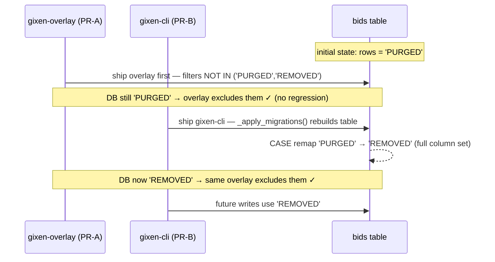
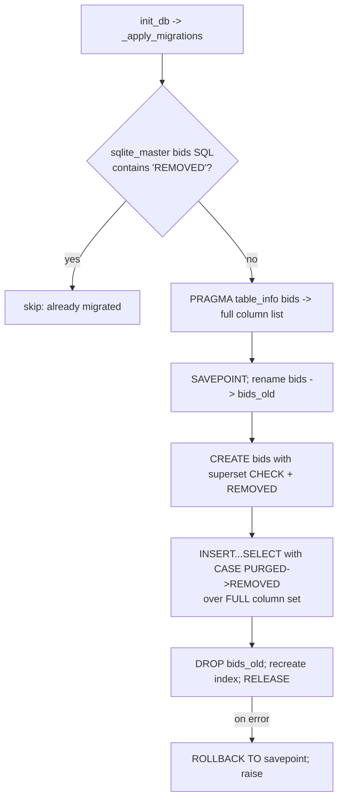

# refactor: Rename PURGED Bid Status to REMOVED (BUI-49)

> **Spans two repos.** Paths are repo-relative to whichever repo a unit targets;
> each unit names its **Target repo**. The `bids` table and its status lifecycle
> are **owned by `gixen-cli`**; `gixen-overlay` (in `comic-pipeline`) is an
> in-process plugin that JOINs the same table and only *reads* `status`.

## Summary

Rename the `PURGED` bid status to `REMOVED` everywhere it appears, across
`gixen-cli` (owner of the `bids` table) and the `gixen-overlay` plugin, plus a
SQLite migration that rewrites existing `status='PURGED'` rows to `'REMOVED'`.
This is **Option A** from BUI-49 — a pure clarity rename. `REMOVED` stays a
single soft-delete tombstone written by *both* `delete_bid` (live-cancel) and
`mark_bids_purged` (completed-sweep); we are **not** splitting the two events
(that was Option B, explicitly declined).

The work is two PRs (one per repo) with a deliberate **deploy order** and a
**dual-value read defense** so there is no window in which a removed snipe
re-renders as a false "won" — i.e. BUI-50 must not regress.

---

## Problem Frame

`bids.status = 'PURGED'` is a soft-delete tombstone, but the name reads like an
end-of-life sweep, which is part of why a removed-while-live snipe masqueraded
as a finished auction downstream (the BUI-50 false-"won" bug). BUI-50 fixed the
*display symptom*; BUI-49 is the *clarity* follow-up: make the status name say
what it is, so "a REMOVED row in recently-ended" reads as self-evidently wrong.

The rename is non-trivial because:

1. **SQLite has no `ALTER TABLE ... DROP/ALTER CONSTRAINT`.** `status` is guarded
   by a `CHECK(status IN (...))` constraint. Allowing `'REMOVED'` requires a
   **table rebuild** (rename → create → `INSERT...SELECT` → drop), the same
   pattern already used once in `gixen-cli/server/db.py` for FK removal.
2. **The migration runs on every startup with no version counter.** `init_db()`
   calls `_apply_migrations()` each connect; idempotency is by *feature
   detection* (e.g. "does the FK still exist?"), not `PRAGMA user_version`.
3. **The two repos ship as separate packages** but share one DB in one process.
   Version skew between them can regress BUI-50 in *either* direction.

---

## Requirements

- **R1** — Existing `status='PURGED'` rows become `status='REMOVED'` after the
  migration runs, with no data loss and full idempotency (safe to run N times).
- **R2** — All `gixen-cli` writers that set the tombstone write `'REMOVED'`;
  all live-snipe filters exclude the tombstone under its new name.
- **R3** — The `gixen-overlay` read paths and `outcome()` continue to exclude /
  render the tombstone correctly — **BUI-50 must not regress** at any point in
  the rollout, including under version skew between the two packages.
- **R4** — No new behavior: `REMOVED` remains one status written by both
  `delete_bid` and `mark_bids_purged`. Include/exclude *behavior* of each
  endpoint is unchanged from today; only the token changes.
- **R5** — The API response contract that currently emits `{"status": "PURGED"}`
  is updated to `"REMOVED"`, and any in-repo consumer is updated in lockstep.

---

## Key Technical Decisions

### KTD-1 — New `CHECK` is a **superset** that keeps `PURGED` legal

The rebuilt `bids` table's constraint becomes
`CHECK(status IN ('PENDING','WON','LOST','FAILED','ENDED','PURGED','REMOVED'))`
— i.e. **add `REMOVED`, keep `PURGED`**.

- **Why:** The migration's `UPDATE`/`INSERT...SELECT` remap requires `REMOVED`
  to be legal. Keeping `PURGED` legal too makes the migration **non-destructive
  of the constraint** and immune to CHECK violations from any straggler row,
  half-migrated DB, or a `gixen-cli` downgrade. No row uses `PURGED` after the
  migration, and no code writes it, so the observable status is always
  `REMOVED`.
- **Alternative (clean set, drop `PURGED`):** cleaner constraint, but a
  `gixen-cli` downgrade or any unmigrated straggler would throw a CHECK error.
  Dropping `PURGED` from the `CHECK` is captured as **deferred follow-up**, doable
  later once confidence is high — it is itself another table rebuild.

### KTD-2 — Migration is a **guarded table rebuild**, idempotent by `sqlite_master` inspection

Mirror the existing FK-removal rebuild in `db.py:_apply_migrations`. The
idempotency guard reads the live table SQL
(`SELECT sql FROM sqlite_master WHERE type='table' AND name='bids'`) and runs the
rebuild **only if** the constraint text does **not** already contain `REMOVED`.
The remap happens in-flight: `INSERT INTO bids_new (...) SELECT ..., CASE WHEN
status='PURGED' THEN 'REMOVED' ELSE status END, ... FROM bids_old`.

### KTD-3 — The rebuild must reproduce the **full live column set**

**Risk discovered during planning:** the *existing* FK-rebuild block hardcodes a
column list that **omits `fmv_id`** (and only stays correct because it fires solely
on pre-`fmv_id` databases). A naïve copy would silently **drop columns**. The
rename migration must enumerate **all current columns** — preferably by
introspecting `PRAGMA table_info(bids)` and building the column list dynamically,
or by explicitly listing the full set (base 15 + `ebay_title`, `status_mirror`,
`cached_current_bid`, `cached_at`, `fmv_id`). Dynamic introspection is preferred
so a future column addition can't silently regress this migration. This is the
single highest-risk part of the change and gets a dedicated round-trip test (U5).

### KTD-4 — `gixen-overlay` filters **both** `PURGED` and `REMOVED` (permanent read defense)

Because the overlay is a separately pip-installed package reading a DB whose
state depends on which `gixen-cli` last opened it, the overlay's read paths use
`status NOT IN ('PURGED','REMOVED')` (and `outcome()` treats either value as
"removed"). This is cheap and makes the overlay correct against *any* DB state —
pre-migration (`PURGED`), post-migration (`REMOVED`), or a half-migrated mix —
eliminating the skew window in both directions.

### KTD-5 — Deploy order: **overlay first, then gixen-cli**

The overlay's dual-value filter (KTD-4) is safe regardless of DB state, so
shipping it first means: while `gixen-cli` is still old (DB has `PURGED`), the
new overlay already filters `PURGED`; after `gixen-cli` ships and migrates the
DB to `REMOVED`, the same overlay filters `REMOVED`. **No regression at any
point.** Shipping `gixen-cli` first would migrate the DB to `REMOVED` while an
old overlay still filters only `PURGED` → removed snipes leak back as false
"won" (BUI-50 regression). The plan therefore sequences the overlay PR ahead of
the gixen-cli PR.

---

## High-Level Technical Design

### Rollout sequence (why overlay ships first)

### Migration decision (idempotent guard)

---

## Implementation Units

> Two PRs. **PR-A = gixen-overlay** (units U1–U3, `comic-pipeline` repo) ships
> and deploys **first**. **PR-B = gixen-cli** (units U4–U8) ships **second**.
> Implementation can proceed on both branches in parallel; only *merge/deploy*
> ordering is constrained (KTD-5).

### U1. Overlay read paths tolerate both `PURGED` and `REMOVED`

- **Target repo:** comic-pipeline (`gixen-overlay`)
- **Goal:** Make all three overlay query filters exclude the tombstone under
  either name, per KTD-4.
- **Requirements:** R3, R4
- **Dependencies:** none
- **Files:**
  - `plugins/gixen-overlay/src/gixen_overlay/routes.py`
    - `api_comics_snipes` (`WHERE b.status != 'PURGED'`, ~581)
    - `api_comics_history` inner dedup subquery (the BUI-50 filter, ~609)
    - `api_extract_comics` (`AND status != 'PURGED'`, ~646)
  - test: `plugins/gixen-overlay/tests/test_gixen_overlay_routes.py`
- **Approach:** Replace each `status != 'PURGED'` with
  `status NOT IN ('PURGED','REMOVED')`. Keep the BUI-50 placement *inside* the
  `MAX(id)` dedup subquery (do not move it to the outer query — see the BUI-50
  shadow test). Add a short comment that both values are the soft-delete
  tombstone during/after the BUI-49 rename.
- **Patterns to follow:** the existing BUI-50 filter and its comment block in
  `api_comics_history`.
- **Test scenarios:**
  - A `REMOVED` bid within the 7-day window is excluded from
    `/api/comics/history` (mirror of the existing `excludes_purged` test).
  - A `REMOVED` bid is excluded from `/api/comics/snipes`.
  - The existing `PURGED` exclusion tests still pass (both values handled).
  - Reverse-id shadow test still holds with a `REMOVED` higher-id row over a
    legit `LOST` lower-id row.
- **Verification:** overlay suite green; both `PURGED` and `REMOVED` tombstones
  are excluded from snipes, history, and extract-comics.

### U2. `outcome()` renders both `PURGED` and `REMOVED` as "removed"

- **Target repo:** comic-pipeline (`gixen-overlay`)
- **Goal:** The ended-row pill treats either tombstone value as "removed",
  never "won".
- **Requirements:** R3
- **Dependencies:** none
- **Files:**
  - `plugins/gixen-overlay/src/gixen_overlay/static/v2-comics.html` (`outcome()`)
  - test: `plugins/gixen-overlay/tests/test_gixen_overlay_routes.py`
    (node-executed `outcome()` harness from BUI-50)
- **Approach:** Change the BUI-50 branch
  `if (r.status === "PURGED")` to match either value
  (e.g. `if (r.status === "PURGED" || r.status === "REMOVED")`) → muted
  `removed`. Keep it before the `winning_bid <= max_bid` heuristic.
- **Test scenarios:**
  - `outcome({status:"REMOVED", winning_bid:10, max_bid_numeric:120})` →
    `pill won` not present, `removed` present.
  - Existing `PURGED` outcome test still passes.
  - WON/LOST guards still pass.
- **Verification:** node-executed `outcome()` tests pass for both values.

### U3. Overlay docs/comment touch-ups

- **Target repo:** comic-pipeline (`gixen-overlay`)
- **Goal:** Keep `CLAUDE.md` / solution-doc references coherent with the rename
  without rewriting history.
- **Requirements:** R4
- **Dependencies:** U1, U2
- **Files:** `CLAUDE.md` (the `status != 'PURGED'` parity note and the
  `bids.status` lifecycle paragraph); optionally a one-line addendum to
  `docs/solutions/ui-bugs/purged-snipes-shown-as-won-2026-06-01.md` noting the
  rename follow-up.
- **Approach:** Update prose to say the tombstone is `REMOVED` (formerly
  `PURGED`); note the overlay tolerates both during transition.
- **Test scenarios:** `Test expectation: none — documentation only.`
- **Verification:** docs read correctly; no stale "PURGED-only" claims.

### U4. gixen-cli schema: superset `CHECK` in both copies

- **Target repo:** gixen-cli
- **Goal:** Fresh DBs and the FK-rebuild path produce a `CHECK` that allows
  `REMOVED` (KTD-1).
- **Requirements:** R1
- **Dependencies:** none
- **Files:** `server/db.py` (`_SCHEMA` CHECK at line 18; the FK-rebuild
  `CREATE TABLE` CHECK at line 78); test: `tests/test_server_db.py`
- **Approach:** Change both `CHECK(status IN (...,'PURGED'))` to include
  `'REMOVED'` (superset, both legal). These are the "two schema copies" called
  out in BUI-49.
- **Test scenarios:**
  - A fresh DB accepts an `INSERT` with `status='REMOVED'`.
  - A fresh DB still accepts the other valid statuses; an invalid status is
    still rejected.
- **Verification:** schema tests green; `REMOVED` is a legal value on a new DB.

### U5. gixen-cli migration: rebuild + remap `PURGED` → `REMOVED`

- **Target repo:** gixen-cli
- **Goal:** Existing DBs migrate all `PURGED` rows to `REMOVED`, idempotently,
  preserving every column (KTD-2, KTD-3, R1).
- **Requirements:** R1
- **Dependencies:** U4
- **Files:** `server/db.py` (`_apply_migrations`); test: `tests/test_server_db.py`
- **Approach:** Add a guarded rebuild after the existing FK-rebuild block.
  Guard: skip if `sqlite_master` table SQL already contains `REMOVED`.
  Otherwise `SAVEPOINT`, rename → create (superset CHECK) → `INSERT...SELECT`
  with `CASE WHEN status='PURGED' THEN 'REMOVED' ELSE status END` over the
  **full** column set (introspect via `PRAGMA table_info` — do **not** hardcode,
  to avoid the `fmv_id`-drop trap), drop old, recreate `idx_bids_item_id`,
  release. Wrap in try/except with `ROLLBACK TO` on failure, mirroring the
  existing block.
- **Execution note:** Characterization-first — write the migration round-trip
  test (seed a DB with the *old* schema + a `PURGED` row + a populated `fmv_id`,
  run `init_db`, assert) **before** writing the migration.
- **Test scenarios:**
  - Old-schema DB with a `PURGED` row → after `init_db`, that row is `REMOVED`;
    no row remains `PURGED`.
  - **Column preservation:** a row with non-null `fmv_id`, `ebay_title`,
    `status_mirror`, `cached_at` retains every value after migration (guards
    KTD-3).
  - **Idempotency:** running `init_db` twice does not error and does not
    double-migrate or lose data.
  - Non-tombstone rows (`PENDING`, `WON`, `LOST`) are untouched.
  - After migration, inserting `status='REMOVED'` succeeds (CHECK allows it).
- **Verification:** migration test green including the column-preservation and
  idempotency cases.

### U6. gixen-cli writers + live-snipe filters use `REMOVED`

- **Target repo:** gixen-cli
- **Goal:** The tombstone is written as `REMOVED`; live-snipe operations exclude
  it (R2).
- **Requirements:** R2
- **Dependencies:** U4
- **Files:** `server/db.py` — `delete_bid` (`SET status='PURGED'`, ~235),
  `mark_bids_purged` (`SET status='PURGED'`, ~256), and the live-op filters
  `status NOT IN ('PURGED')` at ~193 and ~227; tests:
  `tests/test_server_db.py`, `tests/test_gixen_client.py`
- **Approach:** Writers set `'REMOVED'`. For the two filters, use
  `status NOT IN ('PURGED','REMOVED')` (belt-and-suspenders against any
  straggler), consistent with KTD-4. Consider renaming `mark_bids_purged`'s
  internal identifiers only if low-churn; the function name is a separate
  follow-up (see Scope Boundaries) to keep this PR reviewable.
- **Test scenarios:**
  - `delete_bid` sets a live row to `REMOVED` and does not touch an already
    tombstoned row.
  - `mark_bids_purged` sets completed rows to `REMOVED`.
  - `update_bid_status` / the ~227 filter does not mutate a `REMOVED` row.
- **Verification:** db + client suites green; tombstone writes are `REMOVED`.

### U7. gixen-cli `main.py`: filters, special-handling block, and API contract

- **Target repo:** gixen-cli
- **Goal:** Update every `main.py` `PURGED` reference, including the response
  contract (R2, R5).
- **Requirements:** R2, R5
- **Dependencies:** U4
- **Files:** `server/main.py`; tests: `tests/test_server_api.py`
- **Approach:** Update, by reference:
  - the live-snipe filter `WHERE status != 'PURGED'` (~798) →
    `NOT IN ('PURGED','REMOVED')`;
  - the special tombstone-handling block (~443–499) that selects/updates
    `WHERE status='PURGED'` — must match `REMOVED` (and tolerate `PURGED`
    transitionally);
  - **the API response literal `{"status": "PURGED"}` (~963) → `"REMOVED"`**
    — this is a response-contract change (R5); grep the overlay and `/comic:*`
    skills for any consumer that string-matches `"PURGED"` on this response and
    update in lockstep, or confirm none exists;
  - comments at ~443, ~477, ~829, ~1001.
  - **Out of scope:** changing whether `/api/history` (~829) *includes* the
    tombstone — that is gixen-cli's existing behavior; only the token changes.
- **Test scenarios:**
  - The remove/delete endpoint returns `{"status": "REMOVED"}`.
  - The special-handling path that backfills `winning_bid` on tombstoned rows
    operates on `REMOVED` rows.
  - The `main.py` live-snipe filter excludes `REMOVED`.
- **Verification:** server API suite green; response contract emits `REMOVED`;
  no in-repo consumer still expects `"PURGED"`.

### U8. gixen-cli test sweep

- **Target repo:** gixen-cli
- **Goal:** All remaining `PURGED` literals in tests reflect the rename, and the
  new migration/contract behavior is covered (R1–R5).
- **Requirements:** R1, R2, R5
- **Dependencies:** U5, U6, U7
- **Files:** `tests/test_server_db.py`, `tests/test_server_api.py`,
  `tests/test_gixen_client.py`
- **Approach:** Update existing `PURGED` assertions to `REMOVED` where they
  assert post-change behavior; keep a small number that intentionally seed a
  legacy `PURGED` row to exercise the migration/tolerance paths.
- **Test scenarios:** covered by U5–U7; this unit ensures the suites are
  internally consistent and green as a whole.
- **Verification:** `cd gixen-cli && uv run pytest` green.

---

## Scope Boundaries

**In scope:** rename `PURGED` → `REMOVED` across both repos; superset `CHECK`;
idempotent remap migration; overlay dual-value read defense; response-contract
update; test updates; deploy-order sequencing.

### Deferred to Follow-Up Work
- **Drop `PURGED` from the `CHECK`** (clean set) once confident no
  straggler/downgrade can write it — another table rebuild.
- **Rename the `mark_bids_purged` function / `purge` CLI verb** to match the new
  noun. Behavior-neutral identifier churn; kept out to keep these PRs reviewable.
- **Remove the overlay's transitional `'PURGED'` tolerance** after the gixen-cli
  migration has shipped everywhere (leave both for now — it is free safety).

### Explicitly NOT doing (Option B)
- Splitting the tombstone into `REMOVED` (live-cancel) vs `ARCHIVED`
  (completed-sweep). BUI-49 chose Option A. The conflation distinction is not
  addressed here.

---

## Risks & Mitigations

- **Column-drop in the rebuild (highest risk).** A rebuild that doesn't carry
  every live column silently destroys data (the existing FK-rebuild already has
  this latent shape re: `fmv_id`). → KTD-3 dynamic column introspection + the U5
  column-preservation test.
- **BUI-50 regression via version skew.** → KTD-4 dual-value overlay filter +
  KTD-5 overlay-first deploy order. Safe in both install orders.
- **Response-contract break.** A consumer string-matching `"PURGED"` on the
  remove response. → U7 greps overlay + skills before flipping the literal.
- **Migration runs on a live WAL DB on startup.** The existing pattern already
  rebuilds under `SAVEPOINT` with rollback; mirror it exactly. Single-user local
  tool, so no concurrent writers during startup.

---

## Verification (whole change)

1. `cd gixen-cli && uv run pytest` — green, incl. migration round-trip +
   idempotency + column preservation.
2. `cd plugins/gixen-overlay && uv run pytest` — green; both `PURGED` and
   `REMOVED` excluded everywhere; node `outcome()` tests pass for both.
3. Manual: on a DB seeded with a legacy `PURGED` row, start gixen-cli, confirm
   the row reads `REMOVED`, the `/comics` recently-ended tab shows muted
   "removed" (not "won"), and the remove endpoint returns `{"status":"REMOVED"}`.
4. Deploy order honored: overlay PR merged/installed before gixen-cli PR.

---

## Sources & Research

- BUI-49 (Linear) — Option A chosen by the user.
- BUI-50 (Linear) + `docs/solutions/ui-bugs/purged-snipes-shown-as-won-2026-06-01.md`
  — the regression this rename must not reintroduce.
- `gixen-cli/server/db.py` — `_SCHEMA` (18), FK-rebuild precedent (60–117),
  `_apply_migrations` framework (no `user_version`; feature-detect idempotency),
  writers/filters (193, 227, 235, 256).
- `gixen-cli/server/main.py` — PURGED refs (443–499, 798, 829, 963, 1001),
  incl. the `{"status":"PURGED"}` response literal.
- `plugins/gixen-overlay/src/gixen_overlay/routes.py` (581, 609, 646) and
  `static/v2-comics.html` `outcome()` — the BUI-50 fixes this builds on.
