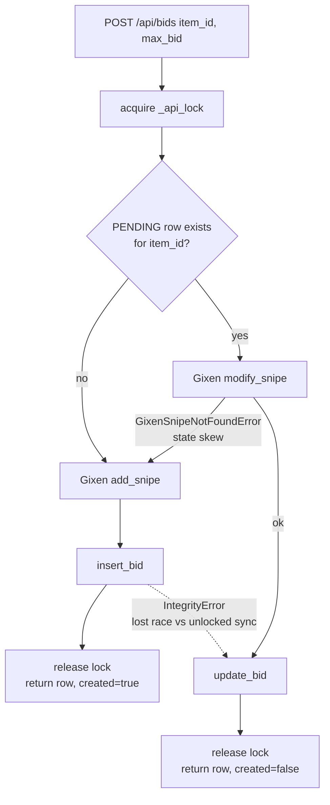
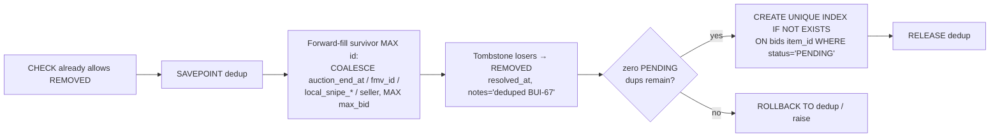

# fix: Prevent Duplicate Active Snipe Entries for Same eBay Item

## Summary

A single eBay auction can appear twice in the dashboard **Active** view because the snipe-add endpoint blindly `INSERT`s a new `bids` row every time, with nothing — at the application or database level — enforcing one live snipe per listing. Item `236831609134` currently has two rows.

The fix is **prevent + enforce + clean up**, with no read-query changes:

1. **Prevent** — `api_add_bid` becomes an upsert performed entirely under `_api_lock`: if a `PENDING` row already exists for the eBay `item_id`, update it (Gixen `modify_snipe` + `update_bid`) instead of inserting; otherwise insert as today. The response signals created-vs-updated so a silent in-place overwrite is visible.
2. **Enforce** — a partial unique index `UNIQUE(item_id) WHERE status='PENDING'` on `bids` makes the database reject a second live snipe for the same listing, covering every insert path. Serializing the write under `_api_lock` means the index is a loud backstop, not the primary guard. The other insert/resolve paths (`_sync_gixen`, `_run_ebay_fallback`) are hardened so the new constraint doesn't turn benign behavior into failures.
3. **Clean up** — a one-time, savepoint-wrapped migration forward-fills each survivor with the group's live-auction data (so no `auction_end_at`/`fmv_id`/bid-ceiling is lost), collapses existing same-item `PENDING` duplicates to `REMOVED`, **then** creates the unique index.

The read-side dedup considered in the original ticket is **dropped**: once the write invariant holds, the Active queries return one row per item unchanged, and read-dedup would only mask future write regressions.

---

## Problem Frame

`bids.item_id` is the eBay listing ID (the number in `ebay.com/itm/<id>`) and is the natural key for a live snipe. Three facts combine to produce the duplicate:

- **No uniqueness on `bids.item_id`** — the table has a PK on `id` and a *non-unique* index `idx_bids_item_id`. Two rows for one listing are physically allowed.
- **The add path always inserts** — `api_add_bid` (`packages/gixen-cli/server/main.py`) calls `insert_bid` unconditionally after the Gixen call, with no existence check. The CLI's direct-Gixen path has such a check, but it is bypassed in server mode.
- **The Active reads don't dedup** — `/api/comics/snipes` (`plugins/gixen-overlay/src/gixen_overlay/routes.py`) and base `/api/snipes` (`main.py`) filter only the tombstone and `GROUP BY b.id`, so two `PENDING` rows for one item render as two entries. (By contrast `/api/comics/history` already dedups via `MAX(id)` per `item_id`.)

The duplicate arises when the same auction is added twice through the server add path (re-running `/comic:snipe-add`, a retried `gixen add`, or add-via-CLI then add-via-dashboard).

**Scope of correctness:** a *relisting* is a new auction with a **new** `item_id`, so it must still create its own snipe. The collapse must therefore key on `PENDING` specifically — never swallow an add just because a terminal (`WON`/`LOST`/`ENDED`) row for that `item_id` exists.

---

## Requirements

- **R1** — Adding an auction whose listing already has a live (`PENDING`) snipe updates that snipe in place rather than creating a second row; the row's `id` stays stable.
- **R2** — Adding an auction with no live snipe for its `item_id` inserts a new `PENDING` row (today's behavior), including the relisting case where a terminal row for the same `item_id` exists.
- **R3** — The database rejects a second `PENDING` row for the same `item_id`, regardless of which code path attempts the insert.
- **R4** — Existing same-item `PENDING` duplicates are collapsed to a single `PENDING` row; the survivor is the most recent add, losers become the `REMOVED` tombstone and are distinguishable from user-cancel / completed-sweep tombstones.
- **R5** — The Active views (`/api/comics/snipes`, `/api/snipes`) show each `item_id` at most once, with **no changes to those queries**.
- **R6** — The migration is idempotent, preserves all columns, and is safe to run against the live deployed DB. The collapse survivor carries forward the union of the group's live-snipe state (`auction_end_at`, `fmv_id`, `local_snipe_at`/`local_snipe_result`, and the highest `max_bid`) so no auction-tracking data or bid ceiling is lost.
- **R7** — The new unique index does not turn other insert paths into failures: the `_sync_gixen` web-added-snipe insert tolerates the constraint instead of aborting the sync run, and dedup-loser tombstones do not trigger spurious eBay-fallback resolution.
- **R8** — The add endpoint distinguishes "created a new snipe" from "updated an existing live snipe" in its response, so a re-add that silently overwrites (e.g. accidentally lowering a live bid) is observable to callers.

---

## Key Technical Decisions

### KTD1 — Upsert keys on `(item_id, status='PENDING')`, not `item_id` alone
The original ticket said "upsert on existing non-tombstone `item_id`," which is too broad: it would also swallow re-adds of a listing whose prior auction ended, breaking legitimate relistings. Keying the collapse and the index on `PENDING` permits any number of terminal rows per `item_id` while guaranteeing at most one live snipe. (See origin: Linear BUI-67 discussion.)

This rests on "a new auction gets a new `item_id`," which holds for eBay "Sell Similar" and the common relist path; terminal rows never block a fresh PENDING add, so the normal relist case is safe. The one narrow residual: if eBay ever surfaces a genuinely new auction under the *same* `item_id` (e.g. a second-chance offer) *while the prior row is still PENDING* (not yet swept terminal), the upsert would treat it as an in-place modify of the old auction. Low-likelihood and not worsened by this change vs. today's duplicate behavior; flagged, not designed-for.

### KTD2 — Existing-PENDING re-add calls Gixen `modify_snipe`, not `add_snipe`; response signals created-vs-updated
Gixen rejects a re-add of an already-sniped item with `GixenItemError` code 202 ("ITEM ALREADY PRESENT"). `add_snipe` only tolerates 202 as evidence of its own prior POST. So when a `PENDING` row exists, the Gixen-side call must be `modify_snipe` (mirroring `api_edit_bid`). Fallback: if `modify_snipe` raises `GixenSnipeNotFoundError` (DB has a `PENDING` row but Gixen lost it — state skew), fall back to `add_snipe` + `insert_bid`, because the user's intent here is "add."

Note the deliberate asymmetry with `api_edit_bid`: edit maps `GixenSnipeNotFoundError` to **404** (editing a thing that isn't there is an error), while add *tolerates* absence and falls back. This divergence is intended — see KTD7 for why it shapes the shared-helper boundary.

`add_snipe` (including the fallback add) can also raise `GixenAddNotConfirmedError` — Gixen accepted the POST but the snipe never appeared on verify. The endpoint must **not** `insert_bid` in that case (no confirmed snipe to record). It already maps to 503 via `GixenError`, but on the *fallback* path (existing PENDING row → modify said not-found → add not confirmed) returning a bare 503 silently drops the user's new `max_bid` while the dashboard still shows the stale live snipe. Decide explicitly: re-query and return the existing PENDING row with a flag indicating the new bid was *not* applied, rather than a bare 503 that hides the stale state.

Because an existing-PENDING add silently becomes an in-place **update**, the response must distinguish the two outcomes (R8) — a `created: true|false` field (and/or 200-on-update vs 201-on-create). Without it, a user who re-pastes an `item_id` with a mistakenly *lower* `max_bid` silently lowers a live bid with no feedback. The CLI/skill surface can then say "updated existing snipe" instead of "added."

### KTD3 — DB backstop is a partial unique index, not read-side dedup, and not `ON CONFLICT`
A partial unique index fails *loud* (`IntegrityError`) and covers every insert path at the database. Read-side dedup would do the opposite — silently hide a duplicate, letting a future write regression rot undetected. The index also naturally permits relistings (new `item_id`) and multiple terminal rows (not `PENDING`). The Active read queries are left untouched.

A SQLite `INSERT ... ON CONFLICT(item_id) WHERE status='PENDING' DO UPDATE` UPSERT is **rejected on purpose**: the conflict is not only in SQLite. The Gixen side has two distinct operations (`add_snipe` vs `modify_snipe`) with different forms and error semantics (202 vs not-found), and the choice between them must be made *before* the DB write — an `ON CONFLICT` resolves only after the row write is attempted, too late to have picked the right Gixen call. The decision belongs in application code keyed on the PENDING lookup; the index is a constraint/backstop, not the write strategy. (Stated so a future reader doesn't "simplify" the branching into an UPSERT and reintroduce the 202 bug.)

### KTD4 — Survivor = `MAX(id)` per `item_id`, with enriched fields COALESCEd forward; losers → `REMOVED` with an audit marker
On the live DB the collapse tombstones real rows, so survivor selection is correctness-critical. The survivor **must** be `MAX(id)` — multiple consumers assume "newest row = the live row": the overlay history `MAX(id)` dedup, and `get_bid_by_item_id` (`ORDER BY id DESC`) which the overlay `link-fmv` / `link-locg` endpoints use. Keeping the *lowest* id would leave those pointing at a tombstone.

But `MAX(id)` is often the *least* enriched row: a blind double-add/retry inserts a fresh clone with `auction_end_at IS NULL`, `fmv_id IS NULL`, `local_snipe_at IS NULL`, while the *older* row carries the auction end time the sniper needs and the FMV linkage. Simply keeping `MAX(id)` and dropping the rest would orphan that data and could make the sniper never fire (`get_bids_ready_to_snipe` requires `auction_end_at IS NOT NULL`) — a missed live auction. **Mitigation:** before tombstoning the losers, fill each live-snipe field (`auction_end_at`, `fmv_id`, `local_snipe_at`, `local_snipe_result`, `seller`, `cached_current_bid`, `cached_at`) onto the `MAX(id)` survivor, and set the survivor's `max_bid = MAX(max_bid)` across the group so a stale clone can never lower the user's ceiling. The survivor then carries the union of the group's state regardless of which physical row held it.

**The fill must be deterministic, not a blind COALESCE.** `auction_end_at` is *not* invariant across same-item rows: `_sync_gixen` recomputes it on every sync from Gixen's relative "time_to_end" string plus the current wall clock, so two PENDING rows last synced at different instants hold end-times that differ by the inter-sync drift. A bare COALESCE over an unordered subquery picks whichever row SQLite returns first and could keep a *stale* end-time → the sniper fires at the wrong second. Rule: for each field, take the value from the row with the most recent `cached_at` (freshest sync) that has it non-NULL, falling back to any non-NULL; for `max_bid` use `MAX`. Because the source rows are in the same table being updated, read them through a CTE / pre-selected snapshot rather than a correlated subquery on `bids` mid-UPDATE (SQLite can otherwise read partially-updated state). U3 carries the concrete SQL shape and the precedence rule.

Tombstone losers to `REMOVED` with `resolved_at` set and `notes='deduped BUI-67'` so a future reader does not misread a deduped loser as a user-cancelled snipe (the BUI-50 tombstone-conflation lesson).

### KTD5 — Migration is raw SQL inside `_apply_migrations`, wrapped in an explicit savepoint, collapse-before-index, after the PURGED→REMOVED block
The collapse must use raw `conn.execute()` SQL, **never** `delete_bid`/`mark_bids_purged` — those call `conn.commit()`, which would collapse an enclosing savepoint and defeat rollback (see `docs/solutions/database-issues/sqlite-fk-rename-savepoint-pragma-2026-05-19.md`).

Although the partial index needs no table rebuild (a `CREATE UNIQUE INDEX`, not a constraint alteration), the collapse `UPDATE`s and the index creation should still be wrapped in an explicit `SAVEPOINT … RELEASE` (with `ROLLBACK TO` on exception), mirroring the existing `status_rename` block — so a failure leaves the original dup state intact rather than a half-collapsed one. **Caveat (verify, don't assume):** Python `sqlite3` with the default `isolation_level` auto-BEGINs around DML but may let DDL (`CREATE INDEX`) implicitly commit the pending `UPDATE`. The existing `fk_rebuild`/`status_rename` blocks issue DDL inside explicit savepoints and rely on `ROLLBACK TO` working, which suggests the implicit-commit-before-DDL behavior does *not* fire inside an open savepoint here — confirm empirically on a copy. Regardless of which way that resolves, ordering the collapse fully *before* `CREATE UNIQUE INDEX` and gating the index on "zero remaining dups" is correct practice (and the only safe order if implicit-commit does occur), so keep it: open savepoint → forward-fill survivor → tombstone losers → verify zero remaining dups → `CREATE UNIQUE INDEX IF NOT EXISTS` → release. Do **not** set `conn.isolation_level` to a mode that reintroduces autocommit between the UPDATE and the index. The block goes **after** the existing PURGED→REMOVED remap so the CHECK constraint already permits `REMOVED`.

### KTD6 — Close the `api_add_bid` race by writing inside `_api_lock`; the index is a load-bearing guard, not a never-fires backstop
The server runs a **single shared `sqlite3` connection on one event loop**. The PENDING lookup and the DB write are synchronous and do not `await`, so they cannot interleave with another coroutine *between* themselves. The only yield point in `api_add_bid` is the `await`ed Gixen call inside `_api_lock`. The hazard for *two concurrent adds* is reentrancy across that await: request A enters the lock and awaits `add_snipe`, request B resumes and re-reads a now-stale "no PENDING row," then both proceed. Fix: make the whole decision atomic under the lock — `get_pending_bid_by_item_id`, the Gixen `add`/`modify` call, **and** the DB `insert`/`update` all inside the existing `async with _api_lock` critical section. This is simpler than a release-then-catch-then-reroute flow and avoids a window where the insert's `max_bid` disagrees with the Gixen call.

**However, `_api_lock` does *not* serialize all writers.** The background `_sync_loop` (enabled by default, `GIXEN_SYNC_ENABLED != "false"`) calls `_sync_gixen` on a **separate `_sync_client`** specifically so its long scrapes don't contend on `_api_lock` — and its web-add `insert_bid` loop runs **unlocked**, against the same shared connection, computing `existing_ids` *before* an `await`. So a sync cycle can interleave with an `api_add_bid` that just inserted, and the sync's `insert_bid` will hit the unique index. **The index therefore genuinely fires in normal single-process operation**, and the U4 `_sync_gixen` `try/except IntegrityError` is the real, load-bearing defender — not mere symmetry. (Do not "simplify" it away as dead code: it is what keeps the default background sync from aborting.) Keep a defensive `except sqlite3.IntegrityError` in `api_add_bid` too.

One coupling to record: `update_bid` is keyed `WHERE item_id=? AND status='PENDING'` (not by `id`) and writes only `max_bid`/`bid_offset`/`snipe_group`. Its correctness as an in-place update of *the* live row depends entirely on the new index guaranteeing at most one PENDING row per item — note this in U2 so a future relaxation of the index doesn't silently make `update_bid` touch multiple rows, and so an implementer doesn't "helpfully" widen `update_bid` to touch `auction_end_at`/`seller` (which would null out the survivor's enrichment on a re-add).

### KTD7 — Share only the `modify_snipe + update_bid` happy path, not the not-found policy
Add and edit both run `modify_snipe + update_bid` with a `GixenSnipeNotFoundError` path, but they **diverge on what not-found means**: edit → resync then 500 if still missing; add → fall back to `add_snipe + insert_bid`. A single helper that owns the not-found handling would need an `is_add` flag and two internal branches — false-DRY that couples two endpoints whose error semantics genuinely differ. Extract only the unambiguous inner step (`modify_snipe` under `_api_lock` then `update_bid`) as a helper that **re-raises `GixenSnipeNotFoundError`**, and let each endpoint own its own `except` policy.

---

## High-Level Technical Design

Add-endpoint decision flow (KTD2/KTD6/KTD7). The entire lookup → Gixen → DB-write sequence runs inside the existing `_api_lock` critical section so the decision is atomic and the index never races:

Migration ordering inside `_apply_migrations` (appended after the PURGED→REMOVED remap), wrapped in a savepoint (KTD4/KTD5):

Both steps are idempotent: the collapse matches 0 rows once no dups remain, and `IF NOT EXISTS` guards the index. The `zero dups remain` gate matters because DDL can implicitly commit the collapse before the index builds (KTD5).

---

## Implementation Units

### U1. PENDING-specific bid lookup helper

**Goal:** Provide a helper that returns the live snipe for an `item_id`, so the upsert decision keys on `PENDING` and not on the latest row of any status.

**Requirements:** R1, R2

**Dependencies:** none

**Files:**
- `packages/gixen-cli/server/db.py` — add `get_pending_bid_by_item_id(conn, item_id: str) -> sqlite3.Row | None`
- `packages/gixen-cli/tests/test_server_db.py` — helper tests

**Approach:** `SELECT * FROM bids WHERE item_id=? AND status='PENDING' ORDER BY id DESC LIMIT 1`. Distinct from the existing `get_bid_by_item_id`, which returns the latest row regardless of status (a `REMOVED`/`WON` row could shadow a `PENDING` one) and is therefore unsafe for the upsert decision. Keep `get_bid_by_item_id` as-is for its existing callers.

**Patterns to follow:** mirror the signature/style of `get_bid_by_item_id` and `get_pending_bids` in the same file.

**Test scenarios:**
- Returns the `PENDING` row when one exists for the `item_id`.
- Returns `None` when only terminal/tombstone rows exist for the `item_id` (e.g. one `ENDED` row → `None`).
- Returns `None` when the item is unknown.
- When both a `PENDING` and a higher-`id` `REMOVED` row exist for the same `item_id`, returns the `PENDING` row (not the newer tombstone) — the exact shadowing case `get_bid_by_item_id` gets wrong.

**Verification:** New helper tests pass; `get_bid_by_item_id` behavior unchanged.

---

### U2. Upsert the snipe-add endpoint

**Goal:** Make `api_add_bid` update an existing live snipe instead of inserting a duplicate, with the correct Gixen-side call, the race closed by serialization, and a created-vs-updated signal in the response.

**Requirements:** R1, R2, R8, R6 (partial — endpoint half of the invariant)

**Dependencies:** U1

**Files:**
- `packages/gixen-cli/server/main.py` — `api_add_bid`, plus a small shared `modify_snipe + update_bid` helper (KTD7)
- `packages/gixen-cli/cli.py` — surface created-vs-updated in the server-mode add output line
- `packages/gixen-cli/tests/test_server_api.py` — endpoint tests

**Approach:**
- **Do the whole decision inside `async with _api_lock`** (KTD6): `get_pending_bid_by_item_id(db, req.item_id)` → choose `add` vs `modify` → DB write, all in one critical section. Do not release the lock between the lookup and the write. The lock already wraps the Gixen call today; widen its span to cover lookup + DB write. (This closes the *two-concurrent-adds* race; the unique index still defends against the unlocked background `_sync_loop` writer — KTD6, U4.)
- **Shared helper (KTD7):** `_modify_and_update_bid(item_id, max_bid, bid_offset, snipe_group) -> sqlite3.Row` calls `modify_snipe` then `update_bid` and **re-raises** `GixenSnipeNotFoundError`. The helper does **not** acquire `_api_lock` — the caller already holds it across the whole sequence; the helper running the lock would break KTD6's atomicity. Each endpoint owns its own not-found policy (add → fall back; edit → 404).
- **Existing PENDING row:** call the helper; return the (stable-`id`) row with `created=false`. On `GixenSnipeNotFoundError`, fall back to the add branch (state skew). On `GixenAddNotConfirmedError` in the fallback, re-query and return the existing row flagged as not-applied (KTD2), not a bare 503.
- **No PENDING row:** `add_snipe` + `insert_bid`; return with `created=true`. Keep a defensive `except sqlite3.IntegrityError` around the insert (re-query the PENDING row and update) as a backstop.
- **Response signal (R8):** add a `created: bool` to the response body. (Keep HTTP 200 in both cases — do not switch to 201; the CLI currently ignores the status code and a 200→201 change would be a needless contract break.) In `cli.py` server-mode add: capture the response, and **gate `_record_add(item_id)` on `created=true`** — an in-place update must not re-stamp the add-history timestamp (that would silently reset the `--added-since` window for the listing). When `created=false`, print "updated existing snipe (was $X → $Y)" instead of "added snipe" so a re-add that *lowers* a live bid is visible.
- **Coupling note (KTD6):** add a code comment that `update_bid`'s single-row correctness (and the safety of not widening it to other columns) depends on the unique index.
- Preserve `AddBidRequest` validation (`item_id` `^\d+$`, `max_bid > 0`) and the existing 503 mapping for `GixenError`/`requests.HTTPError`.

**Execution note:** Add a failing endpoint test for the re-add-updates-in-place contract first.

**Patterns to follow:** `api_edit_bid` in the same file (the `modify_snipe` + `update_bid` + `GixenSnipeNotFoundError`-resync precedent — but note its not-found→404 policy differs from add's, KTD2/KTD7); the existing `_api_lock` usage in `api_add_bid`.

**Test scenarios (TestClient with mocked GixenClient):**
- *Happy path, new item:* POST `/api/bids` for an unknown `item_id` inserts one `PENDING` row; mock's `add_snipe` called, `modify_snipe` not; response `created=true`.
- *Re-add updates in place:* POST the same `item_id` twice with different `max_bid`; second response carries the **same `id`**, the updated `max_bid`, and `created=false`; exactly one non-tombstone row exists; second call used `modify_snipe`, not `add_snipe`.
- *Re-add with lower max_bid is visible:* second POST with a lower `max_bid` returns `created=false` and the new (lower) value — assert the response distinguishes it from a create (the foot-gun guard).
- *Relisting allowed:* with an existing `ENDED` (or `WON`/`LOST`) row for an `item_id`, POST a new add for that `item_id` inserts a fresh `PENDING` row via `add_snipe`, `created=true` (R2).
- *Gixen state skew:* existing `PENDING` row but `modify_snipe` raises `GixenSnipeNotFoundError` → endpoint falls back to `add_snipe` and returns a row rather than 404/500.
- *Defensive IntegrityError path:* simulate `insert_bid` raising `sqlite3.IntegrityError` on the no-PENDING branch → endpoint re-queries and returns the existing `PENDING` row, not a 500.
- *Re-add does not re-stamp history:* in server mode, a re-add (`created=false`) leaves the `_record_add` timestamp for the `item_id` unchanged (the `--added-since` window is not reset).
- *Add-not-confirmed on fallback:* existing PENDING row, `modify_snipe` → `GixenSnipeNotFoundError`, then `add_snipe` → `GixenAddNotConfirmedError` → endpoint returns the existing row flagged not-applied (no duplicate insert, no silent bid loss).
- *Validation preserved:* non-numeric `item_id` → 422; `max_bid <= 0` → 422; `GixenError` → 503.

**Verification:** Re-adding a listing never produces a second Active row; the response/CLI line distinguishes created vs updated and doesn't reset add-history; endpoint tests pass.

---

### U3. Migration: collapse existing PENDING duplicates + partial unique index

**Goal:** Remove the duplicates already in the DB and install the database-level backstop, safely and idempotently, on every existing and deployed DB.

**Requirements:** R3, R4, R6

**Dependencies:** none (independent of U1/U2; logically lands with them)

**Files:**
- `packages/gixen-cli/server/db.py` — new block at the end of `_apply_migrations`
- `packages/gixen-cli/tests/test_server_db.py` — migration tests

**Approach:**
- Append after the existing PURGED→REMOVED remap so the CHECK already permits `REMOVED`. Wrap the whole block in `SAVEPOINT dedup … RELEASE` with `ROLLBACK TO dedup` on exception (KTD5).
- **Forward-fill the survivor (raw SQL, deterministic):** for each `item_id` group with >1 `PENDING` row, fill the live-snipe fields (`auction_end_at`, `fmv_id`, `local_snipe_at`, `local_snipe_result`, `seller`, `cached_current_bid`, `cached_at`) onto the `MAX(id)` survivor and set its `max_bid` to the group `MAX(max_bid)` (KTD4). For each field take the value from the **freshest** contributing row (highest `cached_at`) that has it non-NULL — not a blind COALESCE, because `auction_end_at` can differ across rows by sync drift. Compute the fill values into a **temp/CTE snapshot first**, then `UPDATE` the survivor from the snapshot — do not run a correlated subquery against `bids` mid-UPDATE (SQLite may read partially-updated state). Runs *before* the tombstone step so loser data is still readable.
- **Collapse (raw SQL):** tombstone the non-survivors — `UPDATE bids SET status='REMOVED', resolved_at=?, notes='deduped BUI-67' WHERE status='PENDING' AND id NOT IN (SELECT MAX(id) FROM bids WHERE status='PENDING' GROUP BY item_id)`. Bind `resolved_at` as a Python `datetime.now(timezone.utc).isoformat()` value (ISO-8601, `+00:00`) so deduped losers match the timestamp shape `delete_bid`/`mark_bids_purged` write — **not** `datetime('now')`, which renders a space-separated, offset-less string that diverges from every other tombstone. No CRUD helpers (they `commit()` and would break the savepoint — KTD5).
- **Verify then index:** assert zero remaining `PENDING` duplicates, then `CREATE UNIQUE INDEX IF NOT EXISTS idx_bids_pending_item_id ON bids(item_id) WHERE status='PENDING'`. The verify gate matters because DDL can implicitly commit the collapse first (KTD5) — building the index over un-collapsed dups would fail with the collapse already durable.
- Do **not** rebuild the table — there is no CHECK/FK change.

**Edge cases to guard (verify on the live copy before deploy):**
- **`item_id` formatting:** the collapse groups by exact `item_id` string. If the two `236831609134` rows differ by whitespace/leading zeros, `GROUP BY` won't group them, the collapse skips them, and `CREATE UNIQUE INDEX` *also* won't see a conflict — the bug would persist silently. Confirm the dup pair stores byte-identical `item_id`.
- **NULL `item_id`:** schema is `TEXT NOT NULL`, but a pre-constraint legacy row could exist. SQLite treats NULLs as distinct in a UNIQUE index but `GROUP BY item_id` lumps all NULLs together — confirm `SELECT COUNT(*) FROM bids WHERE item_id IS NULL` is 0.

**Patterns to follow:** the BUI-49 status-rename migration's savepoint/`ROLLBACK TO` structure and the final `UPDATE bids SET status='REMOVED' WHERE status='PURGED'` remap already in `_apply_migrations`; the deterministic survivor-selection join pattern in `docs/solutions/database-issues/sqlite-fk-rename-savepoint-pragma-2026-05-19.md`.

**Test scenarios:**
- *Collapse keeps the survivor:* seed (legacy raw DB, then `init_db`) two `PENDING` rows for one `item_id` → exactly one remains `PENDING` (the higher `id`), the other is `REMOVED` with `resolved_at` set and `notes='deduped BUI-67'`.
- *Forward-fill (the data-loss guard):* seed an older `PENDING` row (id=10) with `auction_end_at`, `fmv_id`, and `max_bid=20` plus a newer `PENDING` clone (id=11) with those NULL and `max_bid=15` → survivor id=11 ends up with id=10's `auction_end_at` and `fmv_id` filled in, and `max_bid=20` (the higher). Asserts the sniper-tracking data and bid ceiling are not lost.
- *Divergent end-times pick the freshest:* both rows have non-NULL but *different* `auction_end_at`, with the **lower-id** row carrying the more recent `cached_at` → survivor takes the lower-id row's (fresher) `auction_end_at`, not its own stale one. Asserts the determinism rule (freshest `cached_at` wins), not blind COALESCE-keeps-survivor.
- *Higher max_bid on the newer row wins too:* same but id=11 has `max_bid=25` → survivor `max_bid=25`.
- *Relisting preserved:* seed one `ENDED` + one `PENDING` row for the same `item_id` → the `PENDING` row untouched, the `ENDED` row untouched (only all-but-one *PENDING* collapses).
- *Three-way collapse:* three `PENDING` rows for one item → one survives carrying the union of their live fields, two tombstoned.
- *Index enforces invariant:* after `init_db`, inserting a second `PENDING` row for an existing live `item_id` raises `sqlite3.IntegrityError`; a `PENDING` row for a *new* `item_id` succeeds; a non-`PENDING` (e.g. `ENDED`) row for an item that already has a `PENDING` row succeeds.
- *Idempotency:* running `init_db` twice collapses 0 rows on the second pass and does not error (index `IF NOT EXISTS`).
- *Crash re-entrancy:* simulate the collapse committed but index absent (Finding 2 state) → a re-run finds 0 dups and creates the index cleanly.
- *Column preservation:* a seeded row's `fmv_id` / `auction_end_at` / `seller` / `cached_*` survive the migration unchanged (guards against the BUI-64 hardcoded-column trap).

**Verification:** Migration tests pass; on a copy of the live DB, the known duplicate of `236831609134` collapses to one `PENDING` row that retains any `auction_end_at`/`fmv_id` either row had, and the index is present (`PRAGMA index_list(bids)`).

---

### U4. Harden the other insert/resolve paths against the new index

**Goal:** Ensure the unique index does not convert previously-benign behavior in `_sync_gixen` and `_run_ebay_fallback` into failures or wasted work.

**Requirements:** R7

**Dependencies:** U3 (the index must exist for these to matter)

**Files:**
- `packages/gixen-cli/server/main.py` — `_sync_gixen` web-add insert; `_run_ebay_fallback` selection
- `packages/gixen-cli/tests/test_server_api.py` (or `test_server_db.py`) — regression tests

**Approach:**
- **`_sync_gixen` web-add (load-bearing, not symmetry):** `_sync_loop` runs `_sync_gixen` on a separate `_sync_client` **without `_api_lock`** and is enabled by default — so it is a genuine second concurrent writer (KTD6). Its web-add insert computes `existing_ids` once via `get_all_bids` *before* an `await asyncio.to_thread(client.list_snipes)` yield point, then inserts in a loop; that snapshot is stale for any item an `api_add_bid` commits during the await. The sync's `insert_bid` then hits the unique index and raises an **uncaught** `sqlite3.IntegrityError`, which propagates out of `_sync_gixen` and is counted as a sync failure by `_sync_loop` (triggering backoff). Wrap the web-add `insert_bid` in `try/except sqlite3.IntegrityError: continue` (the row already exists; skipping is correct). This is the unique index's primary real-world defender — required, not defensive.
- **`_run_ebay_fallback` leak (confirmed real):** the REMOVED branch selects `status IN ('PURGED','REMOVED') AND winning_bid IS NULL AND datetime(COALESCE(auction_end_at, resolved_at)) >= datetime('now','-7 days')`. The `COALESCE(auction_end_at, resolved_at)` means a dedup loser with NULL `auction_end_at` still passes via its freshly-set `resolved_at`, so requiring `auction_end_at IS NOT NULL` would **not** suffice (forward-fill may also leave an end-time on the loser). Add `AND notes IS NOT 'deduped BUI-67'` (or equivalent) to the removed-branch selection so dedup losers consume no eBay budget and get no phantom WON stamp. Mirror existing filter style.

**Test scenarios:**
- *Sync survives a racing duplicate:* with a PENDING row already present for `item_id` X, drive `_sync_gixen` over a Gixen response that also contains X as a live snipe → the run completes without raising; no second row is created; other snipes in the same response are still ingested.
- *Dedup loser does not trigger eBay resolution:* seed a `REMOVED` row with `notes='deduped BUI-67'` and `winning_bid IS NULL` → `_run_ebay_fallback`'s candidate selection does not include it (assert no eBay client call for that `item_id`).
- *Genuine removed/ended rows still resolve:* a legitimately removed/ended row with `winning_bid IS NULL` is still picked up (no regression to the fallback's real job).

**Verification:** A concurrent add during sync no longer aborts the sync loop; dedup losers consume no eBay budget; existing fallback behavior for real rows is unchanged.

---

## Scope Boundaries

**In scope:** all four implementation units (U1 lookup helper, U2 upsert endpoint, U3 collapse + partial unique index migration, U4 hardening of `_sync_gixen` and the eBay fallback) and their tests.

**Not changing (relies on the write invariant — this is how R5 is satisfied, with no query edits):**
- `/api/comics/snipes`, `/api/snipes`, `/api/comics/history`, `/api/history` queries — once ≤1 `PENDING` row per item holds (R1–R4, via U2+U3), the Active views return one row per item unchanged, and the history views already dedup. R5 is therefore a *derived* requirement, not assigned to its own unit.
- The `bids` status lifecycle and the dual `'PURGED'`/`'REMOVED'` tombstone filtering — kept everywhere for version-skew safety.

### Deferred to Follow-Up Work
- **Tombstone semantic split:** BUI-50 flagged that the tombstone conflates user-cancel vs completed-sweep; this fix adds a third writer (dedup loser) distinguished only by `notes`. A first-class status split is out of scope.
- **Richer CLI/skill UX for in-place updates:** U2 adds a `created` flag and a basic CLI line change; a fuller "you raised/lowered your bid from $X to $Y, confirm?" gate in `/comic:snipe-add` is deferred.
- **`/ce-compound` learning:** capture a "migrating the live gixen `bids` DB safely" doc after this lands — the learnings search found that gap.

> Note: `_sync_gixen` hardening moved **into scope** (U4) — the new index turns its previously-benign duplicate insert into an uncaught `IntegrityError` that aborts the sync run, so it is required, not a nice-to-have.

---

## Risks & Mitigations

- **Live migration discards sniper-tracking data / a live bid (wrong survivor).** The highest-`id` survivor can be a near-empty clone missing `auction_end_at` (→ sniper never fires) or a lower `max_bid` (→ silently lowered ceiling). Mitigate: forward-fill the survivor with the group's `auction_end_at`/`fmv_id`/`local_snipe_*` and `MAX(max_bid)` before tombstoning (KTD4, U3); run the dry-run diff (Operational Notes) and eyeball every affected group before deploy; `notes='deduped BUI-67'` keeps losers auditable/reversible.
- **`CREATE INDEX` is non-atomic with the collapse.** DDL can implicitly commit the pending collapse before the index builds, so a failed index leaves the collapse durable. Mitigate: explicit savepoint, and verify zero remaining dups *before* `CREATE UNIQUE INDEX` (KTD5).
- **Dedup losers leak into the eBay "won" fallback.** `_run_ebay_fallback` selects on `status`/`winning_bid`, not `notes`. Mitigate: U4 verifies/guards the fallback selection so losers consume no eBay budget and get no phantom WON stamp.
- **The index aborts `_sync_gixen`.** A racing concurrent add makes the sync's web-add `insert_bid` raise an uncaught `IntegrityError`. Mitigate: U4 wraps it in `try/except … continue`.
- **Migration races a live writer.** The deployed server runs WAL; run the migration with the LaunchAgent unloaded (server stopped) so no concurrent writer hits the DB mid-collapse, then reload — matching the existing deploy cutover ordering. `init_db` applies the migration synchronously at startup before serving, so a cleanly-restarted single server has no internal concurrency.
- **`item_id` formatting / NULL prevents grouping.** A non-identical `item_id` string or a legacy NULL would make the collapse silently skip the dup. Mitigate: pre-deploy verification queries (U3 edge cases, Operational Notes).
- **Gixen ↔ DB state skew on re-add.** Handled by the `GixenSnipeNotFoundError` → `add_snipe` fallback, and `GixenAddNotConfirmedError` → return existing row flagged not-applied (KTD2).
- **Concurrent same-item adds.** The two-concurrent-`api_add_bid` race is eliminated by doing lookup + Gixen + DB write under `_api_lock` (KTD6). The unlocked background `_sync_loop` is a separate concurrent writer the lock does *not* cover — there the partial unique index is the **primary** guard (U4's `try/except` keeps it from aborting sync).

---

## Operational / Rollout Notes

The collapse + index run automatically inside `init_db` → `_apply_migrations` on the next server start — no manual SQL needed for the existing `236831609134` duplicate. Because survivor selection can discard live-auction data if wrong (Risks, KTD4), treat this as a guarded deploy, not a blind restart.

**Deploy sequence:**
1. **Stop first, confirm detached, then back up.** Unload the `com.gixen.server` LaunchAgent, then **confirm no process is still attached to the DB** (`pgrep -f server.main` / `lsof ~/.gixen-server/db.sqlite`) before proceeding — the recent kickstart-after-load cutover (commit 2cc8301) means a stale instance can linger, and the collapse must not run against a DB another process is writing via WAL. Then `PRAGMA wal_checkpoint(TRUNCATE)` (or copy only after the server is confirmed stopped) so the backup captures a quiescent, non-torn DB. Copy `db.sqlite` (+ `-wal`/`-shm`) to a one-move restore path; record the row count.
2. **Dry-run gate on the backup copy.** Run the duplicate-finder and the inverse-of-collapse `SELECT` to list every row that *would* be tombstoned, and diff each loser's `auction_end_at`/`fmv_id`/`local_snipe_at`/`max_bid` against its survivor. Block deploy if any loser holds data the (forward-filled) survivor would not end up with. Also confirm zero NULL/odd-format `item_id` (U3 edge cases).
3. **Deploy + start.** Install the new package; start the server — `_apply_migrations` forward-fills, collapses, and indexes at startup.
4. **Post-deploy verification queries:**
   - `SELECT item_id, COUNT(*) FROM bids WHERE status='PENDING' GROUP BY item_id HAVING COUNT(*)>1` → must return 0 rows.
   - PENDING count after = PENDING count before − dry-run loser count (no surprise tombstones).
   - `SELECT COUNT(*) FROM bids WHERE notes='deduped BUI-67'` = dry-run loser count.
   - No PENDING row that previously had `auction_end_at`/`fmv_id` now has it NULL (the forward-fill regression check).
   - `PRAGMA index_list(bids)` shows `idx_bids_pending_item_id`; the Active view shows `236831609134` once.
5. **Monitor.** Tail `server.log` through the next `_sync_gixen` cycle for `IntegrityError` (would signal an incomplete U2/U4 guard) and confirm the known item tracks/fires normally through the next sniper window.

**Rollback:** primary path — stop the server, restore the pre-deploy backup, redeploy the old package. The `notes='deduped BUI-67'` marker also allows a surgical un-tombstone (drop `idx_bids_pending_item_id` first, since resurrecting a second PENDING row would violate it), but that's the fallback only if writes have happened since deploy.

---

## Sources & Research

- Linear **BUI-67** — issue and the scope discussion that narrowed the collapse to `PENDING`-only and dropped read-side dedup.
- `docs/solutions/database-issues/sqlite-fk-rename-savepoint-pragma-2026-05-19.md` — no-CRUD-helpers-in-migration, `PRAGMA foreign_keys` outside savepoint, deterministic survivor-selection, collapse-before-constraint ordering, idempotency testing.
- `docs/solutions/ui-bugs/purged-snipes-shown-as-won-2026-06-01.md` (BUI-50) — tombstone conflation; endpoint parity; why the dedup loser needs a distinguishing marker.
- `docs/solutions/best-practices/plugin-owned-read-endpoints-cross-repo-2026-05-19.md` — overlay history `MAX(id)` dedup depends on a stable survivor `id`; mirror host WHERE clauses.
- Repo research: `api_add_bid` / `api_edit_bid` / `_sync_gixen` / `_run_ebay_fallback` in `packages/gixen-cli/server/main.py`; `insert_bid` / `update_bid` / `get_bid_by_item_id` / `get_bids_ready_to_snipe` / `_apply_migrations` in `packages/gixen-cli/server/db.py`; `add_snipe` (code 202) vs `modify_snipe` in `packages/gixen-cli/gixen_client.py`; test harnesses in `packages/gixen-cli/tests/test_server_db.py` and `test_server_api.py`.
- Deepening pass (2026-06-01): a data-integrity review (survivor-selection data loss, `CREATE INDEX` atomicity, eBay-fallback leak, WAL backup/rollback) and an architecture review (single shared connection + event-loop concurrency model → write under `_api_lock`; narrow add↔edit helper seam; reject `ON CONFLICT`; `_sync_gixen` IntegrityError) materially reshaped KTD4–KTD7, U2–U3, added U4, and the rollout. See KTD rationales for specifics.
