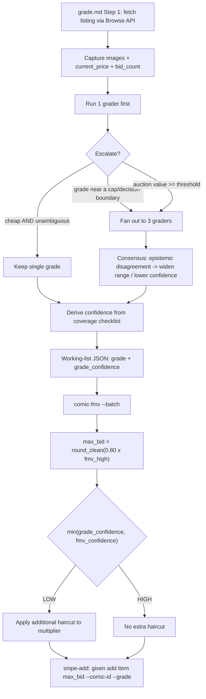

# feat: Comic Photo Grader Accuracy and Efficiency

## Summary

Upgrade the comic photo grader (`.claude/commands/comic/grade.md`) on three fronts surfaced by BUI-51: stop printed cover credits from being mis-read as signatures and capping grades; derive grade **confidence** from photo *coverage* and carry it downstream so the bid cap is haircut when photos are thin; and **value-gate** how many grader sub-agents fan out so cheap lots don't burn 3 agents each.

Most of the work is skill-prose edits to `grade.md`. The load-bearing exception is the confidence haircut, which requires a real change to the `comic-fmv` CLI (`apps/fmv`) where `max_bid = 0.80 × fmv_high` is computed — without it the new confidence field is inert (the actual BUI-51 #2 bug). Phase 1 closes the ticket; Phase 2 carries the stretch set in the same doc, sequenced but not executed by default.

---

## Problem Frame

A June 2026 qualitycomix seller scan (8 ungraded listings) exposed three grader failures, all documented in the origin requirements doc (see origin: `docs/brainstorms/2026-06-03-comic-grader-accuracy-efficiency-requirements.md`):

1. **Printed credits read as signatures.** All 3 graders capped X-Men #24 (1993) at 9.0 over printed creator credits in the cover art. CGC's defect taxonomy treats *Writing* / *Name Written on Cover* as **post-print substance defects**; printed cover elements are not defects at all.
2. **Two photos is a structural ceiling, ignored.** Listings had exactly 2 photos, yet graders returned point-precise grades that FMV then treated identically to a 6-photo assessment. The defects that separate high grades (raking-light spine stress, centerfold attachment, page-edge brittleness) are un-assessable from 2 cover photos.
3. **24 agents for 8 comics.** The skill always fans out 3 graders per comic regardless of value or certainty.

**Organizing principle (origin):** *value-gated balance* — the auction's dollar value governs both fan-out count and grade precision. One knob.

---

## Requirements Traceability

Phase 1 (closes BUI-51):
- **R1–R4** → U1 (print-layer rule; ambiguity defaults to no-cap)
- **R5–R7, R9** → U2 (coverage-based confidence + range output; epistemic-disagreement consensus)
- **R13** → U3 (auction price captured at grade time — prerequisite for U4/U5)
- **R10–R12** → U4 (value-gated escalation)
- **R8** → U5 (confidence consumed by the bid cap — the integration centerpiece)

Phase 2 (stretch):
- **R14** → U6 (seller-grade-as-prior)
- **R15** → U7 (structured defect extraction)
- **R16** → U8 (decision-sensitivity gating)
- **R17** → U9 (batch cheap lots)
- **R18** → U10 (triage pre-pass)

---

## Key Technical Decisions

**KTD1 — The haircut lives in the `comic-fmv` CLI, not the skill.** Both `fmv.md` (line ~180) and `snipe-add.md` compute `max_bid = 80% × FMV high`, but the authoritative computation that `/comic:buy` actually runs is `round_clean(0.80 × fmv_high)` inside `apps/fmv` (`fmv_runner.py`). The confidence haircut must modify that multiplier there; changing only the skill prose would leave the real bid-cap math untouched. *(Confirmed in synthesis — CLI is in scope.)*

**KTD2 — Grade-confidence and `fmv_confidence` stay separate axes.** FMV already emits `fmv_confidence` derived from comp count + CV (comp-data quality). The new grade-confidence measures *photo coverage* (grade certainty). They are orthogonal. The plan keeps them as **separate fields** and the max-bid haircut takes the **more conservative** of the two, rather than collapsing them into one number. This avoids a thin-photo guess on deep comp data (or vice versa) hiding behind a single averaged label.

**KTD3 — Confidence threads through the existing `--batch` envelope.** The grade→FMV handoff is the working-list JSON `[{item_id, title, issue, year, grade, ...}]`. Grade-confidence rides as a **new optional field** on this envelope (e.g. a `grade_confidence` string `high|medium|low`). Per the `fmv-bid-linkage-gap` learning, the CLI flag/field and the request model must be defined in the **same change** or the handoff fails silently. The field is optional and absent-means-`high` so already-graded comics (which skip `grade.md`) and manual runs are unaffected.

**KTD4 — Confidence is capped by coverage, not clamped by count.** A 2-cover-photo listing can never exceed `MEDIUM-LOW` regardless of how clean the visible surfaces look (R6), because the grade-separating defects are structurally invisible. Confidence is derived from a coverage checklist (which *views* are present), not from `len(images)`.

**KTD5 — Ambiguity defaults to no-cap (R4).** The BUI-51 failure was a false *positive* (real print mis-capped). When the grader cannot tell print-layer from post-print, it must default to **not** capping and flag the uncertainty — the safe direction is the opposite of today's behavior.

**KTD6 — Confidence stays in the handoff envelope, not a new DB column.** Per the `stub-fmv-null` / `case-mismatch` learnings, minting new persisted FMV-row attributes keyed on `(locg_id, grade)` is brittle. Grade-confidence influences the computed `max_bid` and is surfaced in skill output, but is **not** added to the `fmv`/`comics` tables in Phase 1. If it ever needs to reach the dashboard, it goes through the shared `_COMICS_AGGREGATES` constant with sibling-endpoint parity (deferred — see Scope Boundaries).

---

## High-Level Technical Design

**Value-gated escalation (U4) + confidence flow (U2 → U5):**

*Directional guidance, not implementation specification.* The two confidence axes (KTD2) converge only at the haircut step (L); everywhere upstream they travel as independent labels.

---

## Implementation Units

### U1. Print-layer rule in the grader prompt

- **Goal:** Printed cover elements (creator credits, facsimile signatures, barcodes, price boxes, cover-art text, logos) never count as defects; only post-print marks (pen/marker/pencil/post-print stamps/stickers) do. Closes BUI-51 #1.
- **Requirements:** R1, R2, R3, R4
- **Dependencies:** none
- **Files:** `.claude/commands/comic/grade.md`
- **Approach:** Replace the existing `WRITING RULE` block (and tighten the `GRADE-CAPPING DEFECTS` section) with a generalized print-layer rule. Give the grader CGC's discriminating test (print-layer = identical across copies, no paper indentation, ink/45°-reflection matches adjacent print; authentic = pressure groove, variable ink density, darker stroke crossings). State grade impact per KTD5: printed/facsimile = zero effect; authentic post-print autograph = substance defect; **ambiguous = default to no-cap + flag in PHOTO LIMITATIONS**. Add a line to the `OUTPUT FORMAT` so a signature observation states "print-layer / post-print / uncertain".
- **Patterns to follow:** mirror the existing prose style of the `WRITING RULE` and `GRADE-CAPPING DEFECTS` blocks in `grade.md`; cite CGC sources from the origin doc's Reference section.
- **Test scenarios:** *(skill-prose unit — no executable assertions)*
  - Covers AE for BUI-51 #1: a grader prompt fed a 1993-era cover with printed creator credits returns no signature cap and no grade reduction.
  - An ambiguous ink mark with no visible pressure groove is treated as print-layer (no cap) and flagged uncertain, not capped.
  - A clear post-print marker autograph on the cover is still recorded as a substance defect.
  - `Test expectation: manual prompt-eval against the qualitycomix X-Men #24 listing` — verify by re-running the grader, not by unit test.

### U2. Coverage-based confidence + range output

- **Goal:** Derive grade confidence from which photo *views* are present (not image count), emit it as a first-class field plus an optional grade range; lower confidence on epistemic (missing-view) consensus disagreement. Closes BUI-51 #2 at the grader.
- **Requirements:** R5, R6, R7, R9
- **Dependencies:** none (independent of U1)
- **Files:** `.claude/commands/comic/grade.md`
- **Approach:** Replace any image-count heuristic with a **coverage checklist** (front / back / spine straight / spine raking / four corners / staples close-up / interior-centerfold / page-edge) mapped to the view→defect table from research. Derive `CONFIDENCE: HIGH|MEDIUM|LOW` anchored to coverage: missing the views that reveal grade-separating defects caps confidence; a 2-cover-photo listing caps at MEDIUM-LOW (KTD4). Add `CONFIDENCE` and optional `GRADE RANGE` (e.g. `5.0–6.0`) to the `OUTPUT FORMAT`. Update the Step 3 consensus rules: when graders diverge because of *missing views* rather than a *named defect*, widen the range / lower confidence instead of taking the median (extends the existing outlier-handling logic).
- **Patterns to follow:** the existing `OUTPUT FORMAT` and `Step 3: Synthesize Consensus` sections in `grade.md`.
- **Test scenarios:** *(skill-prose unit)*
  - Covers AE for BUI-51 #2: a 2-photo (front+back) listing never returns HIGH; output carries a MEDIUM-LOW or lower confidence and a range.
  - Two photos both of the front cover score *lower* coverage than front+back (coverage, not count, drives it).
  - Three graders split 4.5/5.0/5.0 with no named defect → consensus widens range / lowers confidence rather than silently emitting 5.0.
  - `Test expectation: manual prompt-eval` — verify output-format contract by inspection.

### U3. Capture auction price at grade time (R13 prerequisite)

- **Goal:** Make the auction's current price and bid count available to the grader so the value gate (U4) and the downstream haircut have a value signal. The grader runs before FMV and has no price today.
- **Requirements:** R13
- **Dependencies:** none
- **Files:** `.claude/commands/comic/grade.md` (Step 1 download script + Step 2 dispatch prose)
- **Approach:** `apps/ebay/src/ebay_fetch.py`'s `get_item_by_legacy_id` path already returns `current_price` (from `currentBidPrice` for auctions) and `bid_count`. The grade.md Step 1 script currently captures only `title` + `image_count`; extend the `download_listing` return to also capture `current_price` and `bid_count`, and record them in the per-comic working set. Surface the value to the grader dispatch so U4 can branch on it. No change to `ebay_fetch.py` itself — the fields are already in the response.
- **Patterns to follow:** the existing Step 1 `download_listing` function in `grade.md`; the price-extraction fields in `apps/ebay/src/ebay_fetch.py` (`current_price`, `bid_count`).
- **Test scenarios:** *(skill-prose + inline script unit)*
  - The Step 1 script, given an auction item, captures a non-null `current_price` and `bid_count`.
  - A fixed-price (BIN) item yields a `current_price` and `bid_count: null` without erroring.
  - `Test expectation: smoke-run the Step 1 snippet against one live auction item id` — verify the captured fields print.

### U4. Value-gated escalation

- **Goal:** Default to 1 grader; fan out to 3 only when the first grade is near a decision boundary OR the auction value clears a threshold. State per comic what ran and why. Closes BUI-51 #3.
- **Requirements:** R10, R11, R12
- **Dependencies:** U2 (needs first-grade + confidence), U3 (needs price)
- **Files:** `.claude/commands/comic/grade.md` (Step 2 dispatch section)
- **Approach:** Rewrite Step 2 from "always dispatch 3" to a two-stage gate: run **1 grader**, then escalate to the full panel when **(a)** the grade is ambiguous / sits within a small band of a grade-capping threshold, or **(b)** `current_price` (or a value proxy) ≥ a stated threshold. Define the threshold and the boundary band explicitly in the skill prose (planning leaves the exact dollar/band values as tunable constants stated in the doc; see Deferred). Add a required per-comic line to the output stating "1 grader" vs "3 graders" and the trigger — no silent coverage caps (R12, and the `no-silent-caps` quality bar).
- **Patterns to follow:** existing Step 2 parallel-dispatch prose; the `Common Mistakes` table (update the "Running graders sequentially" / "18 parallel calls" rows, which now describe only the escalated path).
- **Test scenarios:** *(skill-prose unit)*
  - A sub-threshold, unambiguous first grade stays at 1 grader and says so.
  - A first grade adjacent to a cap threshold escalates to 3.
  - A high-value auction escalates to 3 regardless of first-grade certainty.
  - Output always states grader count + reason per comic.
  - `Test expectation: manual prompt-eval` across a cheap-clear, cheap-ambiguous, and high-value case.

### U5. Bid cap consumes grade-confidence (integration centerpiece, R8)

- **Goal:** Make grade-confidence actually move the bid. A LOW grade-confidence haircuts the max bid below the standard `0.80 × fmv_high`; HIGH leaves it unchanged. Without this, U2's field is inert.
- **Requirements:** R8
- **Dependencies:** U2 (produces the confidence value)
- **Files:** `apps/fmv/` (`fmv_runner.py` or wherever `max_bid = round_clean(0.80 × fmv_high)` is computed — confirm exact module at implementation), `apps/fmv` `--batch` request model / row schema, `.claude/commands/comic/grade.md` (output → working-list field), `.claude/commands/comic/buy.md` (Step 2.5 → Step 3 envelope threading), `.claude/commands/comic/fmv.md` (document the new field + haircut), `.claude/commands/comic/snipe-add.md` (note the haircut origin). Test file: `apps/fmv/tests/` (mirror existing test layout).
- **Approach:**
  - Add an optional `grade_confidence` (`high|medium|low`, default `high`/absent) field to the `comic-fmv --batch` envelope and its parsed row model (KTD3 — field + model in one change).
  - In the max-bid computation, combine `grade_confidence` with the existing `fmv_confidence` by taking the **more conservative** (KTD2) and apply a discount to the `0.80` multiplier when that combined level is LOW (e.g. a lower multiplier; exact factor is a stated tunable — see Deferred). Round via the existing `round_clean`.
  - Thread the field from `grade.md` consensus output into the Step 2.5 working-list JSON, carried by `buy.md` into Step 3.
  - Document the haircut in `fmv.md` (output section) and `snipe-add.md` (Max Bid Formula note) so the displayed max bid is explained.
- **Patterns to follow:** the existing `--batch` row parsing and `fmv_confidence` handling in `apps/fmv`; the ID-chain threading already documented in `buy.md` Step 3 ("capture them now so Step 5 can thread them"); the `fmv-bid-linkage-gap` learning (define flag + model together).
- **Test scenarios:**
  - Happy path: a row with `grade_confidence: high` and `fmv_confidence: high` produces the unchanged `0.80 × fmv_high` max bid.
  - LOW grade-confidence + HIGH fmv-confidence → haircut applied (conservative axis wins).
  - HIGH grade-confidence + LOW fmv-confidence → haircut applied (existing comp-confidence path still bites).
  - Missing/absent `grade_confidence` defaults to `high` → no behavior change for already-graded or manual rows (back-compat).
  - Edge: `fmv_high` null / `n=0` row (`comic_id: null`) is not haircut-crashed — passes through as today.
  - `round_clean` still yields a clean number after the haircut multiplier.
  - `Test expectation: unit tests in apps/fmv/tests` — this is the one unit with real assertions.

---

## Phase 2 — Stretch Units (sequenced, not executed by default)

These advance accuracy/efficiency beyond the ticket. They land after Phase 1 is verified. C2 (U8) is sequenced last for its FMV-in-loop coupling.

### U6. Seller-grade-as-prior

- **Goal:** Use the seller's stated grade as an anchor the grader must argue away from, not a passive note. R14.
- **Dependencies:** U2
- **Files:** `.claude/commands/comic/grade.md`
- **Approach:** The skill already retrieves the title grade. Feed it into the grader prompt with: if the assessment lands ≥2 grades off the seller's claim, justify the gap with a named defect.
- **Test scenarios:** *(skill-prose)* a 2-grade gap with no named defect is flagged for re-examination; a justified gap (named defect) passes. `Test expectation: manual prompt-eval`.

### U7. Structured defect extraction before grading

- **Goal:** Enumerate defects per zone before naming a number; map defects→grade. Reduces vibe-grading; reinforces U1. R15.
- **Dependencies:** U1
- **Files:** `.claude/commands/comic/grade.md`
- **Approach:** Add a procedure step requiring a per-zone defect list (and an explicit "print-layer or post-print?" classification per observed mark) prior to the grade line; map the enumerated defects to the cap logic.
- **Test scenarios:** *(skill-prose)* output includes a per-zone defect enumeration that the grade rationale references. `Test expectation: manual prompt-eval`.

### U8. Decision-sensitivity gating

- **Goal:** Stop grading where the grade doesn't change the buy — if FMV reaches the same buy/no-buy and bid cap at both ends of the plausible range, don't escalate. R16.
- **Dependencies:** U4, U5 (needs the value gate and the confidence→cap path)
- **Files:** `.claude/commands/comic/grade.md`, `.claude/commands/comic/buy.md` (orchestration note)
- **Approach:** Extend U4's gate: when the plausible grade range maps to the same decision after FMV, skip further graders. Couples grading to FMV in the loop — the most invasive change; sequenced last.
- **Test scenarios:** *(skill-prose + orchestration)* a book whose range doesn't move the decision stops at 1 grader; one that does escalates. `Test expectation: manual prompt-eval`.

### U9. Batch cheap lots into one agent

- **Goal:** For sub-threshold books, grade several in one agent context instead of 3-per-book. R17.
- **Dependencies:** U4
- **Files:** `.claude/commands/comic/grade.md`
- **Approach:** Add a dispatch branch: below the value threshold, batch N cheap books into a single grader call; trade cross-agent independence (low value at that price) for token savings.
- **Test scenarios:** *(skill-prose)* multiple cheap lots produce one grader dispatch with per-book grades; independence note stated. `Test expectation: manual prompt-eval`.

### U10. Triage pre-pass

- **Goal:** A cheap first agent answers "is this even worth grading?" (obvious beater, blurry/insufficient photos, not actually on the wish list) before expensive grading. R18.
- **Dependencies:** none (independent; pairs well with U4)
- **Files:** `.claude/commands/comic/grade.md`
- **Approach:** Add an optional triage step that kills no-hopers before fan-out.
- **Test scenarios:** *(skill-prose)* an obvious beater / unusable-photo listing is dropped pre-grade with a reason. `Test expectation: manual prompt-eval`.

---

## Scope Boundaries

**In scope:** Phase 1 (U1–U5) closes BUI-51. Phase 2 (U6–U10) is in this doc, sequenced after Phase 1.

**Non-goals:**
- The Heritage/Overstreet numeric scale and per-grade criteria already embedded in `grade.md` are not changed — only the print-layer, coverage, value-gate, and confidence-handoff logic.
- Witnessed CGC Signature Series / authenticated-autograph workflows — irrelevant to raw photo grading for bidding.
- No general "grading guidelines" knowledge base — the embedded criteria already cover the scale.
- No change to `apps/ebay/src/ebay_fetch.py` — the price fields it returns already exist; U3 only captures them.

### Deferred to Follow-Up Work
- **Surfacing grade-confidence on the `/comics` dashboard.** Per KTD6 and the `plugin-owned-read-endpoints` / `purged-snipes-shown-as-won` learnings, if confidence ever reaches a read endpoint it must go through the shared `_COMICS_AGGREGATES` constant with identical WHERE filters across `/api/comics/snipes` and `/api/comics/history` (tombstone filter `status NOT IN ('PURGED','REMOVED')`). Not needed for the bid-cap haircut; deferred.
- **Persisting grade-confidence as an FMV-row column.** Deferred to avoid the `(locg_id, grade)` keying / case-mismatch duplicate-stub traps. Confidence stays in the handoff envelope for now.
- **Tuning the haircut factor and value/boundary thresholds.** The plan states them as named tunable constants; empirical tuning against a real seller scan is follow-up.

---

## Risks & Dependencies

- **R8 silent-failure risk (high).** Per the `fmv-bid-linkage-gap` learning, a skill doc that references a CLI flag the CLI doesn't define fails silently (Click rejects unknown options, the run falls back without them, the bid records unlinked/un-haircut). **Mitigation:** U5 defines the `grade_confidence` envelope field and the parsing model in the *same* change; verify FMV state via `GET /api/comics/snipes`, never the `POST /api/comics` response (`stub-fmv-null` learning).
- **Confidence-axis confusion (medium).** Two `*_confidence` concepts now exist. **Mitigation:** KTD2 keeps them separate and named distinctly (`fmv_confidence` vs `grade_confidence`); the haircut takes the conservative min; `fmv.md`/`snipe-add.md` docs explain which is which.
- **Back-compat (medium).** Already-graded comics and manual FMV runs never set `grade_confidence`. **Mitigation:** field is optional, absent ⇒ `high` ⇒ no behavior change (U5 test scenario).
- **Prerequisite ordering.** U4 and U5 depend on U2/U3; U8 depends on U4/U5. U1 and U2 are independent and can land first as the highest-certainty wins.

---

## System-Wide Impact

- **`/comic:buy` orchestration:** Step 2.5 (grade) now emits `grade_confidence` into the Step 3 working list; Step 4's displayed max bid may be lower than `0.80 × fmv_high` and must be explained. `buy.md` Step 2.5/3/4 prose updates land in U5.
- **`comic-fmv` CLI consumers:** any caller of `--batch` keeps working (new field optional). The human FMV table / `--out` JSON gains a haircut explanation.
- **No DB schema change** in Phase 1 (KTD6).

---

## Sources & Research

- Origin requirements: `docs/brainstorms/2026-06-03-comic-grader-accuracy-efficiency-requirements.md` (CGC grading sources captured there).
- Learnings applied: `docs/solutions/fmv-bid-linkage-gap-2026-05-23.md` (define flag+model together; verify via `/api/comics/snipes`), `docs/solutions/best-practices/plugin-owned-read-endpoints-cross-repo-2026-05-19.md` (shared aggregates constant), `docs/solutions/ui-bugs/purged-snipes-shown-as-won-2026-06-01.md` (endpoint parity + tombstone filter), `docs/solutions/database-issues/stub-fmv-null-after-extract-comics-2026-05-23.md` (linkage fragility).
- Code grounding: `apps/fmv` max-bid computation (`max_bid = round_clean(0.80 × fmv_high)`), existing `fmv_confidence` rubric in `fmv.md` Step 8, price fields (`current_price`, `bid_count`) in `apps/ebay/src/ebay_fetch.py`, handoff envelope in `buy.md` Step 3.
- No prior `docs/solutions/` learning exists for grader prompt design / multi-agent dispatch — capture with `/ce-compound` after this lands.
