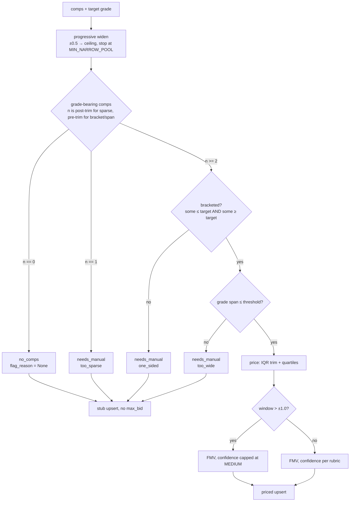

# feat: Honest handling of thin FMV comp pools (BUI-86)

## Summary

Replace `comic-fmv`'s fixed ±0.5→±1.0 grade-window fallback with progressive widening up to a ceiling, gated by honesty guards. A book whose sold comps are one-sided (all above or all below the target grade), grade-smeared (span too wide), or too sparse is flagged `needs_manual` — no bid-able number — instead of emitting a confidently-wrong FMV. Priceable-but-widened pools cap at MEDIUM confidence. A `--grade-window` flag exposes the widen ceiling. The flagged state is made legible through a field on the `comic-fmv` output and a `fmv_notes` token; it reuses the existing stub-upsert rails so the comic stays linked.

---

## Problem Frame

`fmv_math.build_pool()` filters sold comps to ±0.5 grade points, widening once to ±1.0 only when the narrow pool has fewer than 5 comps. The window used never affects the confidence label, and the n=0 / n≥1 branching gives exactly two output states (priced or no-comps). For books that sell mainly in grade tiers far from the target this produces either an empty pool or — worse — a non-empty pool whose median is meaningless.

Two distinct failure shapes from the 2026-06-03 session (see origin: `docs/brainstorms/2026-06-03-fmv-thin-comp-pool-requirements.md`):

- **Bracketed-but-smeared** — Iron Man #124, target 7.0, comps at 4.0/5.0/9.0/9.0/9.4/9.6. The target is bracketed, but a ±2.0 pool spans 4 grade points and its median is noise because price is monotonic in grade.
- **One-sided** — FF #63, target 9.6, all comps ≤ 9.0. Widening only reaches downward into cheaper sales, dragging the NM+ estimate *below* the 9.0 comps — the opposite of the truth.

The output feeds a real-money bid cap, so a wrong FMV is worse than a missing one. Today's workaround (patch `WIDE_GRADE_WINDOW` 1.0→2.0, reinstall, run, restore, reinstall) is a two-reinstall cycle that, even when it produces a number, produces the untrustworthy kind.

---

## Requirements

**Pool building (origin R1–R3)**

- R1. `build_pool()` widens progressively (±0.5 → ±1.0 → … → ceiling) and stops as soon as the minimum priceable pool size is reached, rather than the current single ±0.5→±1.0 step.
- R2. The window actually used is returned to the caller and surfaced in `fmv_notes`.
- R3. Comps with no parsed grade are dropped from the pool; the guards (R4) are evaluated only over grade-bearing comps.

**Pricing guards / flag-for-manual (origin R4–R6)**

- R4. After widening to the ceiling, a pool is classified `needs_manual` when any of: (a) all comps fall strictly above OR strictly below the target (one-sided / not bracketed), (b) the pool's grade-span exceeds the spread threshold, (c) the pool is too sparse to compute a defensible range.
- R5. A `needs_manual` book emits no bid-able number (`fmv_low`/`fmv_high`/`median`/`max_bid` absent) and carries a machine-readable reason distinguishing `one_sided` / `too_wide` / `too_sparse`.
- R6. A priceable pool (bracketed, bounded span, enough comps) produces an FMV as today.

**Output & confidence (origin R7–R9)**

- R7. An FMV built at a window wider than ±1.0 is capped at MEDIUM confidence regardless of comp count.
- R8. `fmv_notes` records the window used and the pool grade-span; for flagged books it records the flag reason as a token.
- R9. The `comic-fmv` human table and JSON output distinguish priced books, `needs_manual` books, and no-comps books at a glance.

**CLI flag (origin R10–R11)**

- R10. `comic-fmv` accepts `--grade-window <float>` setting the maximum auto-widen ceiling, threaded through to `build_pool()`.
- R11. `--grade-window` does not bypass the R4 guards — a guarded book stays flagged even at the widened ceiling.

**Downstream behavior (origin R12–R13)**

- R12. A flagged book reuses the existing stub-upsert path: comics row + stub fmv row written, `comic_id` returned, no `max_bid`.
- R13. snipe-add skips a flagged book; `/comic:buy`'s Step 3/4 gate surfaces it as needs-manual using the new output marker (not the existing `comic_id: null` heuristic, which a flagged book — with a real `comic_id` — would slip past).

---

## Key Technical Decisions

- **Flag legibility via output field + notes token, no schema change.** The `compute_fmv` output dict gains `flag_reason` (`one_sided` / `too_wide` / `too_sparse` / `None`) and the persisted `fmv_notes` gains a `manual_review=<reason>` token. The `comic-fmv` output JSON is consumed by `/comic:buy`, which we control, so the buy-flow gate reads the field directly. A dedicated DB column and a distinct `/comic:verify` verdict are **deferred** (see Scope Boundaries) — until then a flagged book classifies as the existing `fmv_stub` verdict in verify, same as a never-filled stub. (See origin Key Decisions; research confirmed reusing the null-pricing stub alone makes flagged-manual indistinguishable from no-comps and from the legacy null-stub bug at four touchpoints.)

- **Thinness rides the comp-pool confidence axis, not the photo-grade axis.** The one-sided / smeared / sparse signal is a comp-pool-quality property, so it stays on `fmv_confidence` and leaves `grade_confidence` (photo coverage) and `bid_factor()`'s conservative `min` untouched. (BUI-51 orthogonal-axes design — see `docs/solutions/architecture-patterns/grade-confidence-haircut-and-print-layer-rule-2026-06-03.md`.)

- **Three priceability outcomes, explicit in the result dict.** `n == 0` → no-comps (existing stub, `flag_reason=None`); `needs_manual` → flagged (stub written, `flag_reason` set); otherwise priced. The two-state `fmv_low is None` branch in `_print_table` is replaced by a three-way branch on `flag_reason` then `fmv_low`.

- **Two distinct pool-size constants — do not conflate.** `MIN_NARROW_POOL` (existing, = 5) is the **widen-stop target**: `build_pool` keeps widening until it has ≥ 5 grade-bearing comps or hits the ceiling. `MIN_PRICEABLE_POOL` (new, = 2) is the **sparse-flag floor**: after widening *and* IQR-trim, a book with fewer than 2 trimmed comps flags `too_sparse`. They govern different decisions (when to stop reaching vs. when there's too little to price) and keep different values. Other tunable constants: widen ceiling ±2.0 (`MAX_GRADE_WINDOW`), step 0.5 (`GRADE_WINDOW_STEP`, giving ±0.5→±1.0→±1.5→±2.0), too-wide span > 2.0 grade points (`MAX_GRADE_SPAN`). `WIDE_GRADE_WINDOW` (= 1.0) is retained as the confidence-cap boundary (see R7). All adopted from the origin's proposed defaults; a lone single comp (n==1 after trim) now flags `too_sparse` rather than emitting a point estimate — the one behavior change to existing priced output.

- **`build_pool` returns comps, not just prices; guard/trim ordering is fixed.** The one-sided and span guards need comp grades, which the current `(prices, window)` return discards. `build_pool` returns the selected comp dicts (carrying grade) plus the window. `compute_fmv` then evaluates in a fixed order: compute `one_sided` and `too_wide` on the **untrimmed** grade-bearing pool (span is a grade-coverage property, not a price-outlier one), IQR-trim the prices, then evaluate `too_sparse` on the **post-trim** count. All callers update for the new return shape.

- **Grade coercion precedes the guards.** Coercion already runs in `fmv_runner._compute_and_upsert_one` before `compute_fmv` is called, so the guards see a numeric target. No reordering needed, but the sparse guard must not be reached with a string target (which would masquerade as n=0). Verified safe by the existing coercion guard; called out so it isn't regressed.

---

## High-Level Technical Design

Priceability decision over the widened pool:

Both flagged and no-comps books travel the stub-upsert rails (no `max_bid`); only `flag_reason` and the `fmv_notes` token distinguish them downstream.

---

## Implementation Units

### U1. Progressive widening + priceability guards in `fmv_math`

- **Goal:** Replace the fixed two-step widen with progressive widening, add the one-sided / too-wide / too-sparse guards, return a flag reason, and cap confidence for wide windows.
- **Requirements:** R1, R3, R4, R5, R6, R7
- **Dependencies:** none
- **Files:** `apps/fmv/src/fmv_math.py`, `apps/fmv/tests/test_fmv_math.py`
- **Approach:**
  - Add constants: `MAX_GRADE_WINDOW = 2.0`, `GRADE_WINDOW_STEP = 0.5`, `MAX_GRADE_SPAN = 2.0`, `MIN_PRICEABLE_POOL = 2`. Retain `DEFAULT_GRADE_WINDOW` (= 0.5, widen start), `WIDE_GRADE_WINDOW` (= 1.0, confidence-cap boundary per R7), and `MIN_NARROW_POOL` (= 5, widen-stop target). See the KTD on the two distinct pool-size constants.
  - `build_pool(comps, target_grade, max_window=MAX_GRADE_WINDOW)` widens from `DEFAULT_GRADE_WINDOW` in `GRADE_WINDOW_STEP` increments up to `max_window`, stopping at the first window whose grade-bearing comp count ≥ `MIN_NARROW_POOL` (the existing "enough at narrow" early-out, now generalized past ±1.0). Return the selected comp dicts (with grade) and the window used.
  - In `compute_fmv`, evaluate guards in this fixed order over the `build_pool` output: (1) `one_sided` — not bracketed, where bracketed = `any(g <= target) and any(g >= target)` over the **untrimmed** pool grades; (2) `too_wide` — `grade_span = max(g) - min(g) > MAX_GRADE_SPAN` over the **untrimmed** pool; then IQR-trim the prices and (3) `too_sparse` — `0 < trimmed_n < MIN_PRICEABLE_POOL`. Precedence when more than one applies: `too_sparse` → `one_sided` → `too_wide`.
  - When `flag_reason` is set: return `fmv_low=fmv_high=median=max_bid=None`, the reason, `grade_span`, and **force `confidence` to LOW** (so `_confidence_to_db_label` persists `low` regardless of pool count/CV — without this, a dense one-sided pool would label HIGH and contradict the U3 stub-upsert assertion). Priceability is derived downstream from `flag_reason is not None`; do not add a separate `priceable` field. When *not* flagged and `window > WIDE_GRADE_WINDOW`, cap `confidence` at MEDIUM (`_CONF_RANK`-aware min with MEDIUM).
  - Extend the output dict with `flag_reason: str | None` and `grade_span: float | None`; keep all existing keys.
- **Patterns to follow:** existing `confidence_label` / `_CONF_RANK` ranking; the inclusive-quantile note at the top of the module; constant-driven thresholds mirror `DEFAULT_GRADE_WINDOW` style.
- **Test scenarios** (`test_fmv_math.py`, extend `TestBuildPool` / `TestComputeFmv`):
  - Covers AE3. Progressive widen: thin at ±0.5, enough at ±1.5 → priced, `window == 1.5`, confidence capped at MEDIUM, `grade_span` recorded.
  - Covers AE1. One-sided: target 9.6, comps all ≤ 9.0 even at ceiling → `flag_reason == "one_sided"`, `fmv_low is None`, `max_bid is None`.
  - Covers AE2. Bracketed-but-smeared: target 7.0, pool 5.0/9.0/9.0 (span 4.0) → `flag_reason == "too_wide"`, not priced.
  - Too-sparse: single lone comp after widen → `flag_reason == "too_sparse"`, not priced (regression of old n==1 point estimate — assert it no longer prices).
  - Guard precedence: a single comp (n==1) that is also one-sided → `flag_reason == "too_sparse"` (not `one_sided`), exercising the documented sparse-first order so an inverted condition can't pass on the single-guard tests alone.
  - No-comps: empty → `n == 0`, `flag_reason is None`, `fmv_low is None` (existing `test_no_pool` updated for the new key).
  - Priceable narrow dense pool unchanged: `window == 0.5`, confidence may be HIGH, `flag_reason is None`.
  - Confidence cap boundary: a dense pool that would score HIGH but was built at ±1.5 → confidence == MEDIUM; same pool at ±0.5 → HIGH (guards the `> WIDE_GRADE_WINDOW` boundary, not `>=`).
  - `build_pool` return shape: returns comp dicts carrying grade plus window (not bare prices).
- **Verification:** `cd apps/fmv && uv run pytest tests/test_fmv_math.py` green; the two ticket examples (FF #63 one-sided, Iron Man #124 smeared) both flag rather than price.

### U2. `--grade-window` ceiling flag through CLI → runner → math

- **Goal:** Let the operator raise/lower the auto-widen ceiling without patching source, without bypassing the guards.
- **Requirements:** R10, R11
- **Dependencies:** U1
- **Files:** `apps/fmv/src/fmv_cli.py`, `apps/fmv/src/fmv_runner.py`, `apps/fmv/tests/test_fmv_runner.py`
- **Approach:** Add a `--grade-window` Click option (float, default `None` → use `MAX_GRADE_WINDOW`) to `cli`. Thread it through `fmv_runner.run(...)` → `_compute_and_upsert_one` → `compute_fmv(..., max_window=...)` → `build_pool`. The ceiling only changes how far widening reaches; the guard evaluation in U1 is unchanged, so a one-sided book at a higher ceiling stays flagged.
- **Patterns to follow:** existing option plumbing for `--max-age-days` / `--force` in `fmv_cli.py` and the keyword-only `run(...)` signature in `fmv_runner.py`.
- **Test scenarios** (`test_fmv_runner.py`):
  - Covers AE4. `--grade-window 2.5` on a one-sided book → still flagged `one_sided` (ceiling did not manufacture a price).
  - Default (flag omitted) → widen ceiling is `MAX_GRADE_WINDOW`; a book priceable only at ±1.5 still prices.
  - A lower ceiling (`--grade-window 0.5`) → a book that is sparse at ±0.5 and would have reached `MIN_NARROW_POOL` only by widening to ±1.0 cannot widen past 0.5, so it flags `too_sparse` instead. (A book already dense at ±0.5 still prices at ±0.5 — the ceiling only caps reach, it doesn't force a flag.)
- **Verification:** `comic-fmv --help` shows the flag; runner tests green; passing the flag changes the ceiling reached, never the guard outcome.

### U3. Runner persistence, table, and JSON output for the flagged state

- **Goal:** Persist the flag via the stub path + notes token, and render the three states distinctly in the human table and the `--out` JSON.
- **Requirements:** R2, R8, R9, R12, R13
- **Dependencies:** U1
- **Files:** `apps/fmv/src/fmv_runner.py`, `apps/fmv/tests/test_fmv_runner.py`
- **Approach:**
  - `_build_notes`: append `manual_review=<flag_reason>` when set; always include `window=±<w>` (existing) and add `span=<grade_span>` when present.
  - `_upsert_fmv`: unchanged POST shape — a flagged book already posts `fmv_low/high=None` like the n=0 stub, carrying real `locg_id` + canonical title so the comic stays resolvable (see `docs/solutions/database-issues/fmv-stub-row-case-mismatch-2026-05-23.md`). `fmv_comps` reflects the (un-priced) pool size; `fmv_confidence` is `low` because U1 forces the label to LOW for flagged books (so the 3-value DB CHECK is satisfied and a dense one-sided pool can't persist `high`).
  - `_print_table`: three-way branch — `flag_reason` set → `needs-manual (<reason>)`; else `fmv_low is None` → `n/a`; else the priced range. Add the reason to the row.
  - `_fmv_from_db_row`: add `flag_reason=None` and `grade_span=None` to the reconstructed dict so cached rows match the new shape (flagged books don't cache-hit — `_db_lookup` filters null `fmv_low` — but the shape must stay consistent).
  - Ensure the per-book result dict carried into `--out` JSON includes the `fmv.flag_reason` field for `/comic:buy` to read.
- **Patterns to follow:** the BUI-44 unconditional-upsert path and its tests (`TestComputeOne::test_upserts_stub_when_no_comps`); `_build_notes` substring assertions (`bid_haircut=...`).
- **Test scenarios** (`test_fmv_runner.py`):
  - Flagged book upserts a stub: POST body has `fmv_low None`, `fmv_comps` = pool size, `fmv_confidence "low"`, and `fmv_notes` contains `manual_review=one_sided`; `comic_id` returned.
  - `_build_notes` includes `manual_review=<reason>` and `span=<n>` for a flagged result; omits `manual_review` for a priced result.
  - `_print_table` renders `needs-manual (one_sided)` for a flagged row, `n/a` for a no-comps row, and a range for a priced row (assert the three differ).
  - `--out` JSON for a flagged book carries `fmv.flag_reason`.
  - `_fmv_from_db_row` output contains the new keys (no `KeyError` for downstream readers).
- **Verification:** flagged book writes a linked stub with the token; table and JSON show the three states distinctly; no `max_bid` emitted for flagged books.

### U4. Skill-doc updates for the new pool behavior and gate

- **Goal:** Bring `/comic:fmv` and `/comic:buy` docs in line with progressive widening, the flag states, the confidence cap, and the buy-flow gate change.
- **Requirements:** R9, R13
- **Dependencies:** U1, U2, U3
- **Files:** `.claude/commands/comic/fmv.md`, `.claude/commands/comic/buy.md`
- **Approach:**
  - `fmv.md` §3 "Build the comp pool": rewrite the "±0.5 then ±1.0" rule as progressive widen to the ceiling. §8 confidence rubric: add the "wide window (> ±1.0) caps at MEDIUM" rule and the three output states. Reconcile precedence with the existing interpolation / CGC-proxy escape hatches (§7/§7a) — state when a book flags `needs_manual` vs. uses those fallbacks. Update the Output and Save-to-DB sections and add a Common-Mistakes row for the flag token.
  - `buy.md` Step 3/4: replace/supplement the `comic_id: null` heuristic so a row with `fmv.flag_reason` set is surfaced as needs-manual and not auto-proposed a max bid; mirror the rubric/window edits.
- **Patterns to follow:** existing rubric wording shared between `fmv.md` and `buy.md`; keep the two in sync (they duplicate the rubric).
- **Test scenarios:** Test expectation: none — documentation only. Verification is a read-through that the docs match U1–U3 behavior and the two docs' duplicated rubric stays consistent.
- **Verification:** no contradictory ±1.0-only language remains; the buy-flow gate instructions reference the flag field, not just `comic_id: null`.

---

## Scope Boundaries

### Deferred to Follow-Up Work

- **Structured flag persistence + distinct verify verdict.** A dedicated DB column (or new allowed `fmv_confidence` value) plus a `needs_manual` verdict in `/comic:verify` and a distinct dashboard rendering, so an intentionally-flagged book is told apart from a never-filled stub (`fmv_stub`) and from the legacy accidental-null-stub bug. This work is notes-token-only for now; the structured column requires migrations in `plugins/gixen-overlay/src/gixen_overlay/db.py`, the `UpsertComicRequest` model, and the CHECK constraints. Worth a `/ce-compound` doc once landed, since current solutions treat null-FMV stubs only as a bug, not an intended state.
- **Grade-curve interpolation / extrapolation** (origin "Deferred for later", ticket option 4). A grade→price model that converts one-sided and smeared cases into real auto-priced numbers (interpolate 7.0 from a 5.0/9.0 bracket; extrapolate 9.6 above the 9.0 comps). The genuine fix for the cases this work flags; needs calibration. Flag-for-manual is the honest interim.

### Outside this work

- **Ungraded-comp fallback** (ticket option 3) — folding grade-unknown comps into a thin pool. Rejected: noisiest possible signal for a grade-precision problem.
- **`ebay-sold-comps` changes** — it has no grade-window logic; all windowing lives in `comic-fmv` / `fmv_math`. The `--grade-window` flag lands only in `comic-fmv`.

---

## Risks & Dependencies

- **Behavior change to existing priced output.** A lone single-comp pool (n==1) now flags `too_sparse` instead of emitting a point FMV. This is intentional (honesty principle) but will change output for some books that previously got a number; the tunable `MIN_PRICEABLE_POOL` constant lets it be relaxed if it over-flags.
- **`build_pool` return-shape change ripples to every caller.** `compute_fmv` and the `test_fmv_math` assertions read `window` positionally today; all must move to the new shape in U1 atomically or tests break.
- **Flagged books never cache-hit, so they re-bill comps every run.** Like n=0 stubs, a null-`fmv_low` flagged row is filtered out by `_db_lookup`, so a persistently one-sided/thin book re-fetches comps via `ebay-sold-comps` (a SerpApi call) on every `comic-fmv` run even when nothing has changed. This matches existing stub behavior and is accepted, but it is a real per-run cost for chronically-flagged books — `--force`-style recompute is effectively always on for them. Converting a flagged stub into a cache hit is part of the deferred structured-flag follow-up.
- **Doc duplication.** The confidence rubric and window behavior are duplicated across `fmv.md` and `buy.md`; U4 must edit both or they drift.

---

## Sources & Research

- `apps/fmv/src/fmv_math.py` — `build_pool` (lines 22–42), `compute_fmv` two-state branch (203–213), `confidence_label` / `_CONF_RANK` (81–116).
- `apps/fmv/src/fmv_runner.py` — `_compute_and_upsert_one` (219–278), `_upsert_fmv` POST body (292–304), `_build_notes` (334–343), `_fmv_from_db_row` (385–410), `_print_table` two-state branch (431–455), `_db_lookup` null-`fmv_low` filter (163–167), `_coerce_grade` (37–59).
- `apps/fmv/src/fmv_cli.py` — Click option plumbing pattern.
- `apps/fmv/tests/test_fmv_math.py`, `apps/fmv/tests/test_fmv_runner.py` — inline `_comp` / `_make_book` helpers, BUI-44 stub tests (`test_upserts_stub_when_no_comps`).
- `plugins/gixen-overlay/src/gixen_overlay/models.py` (`UpsertComicRequest`, 3-value `fmv_confidence` validator), `db.py` (`fmv` schema, `upsert_fmv` COALESCE), `routes.py` (`_verify_one` verdict ladder — `fmv_stub` is the BUI-44 state).
- `.claude/commands/comic/fmv.md` (§3 widen, §8 rubric, §7/§7a fallbacks), `.claude/commands/comic/buy.md` (Step 3/4 gate, `comic_id: null` heuristic).
- Learnings: `docs/solutions/architecture-patterns/grade-confidence-haircut-and-print-layer-rule-2026-06-03.md` (orthogonal confidence axes; define producer + consumer together), `docs/solutions/fmv-bid-linkage-gap-2026-05-23.md` (linkage chain, COALESCE), `docs/solutions/database-issues/stub-fmv-null-after-extract-comics-2026-05-23.md` (dashboard nulls FMV when any linked row is null; single stub row), `docs/solutions/database-issues/fmv-stub-row-case-mismatch-2026-05-23.md` (stub must carry non-null `locg_id` + canonical title).
- Linear BUI-86; origin `docs/brainstorms/2026-06-03-fmv-thin-comp-pool-requirements.md`.
- No FMV-side golden/eval fixture exists (the BUI-51 frozen baseline is grader-only); regression is new inline comp-pool cases in `test_fmv_math.py`.
