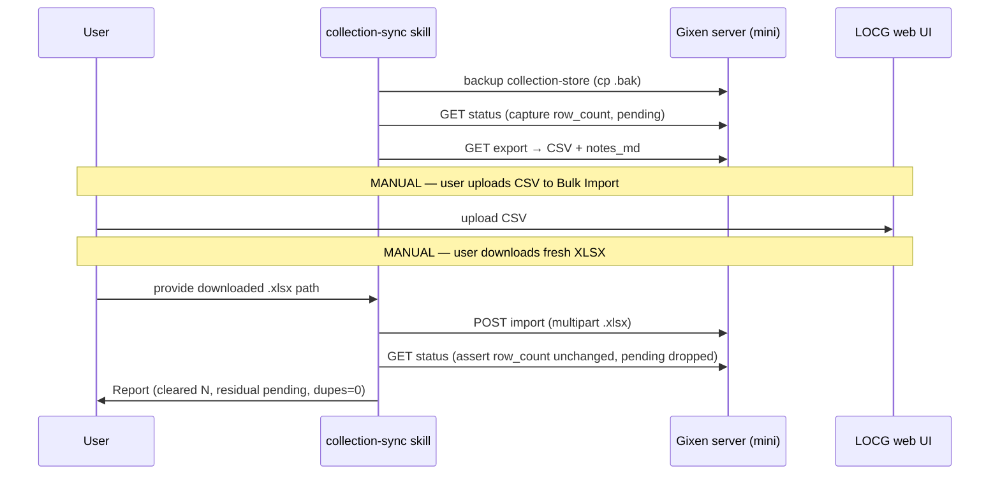

# feat: Safe first LOCG collection/wish-list sync (BUI-122)

## Summary

The documented LOCG collection/wish-list sync process has **never been run end-to-end**, and it predates the BUI-87/93 shift that made the **gixen server** (not `data/locg/`) the canonical store. A read-only dry-run against a copy of the real store (2405 comics, 51 pending, 69 local-only wish adds) confirmed the round-trip mostly works — pending clears, wish-list adds survive (BUI-47 is fixed) — **except** for one data-corruption failure mode: when LOCG rewrites a just-pushed row's Release Date to its own canonical value (which the empirically-validated recipe documents it doing), the re-import fails to match the original and **inserts a duplicate while leaving the original stuck pending forever** (dry-run Scenario B: +33 duplicate rows, 33 stuck).

This plan (1) fixes that import fragility by extending the existing **exact-year (not exact-date)** reconciliation to unflagged pending `agent_win` rows, (2) ships a new `/comic:collection-sync` skill that drives the full round-trip — including the import-back step that has no skill today — with a backup, a dry-run preview, and a post-import safety assertion, and (3) rewrites the stale process doc for the server-canonical architecture. The actual first real sync stays out of scope here: the user runs it via the new skill once the fix is proven safe, because the LOCG web upload/download steps are necessarily manual.

---

## Problem Frame

**Trigger.** 17 Marvel Tales issues (#223–239) plus ~52 other local-only adds sit on the server wish-list. Per the (stale) doc they were thought to be at risk of being wiped on the next `collection import`, prompting a first real sync. Verification showed that fear is unfounded (BUI-47 fixed) — but surfaced a real, different corruption risk in the collection-side merge.

**Current state (verified, read-only, against a copy of the real store):**
- Canonical store: Mac Mini `~/.gixen-server/collection-store/` (`collection.json` ~1.88 MB + rotating `.bak.0/1/2`, `wish-list.json`). Resolved by `plugins/gixen-overlay/src/gixen_overlay/routes.py::_ensure_collection_store`.
- 2405 comics; **51 pending** (44 ready + 7 `needs_manual_series_canonical`), all `source=agent_win`, `publisher_name=None`.
- Wish-list 577 items, **69 local-only** (no `series_name`), 17 of them Marvel Tales.

**Two failure modes the dry-run reproduced:**
1. **Date-canonicalization duplicate + stuck pending (the gate).** Phase-2 standard merge (`collection_io.py::import_xlsx`) matches on the exact `make_identity` tuple `(publisher, series, full_title, release_date)`. `_partial_identity` (rename detection) is also date-dependent. When LOCG returns a different Release Date for a just-pushed row, neither matches → the row inserts as a brand-new `locg_export` row and the original `agent_win` row never gets `pushed_to_locg_at` set, so it re-exports and re-uploads on every future cycle. The reconciliation heuristic that *would* tolerate this (`_reconcile_score`, exact-year) runs **only for flagged rows**.
2. **Pre-existing duplicate-identity rows (minor).** Two rows already in the real collection (`Thor #137`, `Uncanny X-Men #210`, blank publisher) share an identity tuple, so `identity_to_idx` maps the tuple to one index and the other never clears pending. Independent of the sync; cleaned up as a one-time guarded step.

**Why now.** No safe, repeatable runbook exists for the server-backed world, the import-back step has no skill, and the doc actively misleads (says `data/locg/` is canonical, says BUI-47 is an open gap).

---

## Goals & Non-Goals

**Goals**
- Make re-import reconcile a just-pushed win even when LOCG canonicalizes its Release Date — no duplicate, no stuck pending.
- Deliver a guarded, repeatable `/comic:collection-sync` skill covering the full round-trip incl. import-back and a post-import safety assertion.
- Replace the stale process doc with a server-backed runbook.
- Prove the fix safe by re-running both dry-run scenarios (Scenario B must converge to Scenario A: 0 duplicates).

**Non-Goals**
- Porting the collection to SQL. The merge stays in `collection_io.py`.
- Making name-only wish-list adds bulk-import to LOCG. They lack Series Name + Release Date and land as "Not Found" — non-destructive, since seller-scan/collection-check read the **server** wish-list, not LOCG. Documented as a known limitation, not fixed here.
- Automating the LOCG web upload/download (Playwright login + Bulk Import UI). These remain user-driven.
- **Executing the real first sync.** Out of scope; the user runs the new skill once the fix lands. (Origin AC "done on a backup/dry-run first" is satisfied by U1's regression tests + the re-run dry-run.)
- Closing BUI-46 (masthead-alias matcher gap). Untouched; its skipped test stays skipped.

---

## Key Technical Decisions

### KTD-1 — Reuse `_reconcile_score` (exact-year) for pending `agent_win` rows; do not invent new matching
The reconciliation heuristic already encodes exactly the tolerance needed: publisher match → normalized-series match → exact issue-token → **exact-year** Release Date (`collection_io.py:146-190`). The ±1-year tolerance was *deliberately* removed (volume-reboot false positives), so exact-year is the intended grain. The fix extends *which rows* get this treatment, not the scoring. **Rejected:** a date-agnostic identity match for pending wins (broader blast radius, would need its own ambiguity handling, more likely to regress the documented invariants).

### KTD-2 — Preserve Phase-2 exact-match primacy; only fall back to year-tolerance when the exact identity is absent
A naive "add pending `agent_win` rows to `flagged_indices`" would route every pending win through Phase-1 reconciliation *before* Phase 2, and reconciliation flags as `ambiguous` whenever ≥2 xlsx rows score >0 (`collection_io.py:363` — it never compares score magnitude). A win that would have matched cleanly by exact identity in Phase 2 could be left pending by a same-year variant in the export. So the fix must give an **exact identity hit precedence** and apply year-tolerant reconciliation only to pending `agent_win` rows whose exact identity does **not** appear in the export. Exact mechanics (extend the flagged set with an exact-match guard, vs. a dedicated tolerance pass that consumes the matching xlsx row before Phase-2 insertion) is an implementation-time choice — see Open Questions OQ-1.

### KTD-3 — Consume the matching xlsx row before Phase-2 inserts it
The duplicate appears because Phase 2 *inserts* the date-shifted LOCG row as new. The tolerant match must run early enough (or mark the xlsx row consumed) that Phase 2 skips it — mirroring how Phase-1 reconciliation consumes its matched row today (`collection_io.py:379-400`). A post-hoc de-dup after Phase 2 is rejected: it means detecting and merging an already-inserted duplicate, which is messier and risks the wrong merge.

### KTD-4 — Honor the documented duplicate-row policy on ambiguity
When a pending win year-matches multiple export rows (e.g., variant spread), leave it flagged/pending and emit `ambiguous_reconciliation` rather than guessing. A visible non-clear is the accepted failure mode; a silent wrong merge is not (collection-cache requirements). This is existing reconciliation behavior — the fix inherits it.

### KTD-5 — Post-import safety assertion lives in the skill, from `collection status`
`GET /api/comics/collection/status` already returns `row_count` and `pending_push_count`. The skill captures before/after and asserts `row_count` did not grow and `pending_push_count` dropped by the expected amount. No new endpoint or schema change. This catches a residual Scenario-B failure even if the fix is imperfect — defense in depth.

### KTD-6 — Fix lands in `import_xlsx`; both call sites inherit it
CLI `cmd_collection_import` and overlay `POST /api/comics/collection/import` both funnel through `import_xlsx`. The fix is one change; the overlay route and the workspace-imports canary are untouched. Overlay-side coverage (`plugins/gixen-overlay/tests/test_collection_api.py`) is a smoke check, not where the reconciliation logic is proven.

---

## High-Level Technical Design

Import merge today vs. with the fix (one pending `agent_win` win whose Release Date LOCG rewrote):

```mermaid
flowchart TD
    X[xlsx row from LOCG re-export\nseries+issue match, date canonicalized] --> P2{Phase 2: exact make_identity\n(pub, series, title, release_date)?}

    subgraph TODAY[Today — bug]
      P2 -->|no exact match\n date differs| P2b{partial identity\n(pub, series, release_date)?}
      P2b -->|no — date differs too| INS[INSERT as new locg_export row]
      INS --> DUP[Duplicate row +\noriginal agent_win stays pending forever]
    end

    subgraph FIXED[With fix — KTD-1..4]
      P2 -.->|exact match present| UPD[Update in place\nset pushed_to_locg_at]
      P2 -.->|no exact match| REC{pending agent_win?\n_reconcile_score exact-year}
      REC -->|single candidate| RECd[Reconcile: rewrite identity,\nset pushed_to_locg_at, source=locg_export,\nconsume xlsx row before Phase-2 insert]
      REC -->|multiple| AMB[Leave flagged + ambiguous_reconciliation\n visible non-clear, no dupe]
      REC -->|none| INS2[Genuine new row — insert as today]
    end
```

The full round-trip the skill drives (manual LOCG steps marked):



---

## Implementation Units

### U1. Year-tolerant reconciliation for pending `agent_win` rows (the gate)

**Goal.** Re-import reconciles a just-pushed `agent_win` win even when LOCG canonicalized its Release Date, with no duplicate row and no stuck-pending original — while preserving Phase-2 exact-match primacy and the documented merge invariants.

**Requirements.** BUI-122 AC "verify import merge preserves pending rows / clears pending"; the date-canonicalization root cause (Problem Frame failure mode 1).

**Dependencies.** None. This is the gate for U2/U3 and for the real sync.

**Files.**
- `packages/locg-cli/src/locg/collection_io.py` — extend the reconciliation pass in `import_xlsx` (`_reconcile_score` reused as-is; change the candidate-row selection + ordering per KTD-2/KTD-3).
- `packages/locg-cli/tests/test_collection_io.py` — new regression tests (mirror `test_reconciliation_*`, lines ~244-311).

**Approach.**
- Today `flagged_indices` = rows with `needs_manual_variant`/`needs_manual_series_canonical` (`collection_io.py:346-349`). Extend the set the tolerant pass considers to also include **pending `agent_win` rows** (`source == "agent_win" and pushed_to_locg_at is None`) — but gated so a pending win with an **exact** identity hit in the export is matched by exact identity (Phase-2 path), not routed through year-tolerant scoring (KTD-2). Directionally: try exact identity first; only fall back to `_reconcile_score` for pending wins whose `make_identity` is absent from `xlsx_identities`.
- The tolerant match must consume its xlsx row before Phase 2 would insert it (KTD-3), reusing the existing reconcile action (rewrite identity, set `pushed_to_locg_at`/`source=locg_export`, clear flags, preserve `local_added_at`/`gixen_item_id`/`metron_id`, update both indices).
- Ambiguous (≥2 year-matching candidates) → leave flagged + `ambiguous_reconciliation` (KTD-4), unchanged.
- Do **not** touch `_normalize_series_key` (shared with the read-side matcher's four bugfixes), `_reconcile_score`'s scoring, rename detection / `previous_full_title` (R67), or the `possibly_removed` scan.

**Technical design (directional, not spec).** Pseudocode for the selection gate:
```
exact_ids = { make_identity(xr) for xr in xlsx_rows }
tolerant_targets = flagged_indices
  ∪ { i for i,row in comics
        if row.source == "agent_win"
        and row.pushed_to_locg_at is None
        and make_identity(row) not in exact_ids }   # exact hit → let Phase 2 handle it
# run existing single-confident-vs-ambiguous reconcile over tolerant_targets,
# consuming matched xlsx rows so Phase 2 won't re-insert them
```

**Patterns to follow.** Existing Phase-1 reconciliation block (`collection_io.py:345-411`); reconcile action at 379-411; test helpers `make_agent_win_row(..., needs_manual_series=True)`, `cache.apply(add, command="pre-import")`, `import_xlsx(SAMPLE_XLSX, cache)`; autouse `_isolate_cache_dir` (`tests/conftest.py:64-81`).

**Test scenarios.**
- *Happy/core:* a pending `agent_win` row whose export counterpart has the **same year, different Release Date** (e.g., `1988-01-01` → `1988-03-15`) reconciles → `pushed_to_locg_at` set, `source=locg_export`, flags cleared, `local_added_at`/`gixen_item_id` preserved; `summary["reconciled"]` incremented; **no new row** (`added` unchanged), `row_count` stable.
- *Exact-match primacy (KTD-2):* a pending `agent_win` row whose **exact identity** is present in the export is matched by Phase 2 (`updated`), not routed through tolerant scoring; assert it does not get double-counted and is not left flagged when a same-year variant also exists.
- *Different year is NOT tolerated:* same series+issue, **different year** (volume reboot) → no reconcile; original stays pending; export row inserts as genuine new (`added`).
- *Ambiguity:* a pending win that year-matches **two** export rows (variant spread) → left pending + `ambiguous_reconciliation` audit + a `warnings` entry (fills the existing no-coverage gap); no duplicate cleared incorrectly.
- *Regression — flagged rows still reconcile:* existing `needs_manual_series_canonical` reconciliation behavior unchanged (`test_reconciliation_best_guess_row_resolved` still passes).
- *Regression — Vol. mismatch hard-stop:* `_vol_annotation_differs` still blocks (`test_reconciliation_vol_mismatch_not_reconciled` still passes).
- *Full-round-trip via golden export:* seed the cache with pending `agent_win` rows, import `SAMPLE_XLSX` with a subset of those rows' dates perturbed within-year → all perturbed rows clear pending, `row_count` unchanged, no duplicate identities.

**Verification.** `cd packages/locg-cli && uv run pytest tests/test_collection_io.py` green. Then re-run the dry-run harness (`/tmp/bui122_dryrun.py` on the mini, against fresh copies) — **Scenario B must now match Scenario A**: `row_count` delta 0, `pending 51 → 9`, 0 net-new duplicate identities. (The residual 9 = 7 withheld flagged + 2 pre-existing dupes addressed in U3.)

---

### U2. `/comic:collection-sync` skill — guarded full round-trip with import-back + post-import assertion

**Goal.** One skill that walks the user through the complete sync safely: backup → status snapshot → export → (manual upload) → (manual download) → import-back → post-import safety assertion → report. Fills the gap that no skill covers the import-back step today.

**Requirements.** BUI-122 AC "verified step-by-step runbook for the current architecture"; "safe path to preserve pending wish-list adds"; constraints "backup before first run", "collection-check keeps hard-failing on unreachable server (R11)".

**Dependencies.** U1 (do not ship a sync skill that can still duplicate rows).

**Files.**
- `.claude/commands/comic/collection-sync.md` — new skill (sibling of `collection-add.md`).

**Approach.** Follow the established skill shape (frontmatter `name: comic:collection-sync` + one-line description; `# Comic Collection Sync` H1; BUI/R framing; `## Step 0` server health gate identical to `/comic:fmv`/`collection-add`; numbered steps with fenced `bash`; provider-neutral `/api/comics/*`; a dry-run/preview gate before the destructive import; a `## Step N: Report` template; a `## Common Mistakes` table). Steps:
1. **Step 0 — server health gate.** Resolve `GIXEN_SERVER_URL` (env + hostname fallback), `curl -sf .../health`, `GET /api/comics/collection/status`; STOP on failure or `last_full_import == null`. Capture `row_count_before`, `pending_before`.
2. **Step 1 — backup.** `ssh mini 'cp -r ~/.gixen-server/collection-store ~/.gixen-server/collection-store.bak.$(date +%Y%m%d-%H%M%S)'` (the constraint/AC). STOP if backup fails.
3. **Step 2 — export.** `GET /api/comics/collection/export` → save CSV + `.notes.md` locally; surface `ready_count`, `manual_series_count`, `wish_list_count`. Note that name-only wish rows (blank Series/Release Date) will not bulk-import — this is expected, not an error.
4. **Step 3 — manual upload (user).** Instruct: LOCG → My Comics → Bulk Import → upload the CSV. Explicitly a manual, user-only step.
5. **Step 4 — manual re-export (user).** Instruct: LOCG → My Comics → Export → download fresh XLSX; user provides the path.
6. **Step 5 — import-back.** `POST /api/comics/collection/import` (multipart `file=@<xlsx>`), `curl -sf` so non-200 fails loudly. Surface `added`/`updated`/`reconciled`.
7. **Step 6 — post-import assertion (KTD-5).** `GET .../status` again; assert `row_count_after == row_count_before` (allow growth only for genuinely-new LOCG-side adds, called out explicitly) and `pending_after < pending_before`. If `row_count` grew unexpectedly or pending didn't drop, STOP and tell the user to inspect (possible residual canonicalization mismatch) — do not claim success.
8. **Step 7 — Report.** Cleared N, residual pending (+ why: withheld flagged rows), duplicates introduced (expect 0), backup location.
- **Do not** re-export → re-upload without an intervening import (re-emits duplicates — export does not set `pushed_to_locg_at`). Call this out in Common Mistakes.

**Test scenarios.** `Test expectation: none — skill markdown (no executable unit under test).` Validation is manual: dry-run the skill against the mini in a read-only fashion (Steps 0/2 are non-mutating) and confirm the gates fire; the destructive Steps 5-6 are exercised only during the real sync the user runs.

**Verification.** Skill loads via `Skill`/`/comic:collection-sync`; Step 0/2 run read-only against the live server and produce a valid CSV; the Report and Common Mistakes sections render; endpoints are provider-neutral; no direct `data/locg/*.json` writes.

---

### U3. Rewrite the process doc for the server-backed architecture + document the duplicate-row cleanup and wish-list limitation

**Goal.** Replace the stale `locg-collection-wishlist-sync.md` with an accurate server-backed runbook, mark BUI-47 fixed, downgrade the wish-list "gap" to a documented limitation, and add a one-time guarded procedure for the 2 pre-existing duplicate rows.

**Requirements.** BUI-122 AC "process doc updated OR a note explaining what changed"; "safe path for the Marvel Tales adds"; the duplicate-row cleanup (user's chosen scope: folded in as a guarded runbook step).

**Dependencies.** U1, U2 (doc references the fixed behavior and the new skill).

**Files.**
- `packages/locg-cli/docs/processes/locg-collection-wishlist-sync.md` — rewrite.

**Approach.**
- **Mental model / file locations:** canonical store is the gixen server (`~/.gixen-server/collection-store/`), not `data/locg/` (which is a gitignored local cache). All sync goes through `/api/comics/collection/*` and the `/comic:collection-sync` skill.
- **Mark BUI-47 fixed** (commit `52d1e31`): local-only wish-list adds survive import (`_write_wish_list_cache` re-appends entries with no `series_name`). Remove the "silently lost" warning.
- **Downgrade the wish-list gap to a limitation:** name-only adds persist locally/on the server but **won't bulk-import to LOCG** (blank Series Name + Release Date → "Not Found" per the recipe). State the workaround: add wishes in the LOCG UI directly if they must appear on LOCG; otherwise they're fully functional for seller-scan/collection-check, which read the server wish-list.
- **Document the import date-tolerance** (U1): re-import now reconciles wins LOCG re-dated within the same year; cross-year stays distinct (volume reboots).
- **One-time duplicate-row cleanup** (guarded, manual — not automated code): identify the 2 rows sharing an identity tuple (`Thor #137`, `Uncanny X-Men #210`, blank publisher); back up the store; remove the redundant still-pending duplicate (the one with `pushed_to_locg_at == null` whose twin is already pushed) via a careful `jq`/edit on the mini; verify `row_count` drops by 2 and pending drops by 2. Frame as optional and independent of the sync.
- **Recovery section:** double-upload (LOCG dedups by match; re-export+import realigns); residual pending after import (inspect `status --verbose` + `import-history.jsonl` for `ambiguous_reconciliation`).

**Test scenarios.** `Test expectation: none — documentation.`

**Verification.** Doc no longer claims `data/locg/` is canonical or that BUI-47 is open; the safe sequence matches the `/comic:collection-sync` steps; the duplicate-row procedure is backup-gated; a reader can run the round-trip without contradicting the code.

---

## Scope Boundaries

**In scope:** U1 (import fix + tests), U2 (collection-sync skill), U3 (doc rewrite + documented duplicate-row cleanup + wish-list limitation note).

### Deferred to Follow-Up Work
- **Executing the real first sync.** The user runs `/comic:collection-sync` once U1 lands; the manual LOCG steps are theirs.
- **Making name-only wish adds bulk-import to LOCG** (would require enriching `wish-list add` entries with Series Name + Release Date — no tooling today; out of scope and low value since the server wish-list is the read path).
- **Closing BUI-46** (masthead-alias matcher gap) — untouched; skipped test stays skipped.
- **Automating duplicate-row prevention/cleanup** beyond U1 (e.g., a general de-dup migration) — the 2 known dupes are handled manually in U3.

---

## Open Questions (implementation-time)

- **OQ-1 (U1 mechanics).** Two viable shapes for the tolerant pass: (a) extend the `tolerant_targets` set with the exact-match guard and run the existing single-confident reconcile over it before Phase 2; or (b) a dedicated post-flagged, pre-standard-merge sweep that consumes matched xlsx rows. Both satisfy KTD-2/KTD-3; pick during implementation based on which keeps `import_xlsx` readable and the diff minimal. Resolve by writing the U1 tests first and choosing the shape that passes them with the least disturbance to the Phase-1/Phase-2 boundary.
- **OQ-2 (U2 backup transport).** Backup via `ssh mini cp` assumes the skill runs from the MacBook. Confirm the Mac-Mini-local invocation path (where `GIXEN_SERVER_URL` → localhost) backs up without SSH. Resolve while drafting Step 1.

---

## Risks & Mitigations

- **R1 — U1 regresses the documented merge invariants.** Mitigation: reuse `_reconcile_score` unchanged; don't touch `_normalize_series_key`, rename detection, or the `possibly_removed` scan; keep the four read-side bugfix tests and `test_reconciliation_*` green; assert exact-match primacy explicitly (test scenario 2).
- **R2 — Tolerant matching over-merges (wrong canonical row).** Mitigation: exact-year grain (not ±1) + ambiguity → leave flagged (KTD-4); a missed reconcile surfaces as a visible pending row, never a silent wrong merge.
- **R3 — Real LOCG behavior differs from the dry-run's perturbation model.** The harness *simulates* canonicalization; real LOCG may shift dates differently or also rewrite Series Name. Mitigation: the KTD-5 post-import assertion catches any residual `row_count` growth during the real run; the backup (U2 Step 1) makes any surprise fully recoverable.
- **R4 — Series Name (not just date) canonicalization.** If LOCG also rewrites Series Name, the normalized-series match in `_reconcile_score` may still differ. Mitigation: `_normalize_series_key` strips Vol./year/article noise; out-of-scope deeper series canonicalization is caught by R3's assertion + backup, and logged as a follow-up if observed in the real run.
- **R5 — Duplicate-row cleanup edits real data.** Mitigation: backup-gated, manual, removes only the provably-redundant pending twin, verifies counts; fully reversible from `.bak`.

---

## Verification Strategy

1. **Unit:** `cd packages/locg-cli && uv run pytest tests/test_collection_io.py` (U1 scenarios) green; full `uv run pytest -m "not integration"` no regressions.
2. **Overlay smoke:** `cd plugins/gixen-overlay && uv run pytest tests/test_collection_api.py` green (import path still works through the route).
3. **Round-trip dry-run (real-shaped data, zero risk):** re-run `/tmp/bui122_dryrun.py` on the mini against fresh copies — Scenario B converges to Scenario A (delta 0 rows, pending 51→9, 0 net-new dupes).
4. **Skill validation:** `/comic:collection-sync` Steps 0/2 run read-only against the live server, gates fire, valid CSV produced.
5. **Doc:** a reader can execute the round-trip from the doc without contradicting code; BUI-47/file-location corrections present.

---

## Requirements Traceability

| BUI-122 acceptance criterion | Addressed by |
|---|---|
| Verified step-by-step runbook for the current (server-backed) architecture | U2 (skill) + U3 (doc) |
| Process doc updated OR note explaining what changed | U3 |
| Safe path to preserve pending Marvel Tales wish-list adds | Verified: BUI-47 fixed (adds survive); documented in U3 |
| Confirm import preserves pending `record-win` rows / clears pending | U1 tests + dry-run re-run |
| Confirm export does not set `pushed_to_locg_at` (double-upload risk) | Documented in U3 Common Mistakes / Recovery |
| Confirm wish-list overwrite behavior on server path | Verified: merge not overwrite; documented in U3 |
| Done on a non-destructive dry run / backup first | U1 regression tests + re-run dry-run; U2 Step 1 backup gate |
| collection-check keeps hard-failing on unreachable server (R11) | Not modified; U2 health gate preserves it |

---

## Notes
- **Linear:** BUI-122 (BUI team) could not be moved to In Progress earlier (auto-mode denied the external write). You may want to move it and drop the session link.
- The dry-run harness and scratch stores live on the mini at `/tmp/bui122_dryrun.py` and `/tmp/bui122-*` (real store untouched) for re-running step 3 of verification.
