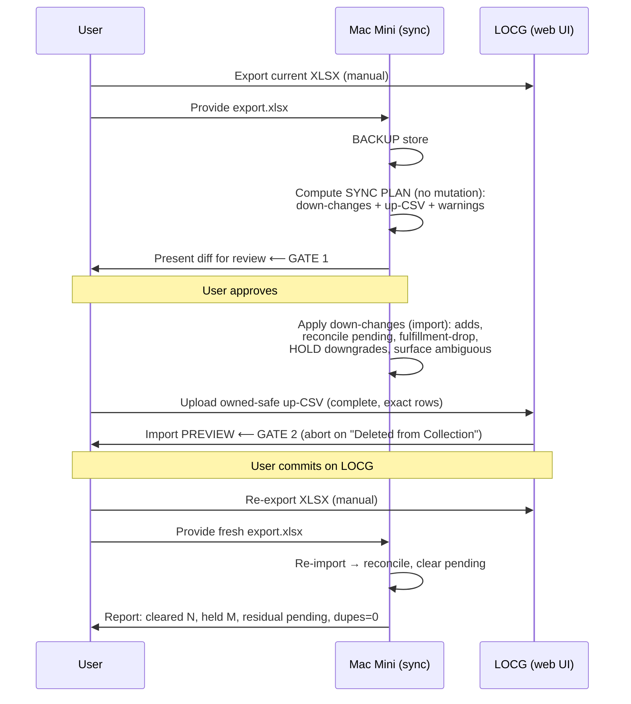
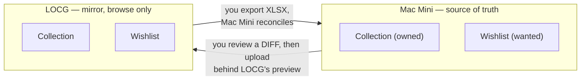
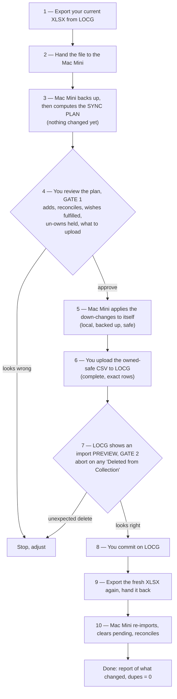

 
# Unified LOCG ↔ Mac Mini Sync — Collection + Wishlist

> **Status: DRAFT for review.** This is the design half of BUI-208. It derives the
> sync model from first principles, decides the open questions, then maps the model
> against what exists today (conformance check) and specifies the implementation.
> Nothing in the current code is assumed correct until the model says it is.

---

## 0. Terminology (read this first)

Three distinct things that earlier drafts and some code conflate. This document
uses these names precisely:

- **Gixen** — a third-party auction-sniping product the user *uses* but does not
  own. It is **not** part of the sync model. Its only role here: a won Gixen
  auction is the event that, via `/comic:collection-add`, records a book into the
  Collection on the Mac Mini.
- **The Mac Mini** — the user's own server (it happens to run the gixen-cli server
  + overlay + the collection store). **The Mac Mini is the source of truth.** Code
  and older docs call this "the gixen server"; conceptually it is the Mac Mini.
- **LOCG** (League of Comic Geeks) — a third-party catalog/app the user *uses* but
  does not own. A downstream **mirror** for browsing and bulk sync, never the
  system of record.

Two datasets are synced: the **Collection** (books owned) and the **Wishlist**
(books wanted, not owned). The **Pull List** (LCS subscriptions, managed on LOCG)
is explicitly out of scope — the bulk-import format has no pull-list field, so sync
can neither read nor write it.

---

## 1. Summary

The Collection and Wishlist have synced to LOCG in accreted pieces
(BUI-87/93/122/124/130/184/206…). The Collection reached a safe, mostly-correct
bidirectional state; the Wishlist did not, and its read path silently
resurrects removed wishes (the old BUI-206) and undoes server-side removals.

This design unifies both entities under **one model**, anchored on two facts that
are not ours to change:

1. **There is no reliable automated write to LOCG.** Cloudflare binds the session
   to the browser's TLS fingerprint; the authenticated write path was formally
   retired (ADR `0001-pivot-locg-cli-to-local-first`). LOCG is reachable to the
   *human* in a browser, not to *automation*. The only interfaces are **manual
   XLSX export down** and **manual owned-safe CSV upload up** (with LOCG's own
   import preview as the last gate).
2. **The same wire that adds a wish to LOCG can delete an owned book.** LOCG's bulk
   import reads `In Collection=0` as "un-collect this book," and the wishlist
   contains books you later come to own — the BUI-122 coupling that twice caused
   real data loss (18 owned books, then 26 owned X-Men).

Because there is nothing to *automate* on the LOCG side, the right shape is the
one the user proposed: **a diff-before-commit**. The user exports LOCG; the Mac
Mini computes the exact set of changes for each side and presents it for review
*before* anything is written; the human applies the LOCG-side change in the web UI
behind LOCG's preview. The diff *is* the architecture, not a convenience on top of
it.

Within that spine, the two entities are governed by **one invariant** but are
**allowed to differ on removal** because the cost of a wrong removal differs by
orders of magnitude (a wrongly-dropped wish is free to recover; a wrongly-un-owned
book buys a duplicate).

The two key decisions (derived in §4, confirmed with the user):
- **Collection:** Mac Mini authoritative, **additive** — LOCG un-collects are
  *held for review*, never auto-applied; new owned books on LOCG (pull-list
  arrivals) flow down.
- **Wishlist:** Mac Mini authoritative (**Option B**). Wishes are managed on the
  Mac Mini (`/comic:wishlist-add` + a durable remove). LOCG is not used to *source*
  wishes; the import only detects **fulfillment** (a wished book becomes owned →
  drop the wish, keep owned). Mirroring wishes *up* to LOCG is an optional,
  owned-safe, opt-in step, defaulted off and probably deferred.

The structural fix this unlocks: the Wishlist stops being **dual-stored** (a flag
on collection rows *and* a separate file, never reconciled — the shared root of
BUI-206). Under Option B the Wishlist becomes a single authoritative dataset on the
Mac Mini, and the import stops writing wish state at all.

---

## 2. First principles: what "sync" even is here

Two stores hold overlapping state, but they are **not peers** — they have
asymmetric capabilities, and the asymmetry dictates the design:

| | The Mac Mini (source of truth) | LOCG (mirror) |
|---|---|---|
| **Read by automation** | Yes (local store) | **No** — Cloudflare blocks it; only a human-driven XLSX export |
| **Written by automation** | Yes (`/api/comics/*`) | **No** — only a human-driven CSV upload (complete, exact rows), with a preview |
| **Canonical strings** | No — stores whatever it was given (record-win rows have `publisher=None`, placeholder dates) | **Yes** — owns canonical Series Name / Full Title / Release Date; not derivable, only learnable from a prior export |
| **Removal semantics** | Explicit, durable | A wish→owned transition silently un-wishes; `In Collection=0` silently un-collects |

So "sync" is **not** "make two peer databases converge." It is: *reconcile a
machine-writable source of truth (Mac Mini) with a human-writable, automation-
opaque mirror (LOCG), where the only safe channel is a reviewed diff applied by a
human behind a preview.*

This reframes the source-of-truth contradiction (CONCEPTS.md says Mac Mini; the
BUI-208 title says LOCG). Neither is globally authoritative. Authority is
**per-entity, per-field-class**:

- **The Mac Mini is authoritative for membership and ownership** (what's owned,
  what's wished) — it is the source of truth and is kept live for the
  duplicate-buy check the moment an auction is won.
- **LOCG is authoritative for canonical strings** (the exact Series Name / Full
  Title / Release Date), because those are *only* knowable from LOCG's own export
  and are required for any future match. The import adopts LOCG's strings onto
  Mac-Mini rows; it does not adopt LOCG's membership decisions wholesale.

---

## 3. The forces (constraints from reality, not decisions)

These are immovable. The design must satisfy all of them; it does not get to
choose them.

- **F1 — No automated LOCG write or read.** ADR `0001`; Cloudflare TLS-fingerprint
  binding (`cloudflare-tls-fingerprint-mismatch-...`); documented IP block. Down =
  manual XLSX; up = manual CSV upload. Human in the loop, always.
- **F2 — `In Collection=0` is destructive.** The wish wire and the un-collect wire
  are the same wire (BUI-122; `locg-export-deletes-owned-wished-books.md`). Caused
  data loss twice.
- **F3 — Normalization that improves matching can re-arm F2.** The 26-owned-X-Men
  deletion: "fixing" a wish row's series name to LOCG canonical made it suddenly
  match an owned book and delete it (`locg-bulk-import-sync-learnings`, lesson 1).
  Any owned-safe filter must compare identities the *same way* the destructive
  match will.
- **F4 — LOCG's importer is flaky and exact.** All 21 columns in header order;
  `My Rating` present-but-blank (omitting it stamps `5.0` + `Marked Read=1`);
  exact canonical Series Name (inconsistent across series; the **X-Men #1–141 =
  "The X-Men", #142+ = "Uncanny X-Men"** split is the canonical trap); a bare Full
  Title variant-spreads; an **incomplete / all-dateless batch hangs** the importer.
  (The earlier "≤20 rows per batch" belief was a **misdiagnosis** — the hang is
  data completeness/exactness, *not* a row-count cap; there is no row limit. See
  sync-learnings lesson 2.) The owned-safe CSV is idempotent, so retries are safe.
  (recipe + sync-learnings)
- **F5 — Both sides can legitimately get ahead.** The Mac Mini leads via pending
  wins (record-win) and local wish adds not yet mirrored. LOCG leads via
  **pull-list arrivals** marked owned there (a recurring, monthly LOCG→Mac Mini
  collection path unrelated to eBay) and one-off edits in its UI.
- **F6 — Identity matching is hard and already carries six bugfixes.** The matcher
  encodes BUI-45 (leading articles), BUI-26 A–D (masthead aliases, exact issue
  token, sub-series qualifiers via `full_title` prefix, the `in_collection` count
  semantics), BUI-46 (year-gated `_SERIES_ALIASES`), BUI-175 (decimal/`½`/`-1`
  issue tokens), BUI-176 (variant base-issue soft match). The masthead-alias class
  (`The X-Men` ↔ `Uncanny X-Men`) **still slips through** and is year-blind in the
  conflicts audit (BUI-129). Any new matching must preserve all of this and stay
  owned-safe where it can re-arm F2.
- **F7 — LOCG canonicalizes Release Date on re-export** (FF #86 sent `1969-05-01`,
  stored `1969-02-11`). Reconciliation therefore matches on **exact year, not
  exact date**; cross-year stays distinct (volume reboots).
- **F8 — CI does not run the test suites** (only AST-parses `plugin.py`). Any
  regression merges green. Local package tests + golden fixtures are the only gate.

---

## 4. The model

### 4.1 The one invariant (both entities)

> **An import may drop or flip a piece of state X if and only if X is
> LOCG-derived (has round-tripped through a LOCG export) and X is absent from /
> contradicted by the new export. It must never silently destroy server-origin
> state that has not round-tripped** — a pending win, or a wish added on the Mac
> Mini and not yet mirrored.

This is the generalization of the Collection's existing downgrade protection. It
applies to both entities. What differs between entities is **what happens when the
invariant *permits* a removal** — and that difference is justified, not accidental.

### 4.2 The cost-asymmetry principle (why the two entities differ)

| Wrong action | Cost | Therefore on removal |
|---|---|---|
| Wrongly **un-own** a book | Real money — `collection-check` says "not owned" → duplicate purchase | **Hold** the un-own, surface for human review (never auto-apply) |
| Wrongly **drop a wish** | A missed seller-scan hit; re-addable in seconds | **Auto-apply** is acceptable |
| Wrongly **keep a fulfilled wish** | Minor clutter; the conflict audit catches it | Generous matching is fine |

Removal is the only place the entities diverge. Membership/identity handling is
identical. This means we do **not** "bring the wishlist to collection parity" —
parity on removal would be *wrong*. We unify the *storage and invariant*, and let
the *removal policy* differ by cost.

### 4.3 Collection (decided: Mac Mini authoritative, additive)

- **Authoritative:** the Mac Mini for ownership; LOCG for canonical strings.
- **LOCG → Mac Mini (import):**
  - **Add** genuinely new owned books (pull-list arrivals, new LOCG owns) — F5.
  - **Reconcile** pending wins to clear pending, tolerant of LOCG's date
    canonicalization (exact-year — F7), never creating a duplicate identity.
  - **Hold** ownership downgrades (owned→not-owned): keep owned, log
    `ownership_downgrade_held`, surface for review (cost asymmetry; the user almost
    never un-owns, so an LOCG "not owned" is more likely stale than real).
  - **Adopt** LOCG's canonical strings onto matched rows.
- **Mac Mini → LOCG (push):** owned-safe CSV of **pending wins only**, `In
  Collection=1` (add-only — cannot delete), every row complete + exact (esp.
  Release Date), behind LOCG's preview; reconcile on re-import. This already works;
  do not regress it.

### 4.4 Wishlist (decided: Option B — Mac Mini authoritative)

- **Authoritative:** the Mac Mini, full stop. Wishes are added via
  `/comic:wishlist-add` (Metron-resolved runs) and removed via a durable remove.
- **LOCG → Mac Mini (import):** the import does **not source wishes from LOCG.**
  It does one thing for the wishlist: **fulfillment** — when a wished book is now
  owned (seen owned in the export, or recorded via record-win), **drop the wish,
  keep owned** (this is the BUI-130 conflict resolution, run as part of sync).
  Fulfillment matching may be **generous** (both error directions are cheap — §4.2),
  unlike the owned-safe export filter which must be conservative. **It mutates only
  wish state** — it deletes the wish entry and must never add, re-key, or re-string a
  collection row (a generous match must not leak into the money-cost entity; U2
  enforces this as a hard test, not a guideline). Every drop is **logged** with the
  matched owned identity and surfaced in the sync plan, so a masthead-alias mis-drop
  is visible and re-addable, not silent.
  - **Escape hatch (no auto-apply):** if the LOCG export carries wishes the Mac
    Mini lacks (e.g. a one-off the user added on their phone), the **diff surfaces
    them as "adopt?" suggestions** — reviewed, never auto-imported. This preserves
    the phone-add habit as an opt-in without making LOCG a wish source.
- **Decided: the two wishlists overlap, they do not nest.** The Mac Mini is *not*
  guaranteed to be a superset of LOCG, even right after a sync — a phone add stays
  LOCG-only until the user re-adds it on the Mac Mini, and a manually-dropped wish
  can linger on LOCG. This is **deliberately accepted** rather than fixed, because
  the alternative (auto-adopting every LOCG wish so the Mac Mini stays a superset)
  would require a removal **tombstone** to avoid resurrecting dropped wishes (a
  BUI-206 re-introduction) — complexity that buys little, since **only the Mac Mini
  is read by `seller-scan` / `collection-check`; LOCG's wishlist is never read by
  automation.** Two distinct costs follow, often conflated: a divergent LOCG
  wishlist is **cosmetic** (it only affects browsing the list in the LOCG app),
  whereas a phone-added wish not being hunted by `seller-scan` until the next sync
  adopts it is a **functional latency** — bounded by sync cadence, and the reason the
  "adopt?" escape hatch matters. Both are acceptable given phone adds are occasional,
  but they are not the same cost. Durable removal needs **no tombstone** precisely
  *because* nothing re-adopts from LOCG.
- **Mac Mini → LOCG (mirror up):** **optional, opt-in, owned-safe, default off,
  likely deferred.** Mirroring is non-essential (the user mostly buys on eBay where
  the Mac Mini is reachable). If built, it rides the dangerous CSV wire and so must
  (a) run only after fulfillment/conflicts are clean, (b) never emit `In
  Collection=0` for any identity the Mac Mini knows is owned — and because comparing
  *the same way* the destructive match does **inherits** the matcher's masthead-alias
  blind spot (F6) rather than closing it, the filter must additionally
  **over-exclude the masthead-alias family** (treat a wish whose series resolves to a
  known alias family as owned-unless-proven-distinct), and (c) be reviewed in the
  diff and behind LOCG's preview. See OQ-3.

### 4.5 Storage model (decided: single home per piece of wish state)

Today wish state is **dual-stored**: an `in_wish_list` flag on every collection
row *and* a separate `wish-list.json` (export-derived entries rebuilt from the
flag, plus local-only adds re-appended). They are never reconciled — the shared
root of BUI-206 (resurrection on import) and the "server DELETE undone on next
import" symptom.

Under Option B the Wishlist is its own authoritative dataset, so it gets its **own
single store**:

- **`wish-list.json` becomes the one home for all wish state.** Each entry carries
  its identity when known (series/issue + resolved canonical strings from Metron or
  a past export), an `added_at`, and — critically — an explicit
  **`source: local | export`** provenance field. Today the code infers "local-only,
  push-eligible" from the **absence** of `series_name` (`_local_only_wish_items`,
  `wish_rows_for_export`); once `/comic:wishlist-add` stamps a Metron-resolved
  `series_name` onto a local add, that sentinel silently misreads it as "LOCG already
  has it" and drops it from any push and from the survives-import logic. **U1 must
  replace the `series_name`-absence sentinel with the `source` field** in both
  functions. Removals delete the entry and are durable.
- **The collection import stops writing wish state.** The `in_wish_list` flag is no
  longer *sourced* from the import (it may remain as a derived read-convenience, but
  it is never the authority and never resurrects a removed wish).
- **The only collection↔wishlist link is fulfillment-drop** (§4.4), an explicit
  operation, not a byproduct of the merge.

This dissolves BUI-206 by construction: there is no second copy of a wish to
resurrect, and a removed wish is simply gone. A one-time migration consolidates
**every** existing wish into the single store — both the local-only adds *and* the
export-derived wishes (today's `in_wish_list==1` rows). This carry-forward is
load-bearing, not cleanup: after cutover the import never re-sources wishes, so any
export-derived wish left behind vanishes from `seller-scan`'s match set. Capture a
pre-migration count of both sets as the verification baseline (OQ-1).

> **Alternative considered — fold the wishlist into the collection rows** (drop
> `wish-list.json`, every wish is a row with `in_wish_list=1`). Rejected: it forces
> identity-less local adds into the identity-keyed collection cache and muddies the
> owned dataset with not-owned rows. A standalone wishlist matches Option B's
> "wishlist is its own authoritative thing" cleanly.

---

## 5. The sync as a diff-before-commit (the spine)

Because no LOCG side-effect can be automated, the safe unit of work is a
**reviewed diff**. The Mac Mini never pushes blind; it proposes, the human approves
and applies behind LOCG's preview.

**The sync plan (the artifact).** A read-only computation over (current Mac Mini
store) × (provided LOCG export) that yields, without mutating anything:

- **Down-changes** the import would apply to the Mac Mini: new owned to add,
  pending wins to reconcile, wishes to drop as fulfilled (each logged with the
  matched owned identity), ownership downgrades to
  **hold** (listed explicitly), ambiguous/possibly-removed to surface, and LOCG-only
  wishes offered as "adopt?".
- **Up-CSV** the user uploads to LOCG: owned-safe, pending wins only (`In
  Collection=1`), every row complete + exact (esp. Release Date), idempotent. The
  sync plan **refuses to emit** an up-CSV containing any `In Collection=0` row — a
  machine-enforced Gate-2 precondition, so LOCG's preview is the backstop, not the
  only stop.
- **Warnings:** anything that would re-arm F2 (an up-row whose identity matches an
  owned book), dateless rows that would hang the importer, `needs_manual_*` rows
  that can never clear via CSV.

**Two gates, in order of trust:** (1) the Mac Mini's computed diff — cheap, before
any write; (2) LOCG's own import preview — the no-undo backstop. The proven way to
*verify* what actually changed is an **identity-level diff of the pre- and
post-upload LOCG exports** (title + series + release date), not a title-only or
simulated comparison (the BUI-122 false-green lesson).

**Cadence (assumed).** A sync runs *after a batch of wins accumulates* or when
wishlist/pull-list activity is worth reconciling — not per-win. The duplicate-buy
check is already real-time (record-win writes the Mac Mini immediately), so sync is
reconciliation, not a hot path; the two-gate manual ritual is sized for an
occasional run, and the phone-add functional latency (§4.4) is bounded by this
cadence. Confirm this assumption holds in practice.

**Activity tracking (decided: lightweight first).** No new event table yet. The
existing per-row breadcrumbs (`local_added_at`, `last_seen_in_export_at`,
`pushed_to_locg_at`) plus the append-only `import-history.jsonl` audit log already
disambiguate "removed on LOCG" from "added on the Mac Mini since the last sync."
Escalate to a first-class event log only if this proves ambiguous in practice
(OQ-4).

---

## 6. Workflows in plain language (for you)

Plain-English walkthroughs of the everyday situations — what you do, what the sync
does, and where things end up. No code. (The one-line lookup table is in §7; this
section is the "why it behaves that way" companion.)

### The mental model

You change things in two places: the **Mac Mini** (the truth) and, occasionally,
**LOCG** (the mirror — e.g. pull-list arrivals). A **sync** is the moment those two
are brought back into agreement. It never happens silently: you see a diff first,
and LOCG shows you a preview before anything is written there.

### The sync, step by step

The whole process, start to finish. You approve twice.

Steps **1, 6, 9 are things only you can do** (LOCG is browser-only). Everything the
Mac Mini does is reversible from the backup, and the only writes to LOCG pass
through two reviews.

### W1 — You add a run to the wishlist (on the Mac Mini)

You run `/comic:wishlist-add` for, say, all of *Saga*. It looks each issue up on
Metron, skips any you already own, and adds the rest to the **Mac Mini wishlist**.

- **Right away:** the wishes live on the Mac Mini, and `seller-scan` starts matching
  them immediately — that's the point of adding them.
- **At the next sync:** nothing needs to happen for them to keep working. They appear
  on LOCG *only* if you've turned on the optional wish mirror-up (off by default —
  it's the one path that can touch the dangerous delete wire). So if you browse your
  wishlist in the LOCG app, these won't show there unless mirrored.

### W2 — You win an eBay auction

`/comic:collection-add` records the win into the **Mac Mini collection** as a
*pending* entry ("owned here, not yet confirmed on LOCG").

- **Right away:** `collection-check` treats it as owned, so you won't re-buy it.
- **At the next sync:** it goes into the owned-safe CSV you upload to LOCG (add-only
  — it can never delete anything). After you commit and re-export, the Mac Mini
  matches it back and clears *pending*. If it was also wished, the wish is dropped
  (W5).

### W3 — A pull-list book arrives (you mark it owned on LOCG)

A monthly pull-list issue shows up; you mark it owned in LOCG (the pull list is
managed there, not on the Mac Mini).

- **At the next sync:** when you hand over the export, the Mac Mini sees a book LOCG
  owns that it doesn't, and **adds it** to the collection. This is the one routine
  case where LOCG legitimately leads and the Mac Mini follows.

### W4 — You add a one-off wish on LOCG (on your phone)

You're in a shop, spot something, tap "wish" in the LOCG app.

- **At the next sync:** because the Mac Mini owns the wishlist, it does **not**
  silently pull this in. The plan lists it under **"LOCG-only wishes — adopt?"** so
  you choose: approve and it becomes a real Mac Mini wish; ignore and nothing
  changes. (This is why Option B doesn't cost you the phone habit — it just turns it
  into a reviewed step.)

### W5 — A book you wished for, you now own (fulfillment)

The happy ending of a wish: you buy it (W2) or mark it owned. Now it's both wished
and owned — the exact situation that historically deleted owned books.

- **At the next sync:** the Mac Mini resolves it the safe way — **keep owned, drop
  the wish.** It never sends a "remove from collection" instruction.

### W6 — You remove a wish on the Mac Mini

You decide you no longer want something and remove it on the Mac Mini.

- **It stays removed.** This is a bug the redesign fixes: today a removed wish can
  reappear on the next import. Under the new single-home wishlist there's no second
  copy to bring it back.

### W7 — You un-collect a book on LOCG

Rare, but say you sold a book and un-owned it on LOCG.

- **At the next sync:** the Mac Mini does **not** auto-remove it. It **holds** the
  change and lists it for your review — because an LOCG "not owned" is far more often
  stale than real, and wrongly un-owning a book is the one mistake that costs you
  money (you'd re-buy it). You confirm genuine sales by hand.

---

## 7. Per-action behavior (the target, confirmed against the issue's table)

| Action | Result | Mechanism |
|---|---|---|
| Win an eBay auction | Owned on Mac Mini immediately (duplicate-check safe) | `/comic:collection-add` (record-win); pending until round-trip |
| Pull-list book arrives, marked owned on LOCG | Added to Mac Mini on next import | Import add (F5) |
| Un-collect a book on LOCG | **Held**, surfaced for review — not auto-applied | Downgrade protection (cost asymmetry) |
| Add a wish (a run) on the Mac Mini | Wishlisted on Mac Mini; not on LOCG unless mirrored | `/comic:wishlist-add`; mirror is opt-in |
| Add a one-off wish on LOCG (phone) | Surfaced in the diff as "adopt?" — not auto-imported | Option B escape hatch |
| Remove a wish on the Mac Mini | Durably removed (survives every import) | Single-home store (§4.5) |
| Remove a wish on LOCG | Not honored (Mac Mini is authoritative) | Option B |
| A wished book becomes owned | Wish dropped, owned kept | Fulfillment-drop (§4.4) |

---

## 8. Conformance check — what exists vs the model

**Already conformant (keep, do not regress):**
- Collection import: add / exact-year reconcile / downgrade-hold — matches §4.3.
- Owned-safe export filter (`wish_rows_for_export`): conservative, owned-set
  guarded — matches the F2/F3 constraint.
- Conflicts audit (BUI-130) — becomes the fulfillment-drop of §4.4.
- `collection-check` via the server API, hard-fail on unreachable (R11 — never
  render "not owned" from a failed call, or it buys a duplicate; defined in the repo
  CLAUDE.md).
- Backup-gated round-trip + LOCG-preview discipline — matches §5.

**Divergent (the bugs this design fixes):**
- **D1 — Dual wishlist storage** (`in_wish_list` flag + `wish-list.json`, never
  reconciled). Root of BUI-206 (resurrection) and the undone-DELETE symptom. →
  §4.5 single-home store.
- **D2 — Import mirrors wish *additions* but not *removals*** (`collection_io.py`
  ~676 rebuilds `wish_rows` from the merged comics but never clears a stale
  `in_wish_list` on rows absent from the export). → Dissolved by Option B: the
  import stops sourcing wishes entirely; there is no stale flag to clear.
- **D3 — Server-side wish removal is not durable** (DELETE on `wish-list.json` is
  overwritten by the next import). → §4.5 (single home, no resurrecting flag).
- **D4 — No reviewable diff artifact.** Sync is run-and-hope behind two ad-hoc
  manual exports. → §5 sync plan.

**Proposed (new):** the sync-plan computation (§5); a durable wishlist remove; the
fulfillment-drop wired into sync; the one-time wish-state migration; the optional
mirror-up (deferred).

---

## 9. Implementation units (directional — detailed plan follows doc approval)

- **U1 — Single-home wishlist store + durable remove.** Make `wish-list.json` the
  one authority; each entry carries identity + `added_at` + an explicit
  **`source: local|export`** field (replacing the `series_name`-absence sentinel in
  `_local_only_wish_items` / `wish_rows_for_export`, §4.5). One-time migration
  consolidating **all** of today's wishes (the `in_wish_list==1` rows *and* the
  file-based local adds), gated on a **verified backup** written outside the store
  dir (abort if the write or read-back fails). Stop the import from *sourcing*
  wishes. (`collection_io.py`, `commands.py` `cmd_wish_list_*`, `routes.py` wish
  endpoints.)
- **U2 — Fulfillment-drop in sync.** Generalize the BUI-130 conflicts audit to run
  as part of sync: owned book ⇒ drop matching wish, keep owned. Generous matching
  (both error directions cheap), enforced by a test that it mutates **only** wish
  state (never adds/re-keys/re-strings a collection row) and logs each drop with the
  matched owned identity.
- **U3 — Sync-plan / diff artifact.** Read-only computation → down-changes, up-CSV,
  warnings, LOCG-only "adopt?" wishes. Output shape: a human-readable printed report
  (the diff) plus the up-CSV written to a named file the user uploads manually — no
  new endpoint, no stored plan artifact. The center of the updated
  `/comic:collection-sync` skill; two gates (incl. the machine-enforced
  no-`In Collection=0` precondition, §5).
- **U4 — Collection: confirm + lock behavior with tests.** No behavior change
  intended; add production-shaped regression tests (publisher=None, `YYYY-01-01`
  dates) covering the behaviors U1–U3 touch (single-home store, durable remove,
  fulfillment-drop, import-no-longer-sourcing-wishes) so F8 can't hide a regression.
  **One** masthead-alias fixture is in scope — it guards the owned-safe filter's
  over-exclusion (§4.4) and gates U5. The broader matcher golden-fixture suite (GSFF,
  leading-article Hulks, full X-Men masthead, BUI-175/176) is pre-existing-bug
  hardening and belongs in a separate matcher ticket, not here.
- **U5 — (Optional, deferred) owned-safe wish mirror up.** Per §4.4; default off;
  OQ-3.
- **U6 — Docs.** Rewrite the runbook for this model; update CONCEPTS.md (wishlist
  is Mac-Mini-authoritative, not import-sourced); a learning doc capturing the
  diff-before-commit spine and the Option-B rationale.

---

## 10. Decisions made / open questions

**Decided (this document):**
- D-A: Collection = Mac Mini authoritative, additive; LOCG un-collects held.
- D-B: Wishlist = Mac Mini authoritative (Option B); import does not source wishes;
  fulfillment-drop is the only collection↔wishlist link.
- D-C: Storage = single home per wish (standalone `wish-list.json`); drop the
  dual-store.
- D-D: Spine = diff-before-commit; two gates; verify via export-to-export identity
  diff.
- D-E: Activity tracking = lightweight (existing breadcrumbs + audit log); no new
  event table yet.

**Open (resolve during implementation or with the user):**
- **OQ-1 — Migration shape (partly resolved).** The structural parts are now
  decided: carry **all** current wishes forward, key local-vs-export on an explicit
  `source` field, gate on a verified backup (§4.5/U1). Still open: whether to retain
  `in_wish_list` on collection rows as a derived read-only convenience or delete it —
  needs a consumer inventory (does any `/comic:*` skill or dashboard tab read the
  flag directly rather than `wish-list.json`?).
- **OQ-2 — Fulfillment matching grain.** It can be generous (both errors cheap),
  but should it reuse the existing matcher (with its masthead-alias gap) or a
  looser title/series match? Lean: reuse the matcher; accept that a masthead-alias
  miss just leaves a fulfilled wish in place (clutter, not loss).
- **OQ-3 — Mirror-up: build now or defer?** Lean: defer; ship Option B's down/
  fulfillment path first, add mirror-up only if the phone-browse use case proves to
  matter.
- **OQ-4 — When (if ever) to add the event log.** Trigger: a real case where
  breadcrumbs can't disambiguate a removal.

---

## 11. Risks & mitigations

- **R1 — Cloudflare tightens further, blocking even export.** Export is
  human-driven in a real browser — the lowest-risk interface; no automation to
  break. Accept.
- **R2 — A matcher false-match re-arms `In Collection=0`** (the 26-X-Men class,
  F3). Comparing *the same way* the destructive match does is **necessary but not
  sufficient** — it inherits the matcher's masthead-alias blind spot (F6) rather than
  closing it. Mitigation: the owned-safe filter additionally **over-excludes the
  masthead-alias family** (§4.4); the sync plan **refuses to emit** any `In
  Collection=0` up-row (machine gate, §5); LOCG's preview is the human backstop.
  Mirror-up (the only `In Collection=0` emitter for wishes) is opt-in, gated, and
  blocked until a masthead-alias owned-safe fixture passes (U4).
- **R3 — The wish-state migration loses data.** Gated on a **verified** backup
  (written and read back outside the store dir before any mutation; abort on
  failure), diff-reviewed, reversible from `.bak`. The migration carries *all*
  current wishes forward (§4.5), not just local-only adds.
- **R4 — F8 lets a regression merge green.** Production-shaped fixtures + a local
  `uv run pytest` gate in the runbook; do not trust CI.
- **R5 — Option B silently drops a wish the user added on LOCG.** Mitigation: the
  diff surfaces LOCG-only wishes as "adopt?" rather than discarding them silently.

---

## 12. Acceptance criteria (BUI-208) — mapping

| Criterion | Addressed by | Note |
|---|---|---|
| Design doc: both entities, both directions, invariants, BUI-122 coupling, dual-storage | This document | §2–§5 |
| Wishlist import drops LOCG-derived items absent from export while preserving local-only adds | §4.4 + §4.5 | **Reframed:** under Option B the import does not source wishes, so there is nothing to resurrect — the bug is *dissolved*, not patched. Underlying intent (removed wish stays removed; local add survives) fully met. |
| Server-side wishlist removal durable across import | §4.5 (D3) | Single home, no resurrecting flag |
| Collection behavior unchanged (downgrade protection, record-win round-trip) | §4.3 + U4 | No behavior change; locked with tests |

---

## 13. Notes

- **Review aid — DELETE BEFORE MERGE:** an Obsidian symlink at `/Users/hsukenooi/Projects/Brain v3.0/BUI-208 LOCG Sync Design.md` points to this file so the mermaid diagrams render in Obsidian during review. Remove it when this doc merges: `rm "/Users/hsukenooi/Projects/Brain v3.0/BUI-208 LOCG Sync Design.md"`.
- This supersedes **BUI-206** (its bug is D2/D3 above).
- Code touchpoints: `packages/locg-cli/src/locg/collection_io.py` (import merge,
  `_write_wish_list_cache`, `wish_rows_for_export`), `commands.py`
  (`cmd_wish_list_*`), `plugins/gixen-overlay/src/gixen_overlay/routes.py`
  (`/api/comics/*`).
- Not in scope: BUI-207 (`/api/comics/history` win-ingestion — Gixen→Mac Mini, a
  different subsystem); the Pull List (no bulk-import field); reviving any automated
  LOCG read/write (ADR 0001).

---

## 14. Review findings (2026-06-22 ce-doc-review)

A 6-persona ce-doc-review (coherence, feasibility, adversarial, product, security,
scope) ran against this draft. **Folded in:** the `series_name`→`source` provenance
fix (§4.5 / U1); owned-safe over-exclusion of the masthead-alias family (§4.4 / R2);
the machine-enforced no-`In Collection=0` up-CSV gate (§5 / R2); full wish
carry-forward + verified-backup migration (§4.5 / U1 / R3); fulfillment-drop
touches-only-wish-state + logging (§4.4 / U2); `R11` defined inline (§8); the
phone-add cosmetic-vs-functional cost split (§4.4); sync cadence stated (§5); U3
output shape + U4 scope narrowed (§9).

**Residual / still open:**
- **OQ-1** — retain-vs-delete the `in_wish_list` flag: needs a consumer inventory
  before implementation.
- **OQ-2** — fulfillment reuses the matcher; a masthead-alias miss leaves a fulfilled
  wish as clutter (now *visible* via logging). Accepted unless it bites.
- **Cadence** (§5) is an assumption to confirm against real usage.
- The §13 "DELETE BEFORE MERGE" symlink note is an intentional, self-removing review
  aid (scope reviewer flagged it; left deliberately until merge).
