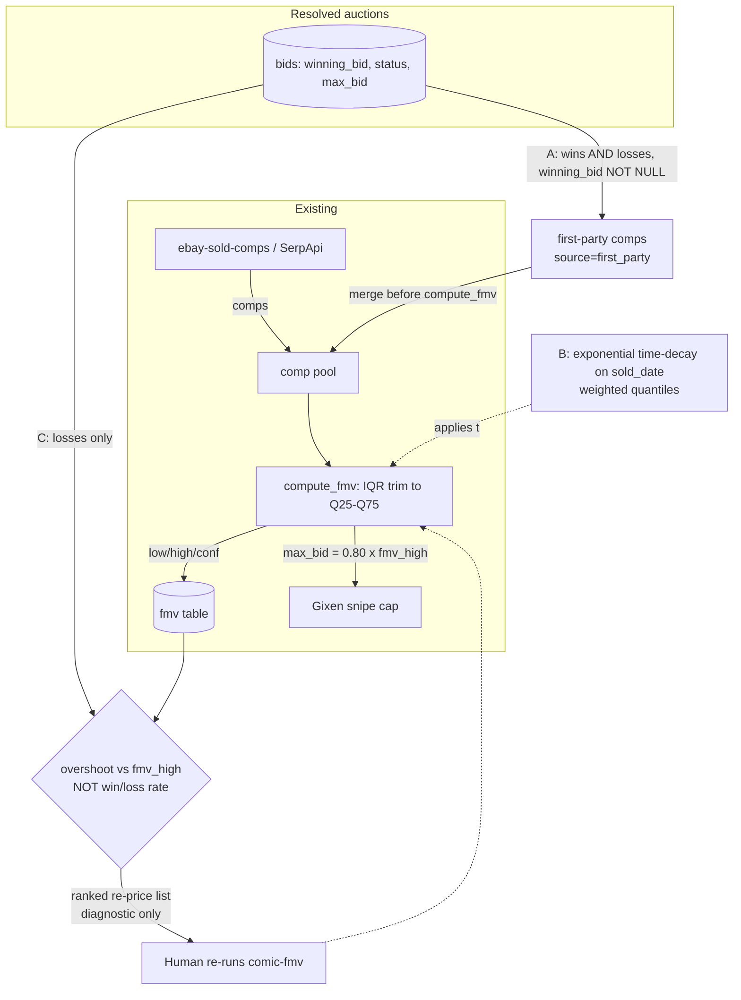

# feat: FMV Auction-Outcome Feedback Loop

**Target repo:** `comic-pipeline` — `apps/fmv` (comp pool + math), `plugins/gixen-overlay` (DB reads, a new audit surface). No `bids` schema change required.

The recent auction *you participated in* is the clearest signal of an issue's current value — you already verified its identity and grade, and it just cleared the market. Today none of that feeds back into pricing. This plan closes the loop in three issues, delivered **A → C → B** by dependency.

---

## Summary

Fold your own resolved auction outcomes — both wins and losses, and their ending/hammer prices from `bids.winning_bid` — back into the FMV for that issue, and add a monitoring loop that detects when you are *systematically* underpricing, without corrupting the discipline that makes you lose most auctions on purpose. Three units, each shipped as its own Linear issue (BUI team, `comics` label):

- **U1 (Issue A)** — Inject your own auction outcomes as first-party comps in `apps/fmv`. The core; highest value-to-risk.
- **U3 (Issue C)** — Loss-vs-FMV calibration report; diagnostic-only. The honest "learn from losing" loop.
- **U2 (Issue B)** — Recency weighting across the whole comp pool. Principled generalization, widest blast radius, done last.

Execution sequence is **A → C → B**: A feeds fresh verified comps in; C interprets the pattern A's per-book outlier trimming deliberately suppresses; B generalizes recency once A + C are understood.

---

## Problem Frame

Two things are true today, verified against the code (see *Sources & Research*):

1. **FMV has zero recency weighting.** `compute_fmv` prices a book as the Q25–Q75 of the IQR-trimmed, grade-windowed pool of eBay **sold** comps, median as point estimate. `sold_date` is parsed into every comp and then *never read*. A sale from two years ago counts identically to one from last week.

2. **Your own auction outcomes never re-enter pricing**, though the DB already captures them: `bids.winning_bid` holds the final hammer price on **both wins and losses** (best-effort via Gixen sync + eBay fallback), stored separately from your `bids.max_bid` ceiling, already tied to a specific `(issue, grade)` through `bids → bid_fmvs → fmv → comics`.

**The reframe that governs the whole plan: losing is usually *correct*.** Your bid cap is deliberately `80% × fmv_high` (dropping to `0.60` on low confidence). You are *designed* to lose most auctions — you bargain-hunt below fair value. A high loss *rate* is the intended behavior of the haircut, not evidence of mispricing. The sound signal is not whether you lost but **where the losing hammer price lands relative to `fmv_high`**: a loss clearing between `max_bid` and `fmv_high` is the haircut working; losses clearing *above* `fmv_high` repeatedly are the real "FMV is too low" signal. Learn from **overshoot vs `fmv_high`**, never from win/loss rate.

**The statistical trap the plan must structurally avoid: never inject wins alone.** On a proxy-auction win, `winning_bid` is the underbidder's max (a real market data point), but the observed win set is **truncated from above** — you never see the wins where the true clearing price exceeded your max, because those became losses. Feeding back wins only drags FMV down over time: a deflationary feedback spiral (FMV↓ → max_bid↓ → cheaper wins → FMV↓ …). Injecting wins **and** losses together restores the missing right tail, so the combined set is a far less biased sample of clearing prices.

---

## Requirements

- **R1.** FMV pricing incorporates the user's own resolved auction outcomes for a book as comps in the pool `compute_fmv` prices from.
- **R2.** Wins and losses are always injected *together* — no code path can inject wins without their contemporaneous losses (the truncation fix).
- **R3.** Only trustworthy outcome rows feed pricing: `winning_bid IS NOT NULL` and `status IN ('WON','LOST')`; NULL-price `ENDED` rows are skipped.
- **R4.** The calibration signal is based on **overshoot vs `fmv_high`**, never raw win/loss rate.
- **R5.** The calibration report is **diagnostic-only** — no automated writeback to `fmv_high` in this plan.
- **R6.** Recency eventually weights the whole comp pool via time-decay, with the confidence rubric reconciled to *effective* sample size.
- **R7.** Any change to the FMV math is regression-guarded against a frozen baseline fixture before it lands.

---

## Key Technical Decisions

- **KTD-1 — First-party comps merge at the pool stage, not as a math special-case.** Pull outcomes in `fmv_runner` after the SerpApi fetch and merge them into the same comp list `compute_fmv` already consumes, tagged `source='first_party'`. Keeps `fmv_math` a pure function over a comp list; the merge is the only new seam. *(R1)*
- **KTD-2 — Start unweighted.** A injects first-party comps with no weight; their voice comes from count (typically 1–3 vs 5–15 SerpApi) plus freshness. True weighting waits for B, so A carries zero risk to the pure math. *(R1, R6)*
- **KTD-3 — Wins-and-losses is a structural invariant, not a caller convention.** The outcome-pull query selects `status IN ('WON','LOST')` in one statement with no win-only entry point, so no caller can request wins alone. *(R2)*
- **KTD-4 — Do not exempt first-party comps from IQR trim.** A lone loss far above the SerpApi pool is indistinguishable, from one data point, from a two-bidder war. Let the trim bound it inline; let C surface the *systematic* case across many auctions. This is the deliberate seam between A and C. *(R3, R4)*
- **KTD-5 — Grade-match via the `fmv.grade` on the linked row**, using the same ±0.5-widening window discipline as `build_pool`, so a first-party comp lands in the right `(comic, grade)`. `bids.seller_grade`/`photo_grade` are a fallback only if the `bid_fmvs` link is absent. *(R1)*
- **KTD-6 — Calibration is a report, not a controller.** C ranks issues by overshoot for a human to re-price; any auto-nudge to `fmv_high` is explicitly out of scope. *(R4, R5)*
- **KTD-7 — B changes the estimator; guard it with the baseline fixture.** Weighted quantiles + a reconciled confidence rubric only land after a before/after diff on the frozen BUI-51-style fixture; large unexplained moves block the change. *(R6, R7)*

---

## High-Level Technical Design

The two data flows this plan adds (A's pricing merge, C's diagnostic loop) over the existing chain:



Prose is authoritative where it and the diagram disagree.

---

## Implementation Units

### U1. Inject Own Auction Outcomes as First-Party Comps (Issue A)

**Goal:** `compute_fmv` prices each book using the user's resolved auctions for that `(comic, grade)` window as comps, merged with the SerpApi pool and tagged by source.

**Requirements:** R1, R2, R3.

**Dependencies:** none. Ships first.

**Files:**
- `apps/fmv/src/fmv_runner.py` — new outcome-pull + merge into the pool in/after `_fetch_comps` (`:233`), before the `compute_fmv` call.
- `apps/fmv/src/fmv_math.py` — no logic change; confirm a `source`-tagged comp flows through `build_pool`/`iqr_trim` untouched (they key on `price`/`grade`).
- `apps/fmv/tests/test_first_party_comps.py` — new test file.

**Approach:** For the book's `(comic_id, grade)`, query the join chain and merge each row as a synthetic comp `{price: winning_bid, grade: fmv.grade, sold_date: resolved_at, source: 'first_party'}`:

```sql
SELECT b.winning_bid AS price, f.grade, b.resolved_at AS sold_date, b.status
FROM bids b
JOIN bid_fmvs bf ON bf.bid_id = b.id
JOIN fmv f       ON f.id = bf.fmv_id
WHERE f.comic_id = ?
  AND f.grade BETWEEN ? - 0.5 AND ? + 0.5      -- same window discipline as build_pool
  AND b.winning_bid IS NOT NULL
  AND b.status IN ('WON','LOST')
  AND b.resolved_at > date('now', '-:N days')
```

*(Directional — final helper names, the `comic_id` resolution path, and the recency-window default `N` are execution-time details.)* Unweighted per KTD-2. The reads live on the comics server (Mac Mini) side; `fmv_runner` already talks to it via `POST /api/comics` — decide at execution time whether to add a small read endpoint (`GET /api/comics/{id}/outcomes`) or reuse an existing DB accessor, consistent with the overlay's provider-neutral endpoint convention.

**Patterns to follow:** the ±0.5→±2.0 widening in `build_pool` (`fmv_math.py:32`) for grade-matching; `_upsert_fmv` (`fmv_runner.py:414`) for how the runner already round-trips the comics server; the `bids → bid_fmvs → fmv → comics` join used by the dashboard query (`plugins/gixen-overlay/.../db.py:1189`).

**Test scenarios:**
- Happy path: a book with two losses and one win in-window folds three first-party comps into the pool; resulting `fmv_low/high` reflects their inclusion vs a baseline pool without them.
- **R2 invariant:** a book with only wins in-window still pulls its in-window losses; assert no code path returns a wins-only first-party set (a wins-only fixture must still execute the same combined query).
- R3 filters: an `ENDED` row with `winning_bid = NULL` and a `REMOVED` tombstone are both excluded from the merged pool.
- Grade window: a comp at `grade = target ± 0.5` is included; one at `± 1.0` (outside the initial window) is excluded when the SerpApi pool already meets `MIN_NARROW_POOL`.
- KTD-4: a single first-party loss far above the SerpApi pool is still subject to `iqr_trim` (not force-included) — assert it can be trimmed like any comp.
- Empty case: a book with no resolved auctions prices identically to today (no first-party rows, no error).
- Source tag: merged first-party comps carry `source='first_party'` through to wherever the pool is inspected.

**Verification:** re-pricing a book that has real resolved auctions visibly shifts its FMV and the run output/notes indicate first-party contribution; a wins-only book demonstrably still incorporates its losses; `uv run --with pytest pytest` in `apps/fmv` passes including the new file. *(apps/* tests need `--with pytest` — plain `uv run pytest` false-passes; see [[project_apps_ebay_pytest_command]].)*

---

### U3. Loss-vs-FMV Calibration Report (Issue C)

**Goal:** a scheduled, diagnostic-only audit that flags issues whose FMV is systematically too low, keyed on overshoot vs `fmv_high` — the honest "learn from losing" loop. No auto-writeback.

**Requirements:** R4, R5.

**Dependencies:** U1 (reuses U1's outcome-pull definition of "a resolved auction"; do not fork a second definition).

**Files:**
- `.claude/commands/comic/calibration-report.md` (+ `skills/` symlink) — a new `/comic:*` skill runnable on a schedule, mirroring `wishlist-sellers`.
- Read path: the same join chain as U1, plus `fmv.low/high`. Prefer a read endpoint on the comics server over a second query definition.
- `plugins/gixen-overlay/tests/` — a test for the metric computation if the aggregation lands server-side.

**Approach:** Per `(issue, grade)` over recent resolved auctions, compute and rank:
- **Above-FMV loss rate** — % of losses where `winning_bid > fmv_high`. Rising → FMV too low.
- **Overshoot** — `median(winning_bid / fmv_high)` on losses; persistently `> 1` → re-price.
- **Contested win margin** (context only) — `winning_bid / fmv_high` on wins; winning far below FMV means bargains, *not* an over-priced FMV.

Emit a ranked list of issues to recompute `comic-fmv` for. **Never rank or report on raw win/loss rate** — state this constraint in the skill body so a future editor doesn't "add win rate" and reintroduce the trap.

**Patterns to follow:** `wishlist-sellers` for the unattended-schedule skill shape; U1's outcome query for the resolved-auction definition.

**Test scenarios:**
- Overshoot ranking: an issue whose losses all cleared 20% above `fmv_high` ranks above one whose losses cleared at/below `fmv_high`.
- Above-FMV loss rate: 3 of 4 losses above `fmv_high` yields 75%; a book that lost only *below* `fmv_high` yields 0% and is not flagged.
- **R4 guard:** a book with a high loss *count* but all losses below `fmv_high` does NOT surface — losing a lot is not the signal.
- R5 guard: running the report performs no write to the `fmv` table (assert no upsert/UPDATE fires).
- Excludes NULL/tombstone rows consistently with U1.
- Win context: a book won well below `fmv_high` is not reported as mispriced.

**Verification:** running the skill against the real DB surfaces a plausible ranked re-price list; a hand-checked issue with known above-FMV losses appears near the top; no FMV row is mutated by the run.

---

### U2. Recency Weighting Across the FMV Comp Pool (Issue B)

**Goal:** recent sales dominate FMV for *every* book via time-decay on the whole pool — the principled home for "recent = clearest," which also naturally up-weights U1's fresh first-party comps without special-casing them.

**Requirements:** R6, R7.

**Dependencies:** U1 and U3 observed in practice first (soft — this is a backlog stretch, not committed until A + C have run). No hard code dependency, but sequencing is deliberate.

**Files:**
- `apps/fmv/src/fmv_math.py` — weighted quantiles in `quartile`/`median` (`:99`, `:271`); reconcile `confidence_label` (`:121`) to effective sample size; consume `sold_date`.
- `apps/fmv/tests/test_fmv_math.py` — extend for weighted behavior.
- The BUI-51-style baseline fixture (frozen, out-of-repo per [[project_grader_eval_fixture]] pattern) — re-price + diff harness.

**Approach:** Turn the point estimate and quartiles into **weighted** quantiles with an exponential half-life (candidate 60–90 days) on `sold_date`, decided empirically from the fixture + recent comps rather than by guess. Reconcile the confidence rubric so *effective* sample size (sum of weights), not raw `n`, drives HIGH/MEDIUM/LOW — otherwise a pool of many stale comps could still claim HIGH.

**Execution note:** characterization-first — freeze current FMVs on the baseline fixture as a regression snapshot *before* changing the estimator, then diff after. Large unexplained moves block the change (R7).

**Test scenarios:**
- Weighting direction: given two comps, a recent high and an old low, weighted median sits above the unweighted median.
- Half-life behavior: a comp older than one half-life contributes ~half the weight of an identical fresh comp.
- Confidence reconciliation: a pool of many old comps no longer earns HIGH purely on raw count.
- Baseline diff: re-pricing the frozen fixture produces only explainable moves; the snapshot test fails loudly on an unexpected large delta.
- Degenerate: all-same-date pool reduces to today's unweighted result (no behavior change when there's no time spread).

**Verification:** the fixture diff is reviewed and every FMV move is explained by recency; the confidence rubric no longer over-credits stale pools; `apps/fmv` tests pass.

---

## Scope Boundaries

**In scope:** first-party comp injection (U1); a diagnostic calibration report (U3); pool-wide recency weighting (U2).

### Deferred to Follow-Up Work
- **Automated FMV writeback** from the calibration report (an auto-nudge to `fmv_high`) — a separate issue only if the diagnostic report proves it's warranted.
- **Backfilling `winning_bid` for NULL `ENDED` rows** — a distinct outcome-capture reliability concern; U1 simply skips those rows.
- **True per-source weighting** of first-party vs SerpApi comps beyond what U2's time-decay provides.

### Out of scope
- Any `bids` schema change — `winning_bid`, `max_bid`, and `status` already exist.
- Changing the 80% bid haircut or the sniping strategy itself — this plan changes *pricing inputs*, not bid discipline.

---

## Risks & Dependencies

- **Deflation feedback spiral (high impact).** Injecting wins without losses biases FMV downward, and FMV feeds `max_bid`, which feeds future wins — a self-reinforcing drop. **Mitigation:** R2/KTD-3 make wins-and-losses a structural invariant with a dedicated test; there is no wins-only code path.
- **Calibrating to the wrong signal (high impact).** Reacting to loss *rate* would chase FMV up until you overpay, defeating the haircut. **Mitigation:** R4/KTD-6 fix the metric to overshoot vs `fmv_high`, stated in the skill body and guarded by a test that a high-loss-count-but-below-FMV book does not surface.
- **First-party self-comp bias.** These are your own auctions; on a win, `winning_bid` is the underbidder's max (fine), but a re-listed self-auction could already leak into SerpApi comps (the known `product_id` vs `item_id` self-exclusion gap). First-party comps are DB-keyed and identity-verified, so they *reduce* that ambiguity rather than add to it — noted, not blocking.
- **Money-path change.** FMV sets bid caps. **Mitigation:** U1 is unweighted (small, bounded); U2 (the estimator change) is gated on the baseline-fixture diff (R7).
- **Data availability.** A nonzero fraction of `ENDED` rows have `winning_bid = NULL`; U1's R3 filter means sparse-history books simply price as they do today (graceful degradation, not error).

---

## Sources & Research

Grounded in a two-agent read of the codebase (2026-07-04):

- **FMV math** — `apps/fmv/src/fmv_math.py`: `compute_fmv` (`:210`), `build_pool` ±0.5→±2.0 widening (`:32`), `iqr_trim` inclusive (`:87`), Q25–Q75 + median (`:271`), `bid_factor` 0.80→0.60 haircut (`:159`), `confidence_label` (`:121`). **No `sold_date`/recency in the compute path.**
- **Comp fetch** — `apps/ebay/src/sold_comps.py`: `parse_comp` (`:322`) yields `{price, grade, sold_date, buying_format, link, …}`; `sold_date` carried, never consumed.
- **Orchestration** — `apps/fmv/src/fmv_runner.py`: `_fetch_comps` (`:233`), `_upsert_fmv` (`:414`) — the merge seam for U1.
- **Data model** — `bids` (`packages/gixen-cli/server/db.py:44`): `winning_bid` (final hammer, nullable), `max_bid` (our ceiling), `status` lifecycle + `PURGED/REMOVED` tombstones, `seller_grade`/`photo_grade`. `fmv` (`plugins/gixen-overlay/src/gixen_overlay/db.py:38`): `comic_id`, `grade`, `low`, `high`, `comps`, `confidence`, `UNIQUE(comic_id, grade)`. `bid_fmvs` (`:53`) join. Outcome writers: `update_bid_status` (`packages/gixen-cli/server/db.py:539`), Gixen path (`server/main.py:382-412`), eBay fallback (`server/main.py:602-729`).
- **Caveats carried into the plan:** NULL `winning_bid` on some `ENDED` rows; the BUI-146 inference can phantom-`WON` a cancelled live snipe (so U1 trusts `winning_bid` magnitude over the WON/LOST label, and U3 leans on losses).
- Related learnings: [[project_apps_ebay_pytest_command]] (test invocation), [[project_grader_eval_fixture]] (frozen-fixture regression pattern for U2).
