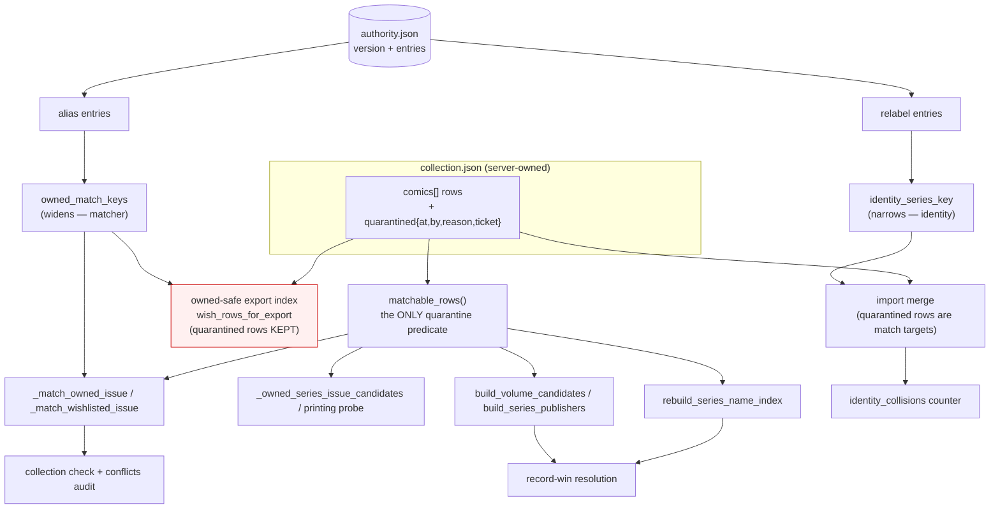

# feat: Collection Identity Spine + Quarantine

## Summary

Add a **quarantine** state to the collection store — a row that stays present and
round-trips with LOCG but answers no matcher question — routed through a single pool seam so
a new matcher cannot forget it. Then move provider naming facts out of Python and into a
schema-versioned **authority table** with two disjoint entry kinds, so the matcher and
identity normalizations keep their opposite pressures. Add the one guard that makes growing
either safe: a post-import count of identity tuples held by more than one row. Remediate the
6 cross-edition twins and 3 identity collisions measured live. Whether identity re-keys onto
`metron_id` is decided by a measurement unit at the end, not by this plan. Implements BUI-611
from the origin requirements doc.

---

## Problem Frame

Six identity tickets shipped in one week in late July, all one class: the provider renamed
something and the key moved with it. Two proposals in that run were falsified on measurement.
The full framing, and the live measurements this plan is built on, are in the origin doc (see
`origin:` above). Two facts drive every decision below:

- The store has no third state between *full citizen* and *unsafe delete*, so six rows that
  are owned twice — created by our own record-win push, undeletable because LOCG re-emits
  them, unclearable because that runs the BUI-122 data-loss path — sit in every candidate
  pool with no way out.
- `metron_id` is present on 11 of 2843 rows (0.4%). The ideation's "already threaded through
  five modules" describes code, not data.

---

## Requirements

Origin R1–R18 carry forward. Refinements forced by reading the code:

- **R2 (pool exclusion) — the pool inventory is nine functions, not four.** The origin names
  four *user-facing* pools; the readers are `_match_owned_issue` (`commands.py:3159`),
  `_match_wishlisted_issue` (:3235), `_owned_series_issue_candidates` (:3091),
  `_printing_conflict_fields` (:3460), `rebuild_series_name_index`
  (`collection_cache.py:816`), `build_volume_candidates` (:841), `build_series_publishers`
  (`collection_io.py:275`), plus the conflicts audit, which reaches ownership through
  `cmd_collection_check` rather than reading rows itself.
- **R2 — "wish-list dedup" is not a collection-row pool.** Wish dedup
  (`_find_duplicate_wish_entry`) compares entries in `wish-list.json`, a separate file. The
  wish path touches collection rows only through the ownership check and the conflicts
  audit, both already covered. Quarantine changes nothing about wish-to-wish dedup.
- **R12 (validator) — split by what CI can see.** CI validates *structure*: kind, evidence,
  derived-key freshness, and no-op entries. The "would this entry create a new cross-volume
  ambiguity" question needs the live corpus, so it ships as an operator report
  (`locg collection authority-check`) run before adding an entry, not as a CI gate. Making
  it a blanket refusal would reject the five aliases already shipped and working.
- **R14 (`identity_collisions`) — counted over *all* rows, not owned rows.** The existing
  `owned_duplicate_identities` is owned-scoped and that scoping is exactly why the three live
  collisions (all wish-side) were invisible to BUI-556's cleanup. A counter must not repeat
  the partition mistake it exists to catch.
- **R16/R17 — remediation runs on the Mac Mini against the server-owned store**
  (`~/.comics-server/collection-store`), through `CollectionCache.apply`, never the delete
  API.

---

## Key Technical Decisions

- **KTD1 — Quarantine is a structured object, not a boolean.** `row["quarantined"] =
  {"at", "by", "reason", "ticket"}`; the key's absence means not quarantined, so every
  existing row and every future LOCG import row is unquarantined without a migration. A bare
  flag would repeat the mistake the `bids` tombstone had to correct: `REMOVED` alone could
  not distinguish a live cancel from a completed sweep, which is why BUI-371 added a `notes`
  marker. Encode the *cause* at write time or lose it (`durable-evidence-store-encode-
  unknowns-and-identity-precisely.md`). `reason` is free text; `ticket` is the audit anchor.

- **KTD2 — One seam: `matchable_rows(comics)` in `collection_cache.py`.** Every matcher pool
  calls it; it is the only place the `quarantined` predicate appears. This mirrors
  `owned_match_keys` — one source of an equivalence, many consumers — and is the only shape
  where adding a tenth pool cannot silently miss the state. A table-driven test enumerates
  every pool function by name and asserts each excludes a quarantined row from a shared
  fixture store; adding a pool without adding it to that table is the only way to regress,
  and the table is one list in one file.

- **KTD3 — The enforcement layer gets the opposite treatment, asserted by an inverted test.**
  `_owned_series_issue_index` (`collection_io.py:2358`) and `wish_rows_for_export` (:2400)
  must **keep** quarantined rows: dropping a quarantined owned row from the owned index makes
  the export emit `In Collection=0` for a wish that matches it, which is the BUI-122 deletion
  path. A test asserts a quarantined owned row is still present in the owned index, so a
  later "helpful" consistency edit fails loudly. This is the mechanized form of "the plan does
  not touch the enforcement layer."

- **KTD4 — Safety direction is asymmetric per surface, and the one dangerous direction is
  fail-closed.** Quarantine may make the buy path more cautious; it may never make the export
  more aggressive. The buy-path risk (a book's only owned row quarantined → `not_in_cache` →
  duplicate purchase) is closed by refusing to quarantine when no other non-quarantined owned
  row covers the same `(owned_match_keys × issue_key)` pair. `--force` overrides and records
  the reason in the quarantine object. Fail-closed scoped to exactly the destructive branch
  (`guard-strictness-must-match-consequence.md`); every non-last-row quarantine proceeds
  without ceremony.

- **KTD5 — The authority table is a git-versioned JSON file inside the package.**
  `packages/locg-cli/src/locg/data/authority.json`, `{"version": 1, "entries": [...]}`, loaded
  once at import via `importlib.resources`, packaged as data. An identity incident becomes a
  reviewed PR touching no matcher logic. A store-local overlay on the Mini was rejected for
  v1: an unreviewed widening on a data-loss-adjacent surface, with no history of who added an
  alias or why, is the wrong trade for saving one deploy.

- **KTD6 — Two entry kinds, two readers, and neither reader can see the other's entries.**
  `alias` — symmetric, `{"kind": "alias", "names": [a, b], "evidence", "added"}` — read only
  by `owned_match_keys`, which widens. `relabel` — directed,
  `{"kind": "relabel", "from", "to", "evidence", "added"}` — read only by
  `identity_series_key`, which narrows. The loader builds two separate frozen structures and
  exposes two separate accessors; there is no combined view to accidentally consume. This is
  how one table serves both without merging the functions: they share a *file and a schema*,
  never a code path. Generative rules (end-year fold, bare-year fold) stay in code because
  they are rules; one-off rewrites become entries because they are facts.

- **KTD7 — Every table key is derived at load time, never stored normalized.** Entries hold
  display strings; the loader runs them through `_normalize_series_key` (alias) or
  `identity_series_key` (relabel). This is the existing `_MASTHEAD_ALIAS_PAIRS` /
  `_XMEN_SPLIT_KEYS` discipline — BUI-546's punctuation fold turned `x-men` into `x men` and
  would have silently emptied a hand-normalized table. A validation test asserts every entry's
  derived key is non-empty and that `from`/`to` do not derive to the same key (a no-op
  entry is a mistake, not a harmless line).

- **KTD8 — `identity_collisions` is computed over all rows and is advisory.** Post-import
  count of identity tuples held by more than one row, plus a warning naming up to ten. Never a
  sync blocker: BUI-563 established that a hard stop over a condition with no local remedy
  blocks every sync indefinitely, and this counter's first reading is 3. It becomes a
  candidate for a hard stop only after every known class has a remedy — recorded as an open
  question, not a plan step.

- **KTD9 — The re-key sweep is a reusable function, not a one-off script.** `rekey_sweep`
  merges rows that a shipped identity change causes to collide, using BUI-556's measured
  survivor rules: newest `last_seen_in_export_at` wins (never `local_added_seq` — it is a
  within-import counter and picks the stale row in 35 of 60 measured groups); fold any field
  the survivor lacks, excluding per-row bookkeeping; **abort** rather than guess when two rows
  carry different non-null `gixen_item_id` or `price_paid`, because that is the signature of a
  genuine second copy. Both remediation units call it; so does any future identity change.

- **KTD10 — Writes go through the server, reads may be local.** The store is server-owned
  (`~/.comics-server/collection-store`). Quarantine's write path is
  `POST /api/comics/collection/quarantine` in the overlay plus a `locg collection quarantine`
  CLI that requires an explicit `LOCG_DATA_DIR` — the same mutating-command guard
  `collection import` and `record-win` carry (BUI-476/489), for the same reason: a bare
  default on the MacBook silently writes into an empty store.

- **KTD11 — The `metron_id` spike ships no behavior.** It is a read-only script whose output
  is a decision recorded on its Linear issue. If resolvability does not support re-keying,
  that is a recorded falsification and the project ends at Phase C — the outcome this repo
  has learned to plan for (four falsified pool-shape signals, BUI-559, BUI-574).

---

## High-Level Technical Design

The two paths out of `authority.json` never meet. `alias` reaches only the widening reader;
`relabel` reaches only the narrowing one. The enforcement layer (red) reads rows directly and
is deliberately outside the seam.

| Surface | Quarantined row | Why |
|---|---|---|
| `collection check` ownership / wish match | excluded | it must stop answering |
| cross-volume candidates, printing probe | excluded | same verdict, same pool |
| record-win series index / volume candidates / publishers | excluded | stop it being a resolution target |
| conflicts audit | excluded (via check) | inherits the ownership verdict |
| import merge | **kept** | else the next export inserts a twin |
| owned-safe export index, `wish_rows_for_export` | **kept** | dropping it deletes an owned book |
| pending-push CSV | excluded | never re-push a row we quarantined |
| `collection status`, import summary | counted, separately | never silently vanish |

---

## Implementation Units

Units are ordered by dependency. U-IDs are stable identifiers, not a reading order.

### Phase A — quarantine (ships alone, useful alone)

### U1. Quarantine state and the `matchable_rows` seam

- **Goal:** A row can be quarantined; every matcher pool excludes it; the enforcement layer
  provably does not.
- **Requirements:** R1, R2, R3, R5; KTD1, KTD2, KTD3.
- **Dependencies:** none.
- **Files:** `packages/locg-cli/src/locg/collection_cache.py` (`matchable_rows`,
  `is_quarantined`, `rebuild_series_name_index`, `build_volume_candidates`),
  `packages/locg-cli/src/locg/commands.py` (`_match_owned_issue`, `_match_wishlisted_issue`,
  `_owned_series_issue_candidates`, `_printing_conflict_fields`),
  `packages/locg-cli/src/locg/collection_io.py` (`build_series_publishers`),
  `packages/locg-cli/tests/test_quarantine.py` (new),
  `packages/locg-cli/tests/test_collection_cache.py`.
- **Approach:** `is_quarantined(row)` is a truthiness read of `row.get("quarantined")`;
  `matchable_rows(comics)` returns the non-quarantined rows. Every pool listed above filters
  at its entry point, not inside its loop, so the predicate appears once per pool and the
  pool's own logic is untouched. `_printing_conflict_fields` and
  `_owned_series_issue_candidates` take `comics` as a parameter today, so the filter lands at
  the `cmd_collection_check` call site once and reaches all four commands-side pools; assert
  that in a test rather than assuming it. `collection_io.build_series_publishers` and the two
  `collection_cache` index builders each filter their own iteration.
- **Patterns to follow:** `owned_match_keys` as the single-source-of-equivalence precedent;
  `_is_owned` as the existing strict row-predicate shape.
- **Test scenarios:**
  - Table-driven: for each named pool function, a fixture store with one quarantined row and
    one clean row returns only the clean row. The table is the test's own list of pools.
  - Covers AE1. Quarantined Panini `X-Men #118` + clean Marvel `The X-Men #118` →
    `collection check` returns `in_collection` naming the Marvel row.
  - Covers AE2. Only owned row quarantined → `collection check` does not report
    `in_collection`.
  - **Inverted (KTD3):** a quarantined owned row IS still in `_owned_series_issue_index`, and
    `wish_rows_for_export` still suppresses a wish for it. These tests fail if someone adds
    the filter there.
  - Covers AE3. Import of an export containing a quarantined book updates the row in place,
    inserts nothing, and preserves the `quarantined` object.
  - A row with `quarantined` absent, `None`, or `{}` is matchable (no migration needed).
- **Verification:** every pool in the table excludes; both enforcement-layer functions
  include; import round-trip preserves the state.

### U2. Quarantine write path, guard, and surfaces

- **Goal:** Quarantine can be applied and lifted, is refused when it would blind the last
  owned copy, is audited, and is visible in counts.
- **Requirements:** R1, R4, R6, R7, R8; KTD4, KTD10.
- **Dependencies:** U1.
- **Files:** `packages/locg-cli/src/locg/commands.py` (`cmd_collection_quarantine`,
  `cmd_collection_unquarantine`, `cmd_collection_status`),
  `packages/locg-cli/src/locg/cli.py`, `packages/locg-cli/src/locg/collection_io.py`
  (`_pending_push_rows`, import summary counts),
  `plugins/gixen-overlay/src/gixen_overlay/routes.py`
  (`POST /api/comics/collection/quarantine`), `packages/locg-cli/tests/test_quarantine.py`,
  `plugins/gixen-overlay/tests/test_gixen_overlay_routes.py`.
- **Approach:** The mutation runs through `CollectionCache.apply` (exclusive lock, backup
  rotation, atomic write) and appends an audit record, matching every other store mutation.
  Row selection must key on something genuinely unique or assert exactly one match —
  `gixen_item_id` is **not** unique (a lot shares it across issues, BUI-500), so selection is
  by `(publisher_name, series_name, full_title, release_date)` identity with an
  exactly-one-match assertion. The last-owned-row guard computes, for the target row's
  `owned_match_keys × issue_key`, whether any other owned non-quarantined row remains; if not,
  refuse with a message naming the book, unless `--force`, which requires and records a
  reason. `_pending_push_rows` skips quarantined rows in the same place it skips
  `needs_manual_*`. `cmd_collection_status` and the import summary gain a `quarantined` count.
  The endpoint requires an explicit store (BUI-476/489 guard) and returns the audit record.
- **Patterns to follow:** `needs_manual_variant` / `needs_manual_series_canonical` as the
  existing "in the store, out of the push" precedent; `cmd_collection_remediate_set_copies`
  for the apply + exactly-one-match shape; `_explicit_store_required_error`.
- **Execution note:** implement the last-owned-row predicate test-first — it is the one piece
  whose failure costs money.
- **Test scenarios:**
  - Quarantine a twin whose sibling is clean → applied, audit record written.
  - Quarantine the only owned row → refused, nothing written, message names the book.
  - Same with `--force` and a reason → applied, reason stored in the quarantine object.
  - `--force` without a reason → refused (the override must not be free).
  - Identity matching two rows → refused before any write (exactly-one-match).
  - Unquarantine → key removed, audit record written, row matchable again.
  - Quarantined pending-push row is absent from the CSV; a clean pending row is present.
  - `collection status` and the import summary report the quarantined count.
  - Endpoint against an unset `LOCG_DATA_DIR` → explicit-store error, no write.
- **Verification:** no path writes a quarantine without an audit record; the guard cannot be
  bypassed silently.

### U3. Remediate the 6 cross-edition twins

- **Goal:** The six measured Panini rows are quarantined on the live store and the
  cross-edition advisory reaches 0 because they were dispositioned.
- **Requirements:** R16.
- **Dependencies:** U1, U2.
- **Files:** no source changes expected; a one-shot script under
  `packages/locg-cli/scripts/` if the CLI cannot express the batch.
- **Approach:** On the Mac Mini: `CollectionCache.backup_store` to a directory outside the
  store, snapshot the pre-state (row count, the 6 identities, the advisory count), apply
  quarantine to each Panini row naming BUI-563/564 as the ticket, then diff and assert: row
  count unchanged, exactly 6 rows gained a `quarantined` object, no other field on any row
  changed, `owned_duplicate_identities_cross_edition` now 0, and `collection check` for each
  of the six issue numbers still returns `in_collection` naming the US row. The diff is taken
  against the backup with the server **stopped or quiesced** — a live diff shows unrelated
  sync drift, and every changed field must be attributable to a named writer (BUI-626/636).
- **Patterns to follow:** the backup → apply → diff → row-count ritual; BUI-556's cleanup as
  the worked example.
- **Test scenarios:** `Test expectation: none — one-shot production remediation; the
  assertions above are the verification and are recorded on the issue.`
- **Verification:** the six US-edition books still read `in_collection`; the advisory count is
  0; the backup exists and is byte-verified before the first write.

### Phase B — identity integrity

### U4. `identity_collisions` counter and the re-key sweep

- **Goal:** The store can notice that its identity key has stopped being a key, and there is
  one reusable way to fix it.
- **Requirements:** R14, R15; KTD8, KTD9.
- **Dependencies:** none (independent of Phase A; sequenced after it only by priority).
- **Files:** `packages/locg-cli/src/locg/collection_io.py` (counter in the import summary),
  `packages/locg-cli/src/locg/collection_cache.py` (`rekey_sweep`),
  `packages/locg-cli/tests/test_collection_io.py`,
  `packages/locg-cli/tests/test_collection_cache.py`.
- **Approach:** The counter groups all rows by `make_identity` and counts groups of size > 1,
  appending a warning naming up to ten titles. Deliberately not owned-scoped (KTD8).
  `rekey_sweep(payload)` returns the merge plan and applies it under the caller's lock:
  survivor by newest `last_seen_in_export_at`; fold missing fields from the loser excluding
  `local_added_*`, `last_seen_in_export_at`, `pushed_to_locg_at`, `source`, `in_collection`;
  abort the whole sweep — do not partially apply — when any group holds two different non-null
  `gixen_item_id` or `price_paid` values, reporting that group. Copy count is decided from
  evidence: one book recorded twice keeps the survivor's count; summing would invent phantom
  copies.
- **Patterns to follow:** BUI-556's three measured findings; the two-pass exact-then-tolerant
  ordering in `_standard_merge_phase` (the sweep runs after exact identity matching, never
  instead of it).
- **Test scenarios:**
  - Covers AE5. Two rows sharing an identity tuple → counter reports 1 group and names it.
  - Counter can fail: a store with no collisions reports 0 *and* the test asserts the fixture
    could have produced a non-zero (seed a collision, assert 1, remove it, assert 0).
  - Sweep picks the newest `last_seen_in_export_at`, not the highest `local_added_seq`
    (seed them in opposite order — this is the case BUI-556 measured wrong in 35 of 60
    groups).
  - Sweep folds a field present only on the loser; leaves bookkeeping fields alone.
  - Sweep aborts wholly on conflicting `price_paid`, applying nothing.
  - Copy count is not summed for a one-book-twice group.
- **Verification:** the counter reports 3 against a fixture copy of the live store's colliding
  rows; the sweep is a pure plan-then-apply with an all-or-nothing abort.

### U5. Remediate the 3 identity collisions

- **Goal:** `identity_collisions` reaches 0 on the live store because the rows were merged.
- **Requirements:** R17.
- **Dependencies:** U4.
- **Files:** none expected beyond a one-shot invocation.
- **Approach:** Same ritual as U3. The three Absolute Martian Manhunter groups are wish-side
  (`#1` also holds an owned row); assert after the sweep that the owned `#1` row is untouched,
  the wish rows are merged into one per identity, `in_wish_list` state is preserved, and the
  wish-list file (`wish-list.json`, a separate file) is unchanged — the collision is in
  `collection.json` only.
- **Test scenarios:** `Test expectation: none — one-shot production remediation; assertions
  recorded on the issue.`
- **Verification:** `identity_collisions` is 0; row count drops by exactly the merged count;
  no owned row changed.

### Phase C — authority table

### U6. Authority table schema, loader, and validation

- **Goal:** A schema-versioned data file with two entry kinds, loaded and validated, with a
  validator proven able to fail.
- **Requirements:** R9, R10, R11, R12; KTD5, KTD6, KTD7.
- **Dependencies:** none (independent; sequenced after Phase A/B by priority).
- **Files:** `packages/locg-cli/src/locg/data/authority.json` (new),
  `packages/locg-cli/src/locg/authority.py` (new loader),
  `packages/locg-cli/pyproject.toml` (package data),
  `packages/locg-cli/tests/test_authority.py` (new).
- **Approach:** `{"version": 1, "entries": [...]}`. The loader reads once at import via
  `importlib.resources`, validates, and builds **two separate** frozen structures: alias
  groups (symmetric + transitively closed, reusing `_build_alias_groups`) and a relabel map
  (directed, `from_key -> to_display`). Two accessors, no combined view. Validation rejects:
  unknown `kind`, missing `evidence` or `added`, an `alias` whose two names derive to the same
  key, a `relabel` whose `from` and `to` derive to the same identity key, an entry whose
  derived key is empty, and an unknown `version`. A malformed table raises at import — this
  file is small, reviewed, and shipped with the package, so failing loudly beats degrading to
  a partial table that silently stops matching.
- **Patterns to follow:** `_build_alias_groups` and the derived-key discipline already in
  `collection_cache.py`; `scripts/solutions-lint --self-test` as the "prove the check can
  fail" precedent.
- **Test scenarios:**
  - Covers AE7. A no-op `relabel` → validation error naming the entry.
  - Covers AE8-adjacent structure: an `alias` whose names already normalize equal → error.
  - Missing `evidence` → error; unknown `kind` → error; unknown `version` → error.
  - The two accessors are disjoint: an `alias` entry never appears in the relabel map and
    vice versa (assert by construction over a fixture holding both kinds).
  - Derived keys are recomputed at load: monkeypatch the normalizer to a different fold and
    assert the built keys change (the anti-orphan property BUI-546 needed).
  - Self-test: each validator rule is exercised by a fixture that violates exactly it, so no
    rule can be dead.
- **Verification:** the shipped table loads clean; each validator rule has a failing fixture.

### U7. Move the masthead aliases into the table

- **Goal:** `_MASTHEAD_ALIAS_PAIRS` becomes data with no behavior change.
- **Requirements:** R13; KTD6.
- **Dependencies:** U6.
- **Files:** `packages/locg-cli/src/locg/collection_cache.py` (`_ALIAS_GROUPS` sourced from
  the loader), `packages/locg-cli/src/locg/data/authority.json`,
  `packages/locg-cli/tests/test_collection_commands.py` (unmodified — that is the proof).
- **Approach:** The five pairs (`Mighty Thor`/`Thor`, `Invincible Iron Man`/`Iron Man`,
  `Incredible Hulk`/`Hulk`, `Uncanny X-Men`/`X-Men`, `Dr. Strange`/`Doctor Strange`) become
  `alias` entries carrying their originating ticket as evidence (BUI-197, BUI-546).
  `owned_match_keys` reads the loader's alias groups. The X-Men issue-number split and the
  annual-suffix rule stay in code — they are *rules over keys*, not naming facts, and the
  split is scoped to an era boundary a table cannot express. Behavior preservation is proven
  by the BUI-197/BUI-200 alias tests passing **unmodified**; if a test needs editing, the
  migration was not behavior-preserving.
- **Test scenarios:**
  - Covers AE6. Existing alias/annual/split tests pass with no edits.
  - The Python tuple is gone: a test asserts the module no longer defines it (so a future
    reader cannot add a sixth pair to a dead constant).
  - An entry added to the table takes effect in `owned_match_keys` without a code change
    (add one in a fixture table, assert the key set widens).
- **Verification:** `git diff` on the alias test files is empty.

### U8. Relabel entries and the authority-check report

- **Goal:** `identity_series_key` consults directed relabel entries, and an operator can see
  what an entry would do to the live corpus before adding it.
- **Requirements:** R9, R10, R12 (operator half), R15; KTD6, KTD9.
- **Dependencies:** U4 (the sweep), U6.
- **Files:** `packages/locg-cli/src/locg/collection_cache.py` (`identity_series_key`),
  `packages/locg-cli/src/locg/commands.py` (`cmd_collection_authority_check`),
  `packages/locg-cli/src/locg/cli.py`, `packages/locg-cli/tests/test_authority.py`,
  `packages/locg-cli/tests/test_collection_cache.py`.
- **Approach:** `identity_series_key` applies the generative folds first (end-year, bare
  year), then looks the result up in the relabel map and rewrites if present — so a relabel
  entry can be written against either spelling and still land. Order is asserted by test. The
  table ships with **zero** relabel entries: none of the currently-known classes needs one
  (the folds cover them), and shipping an empty kind with a live reader plus a test is
  correct — the mechanism exists for the next incident, and an empty table is honest about
  today. `cmd_collection_authority_check` reports, per entry, which owned rows it makes
  equivalent and flags any pair it newly makes equivalent that shares an issue number with
  incompatible release dates — a new cross-volume ambiguity. Advisory report, run before
  adding an entry. Adding a relabel entry is documented as owing a `rekey_sweep` run (U4).
- **Test scenarios:**
  - A relabel entry rewrites the identity key; the generative folds still run first.
  - A relabel written against the *unfolded* spelling still applies (order property).
  - No relabel entries → `identity_series_key` behaves byte-for-byte as today (regression
    guard over a corpus of real series names).
  - `authority-check` on the live-shaped fixture flags the `uncanny x men`/`x men` pair's
    same-issue incompatible-date rows and does not flag legitimately distinct series.
  - `authority-check` with an empty store → reports nothing, does not crash, and says the
    corpus was empty rather than reporting "clean".
- **Verification:** the identity path reads only relabel entries; the matcher path reads only
  alias entries; the report names the rows it would affect.

### Phase D — measurement

### U9. Spike: `metron_id` resolvability and backfill cost

- **Goal:** Decide, on measured evidence, whether re-keying identity onto `metron_id` is
  worth designing.
- **Requirements:** R18; KTD11.
- **Dependencies:** none.
- **Files:** `packages/locg-cli/scripts/` (read-only measurement script); results recorded on
  the Linear issue.
- **Approach:** Over a sample of the live store's 2843 rows (stratified: vintage, modern,
  annuals, variants/printings, foreign editions, dateless rows), attempt Metron resolution and
  record: resolved / ambiguous / not-found rates per stratum, disagreement against the 11 rows
  that already carry a `metron_id`, wall-clock and request count per 100 rows, and the
  observed failure modes. Then state what a re-key would *buy*: for each duplicate class this
  repo has recorded, whether a `metron_id` anchor would have prevented it. Run read-only, with
  no writes to the store and no `--force` paths.
- **Execution note:** the oracle-bound question comes first — if a perfect `metron_id` anchor
  would not have prevented the recorded incidents, the resolvability number does not matter
  and the spike stops there (BUI-629's rule; it killed a ticket before any signal was
  designed).
- **Test scenarios:** `Test expectation: none — read-only diagnostic; findings recorded on the
  issue.`
- **Verification:** a number and a recommendation on the issue, including an explicit
  "not worth it" outcome as an acceptable result.

---

## Acceptance Examples

Origin AE1–AE8 carry forward and are mapped to units above. Plan-added:

- **AE9. Covers KTD2.** Given a tenth matcher pool is added without registering it in the
  seam test's table, the omission is visible as a missing row in one list in one file — the
  only place the plan concedes discipline is still required.
- **AE10. Covers KTD3.** Given someone adds a `matchable_rows` filter to
  `_owned_series_issue_index`, the inverted test fails and names the BUI-122 deletion path.
- **AE11. Covers KTD9.** Given a collision group whose two rows carry different non-null
  `price_paid`, when `rekey_sweep` runs, nothing is applied and the group is reported.
- **AE12. Covers U8.** Given the authority table ships with zero relabel entries, when
  `identity_series_key` runs over a corpus of real series names, its output is identical to
  today's.

---

## Scope Boundaries

Carried from origin: the owned-safe export enforcement layer is not modified; `metron_id`
re-keying is measured, not planned; the overlay's SQLite `comics` table is out; the `bids`
tombstone and status classification are untouched; the generative folds stay as code; no bulk
wish-list conflict removal.

### Deferred to Follow-Up Work

- A store-local authority overlay editable on the Mini without a deploy (KTD5 rejected it for
  v1; revisit only if incident latency proves binding).
- Auto-proposing `relabel` entries from import diffs — the import can see the rename it just
  failed to match, but proposing entries automatically is a widening generator and needs its
  own falsification story.
- Quarantine as an input to FMV or bid policy (a quarantined row is an identity fact, not a
  pricing one).
- Promoting `identity_collisions` to a sync hard stop once every known class has a remedy.
- Extending the doctrine to the overlay `comics` table (BUI-591/596/600/626 surface).
- A `/comic:*` skill surface for quarantine — the CLI plus the endpoint cover the operator
  path; a skill only earns its place once the state is used routinely.

---

## Risks & Dependencies

- **The buy path can be made blind by a quarantine.** This is the plan's only money-adjacent
  risk. Mitigated by the last-owned-row refusal (KTD4), by the fact that every seeded row has
  a clean sibling by construction, and by U3's post-remediation assertion that all six books
  still read `in_collection`. Residual: a `--force` quarantine of a last owned row is
  permitted by design, and will cause a duplicate-buy verdict; it records why.
- **A "consistency" edit to the enforcement layer.** The single most dangerous follow-up
  someone could make is to filter quarantined rows out of the owned index for symmetry.
  Mitigated by the inverted test (KTD3) and by the table above; the comment at the call site
  must name the deletion path, not just say "do not filter".
- **The seam concedes one point of discipline.** A new matcher pool that never calls
  `matchable_rows` is undetectable by the seam itself. The pool table is the mitigation, and
  it is deliberately a plain list in the test file so the cost of registering is one line.
- **Remediation on live production data.** Both U3 and U5 run the documented ritual; the
  backup is byte-verified before the first write; the diff is taken with the server quiesced
  so unrelated sync drift cannot be mistaken for the change (BUI-626/636).
- **The authority table can over-fold via `alias`.** An alias widens the matcher, which is
  owned-*safe* in the export direction but can produce a false `in_collection` on the buy
  path. Mitigated by `authority-check` (U8) reporting the ambiguities an entry would create,
  by the year gate and BUI-284's `ambiguous_cross_volume` verdict downstream, and by the
  entries staying reviewed PRs rather than live edits.
- **The project may end at Phase C.** If U9's oracle bound says a `metron_id` anchor would not
  have prevented the recorded incidents, the ID-anchored endpoint is dropped. That is a
  successful outcome, recorded as a falsification.
- **Dependency:** deployment to the Mini runs `scripts/deploy.sh` (BUI-612), which asserts
  every deployed component reports the merged HEAD SHA — U3 and U5 must not run against a
  stale `locg` wheel (BUI-455: `--force` alone serves a cached wheel).

---

## Documentation / Operational Notes

- CONCEPTS.md gains **Quarantine** (a row present for the round-trip and absent from every
  matcher pool), **Authority Table**, **Alias Entry** / **Relabel Entry**, and **Identity
  Collision**. It already defines Identity Key, Duplicate Identity, Licensed Edition,
  Masthead, and Cross-Volume Ambiguity, which these build on.
- `packages/locg-cli/CLAUDE.md` documents `locg collection quarantine` / `unquarantine` /
  `authority-check`, all requiring an explicit `LOCG_DATA_DIR` for the mutating pair.
- The repo CLAUDE.md's "collection + wish-list are served from the comics server" section
  gains the quarantine endpoint alongside the existing write paths.
- A `docs/solutions/` doc is owed for the U1/U3 pair — the third-state pattern generalized
  from the `bids` tombstone — with `mechanized_by: test` naming the pool table and the
  inverted enforcement test (BUI-605 contract).
- Rollout: Phase A deploys inert (no row is quarantined until U3 runs). Phase B's counter
  deploys reporting 3, which is the correct first reading. Phase C ships with zero relabel
  entries and identical behavior.

---

## Assumptions

- LOCG re-emits a deleted row on the next export. This is documented in BUI-563's advisory
  text and is the premise of the whole quarantine design; it is stated as an assumption
  because it is a provider behavior, not something the repo can enforce.
- `_printing_conflict_fields` and `_owned_series_issue_candidates` receive `comics` from
  `cmd_collection_check`'s single call site, so one filter reaches all four commands-side
  pools. U1 asserts this rather than trusting it.
- The 6 twins and 3 collisions are stable between planning and execution; U3/U5 re-measure
  before writing rather than trusting these counts.
- Zero relabel entries at ship time is correct, not a gap — the generative folds cover every
  currently-known class.
- Advisory-first is right for `identity_collisions` because its first reading is non-zero; a
  hard stop would block every sync on day one (BUI-563's measured lesson).

---

## Sources / Research

- Origin: `docs/brainstorms/2026-08-03-collection-identity-spine-requirements.md` (BUI-611;
  seeded from `docs/ideation/2026-08-01-repo-improvements-ideation.md` survivor 7).
- Live measurements: `~/.comics-server/collection-store/collection.json` on the Mac Mini,
  2026-08-03, using the modules' own predicates (`_is_owned`, `_duplicate_check_title_key`,
  `_release_dates_compatible`, `_cross_edition_twin_signal`, `make_identity`).
- Identity + matcher code: `packages/locg-cli/src/locg/collection_cache.py`
  (`identity_series_key`:152, `make_identity`:205, `_normalize_series_key`:309,
  `_MASTHEAD_ALIAS_PAIRS`:508, `_build_alias_groups`:527, `owned_match_keys`:597,
  `rebuild_series_name_index`:816, `build_volume_candidates`:841, `CollectionCache.apply`:1146).
- Pools and enforcement: `packages/locg-cli/src/locg/commands.py`
  (`_owned_series_issue_candidates`:3091, `_match_owned_issue`:3159,
  `_match_wishlisted_issue`:3235, `_printing_conflict_fields`:3460, `cmd_collection_check`:3547,
  `cmd_wish_list_conflicts`:1387, `cmd_collection_record_win`:4962);
  `packages/locg-cli/src/locg/collection_io.py` (`build_series_publishers`:275,
  `_is_pending_push_row`:2252, `_pending_push_rows`:2268, `_owned_series_issue_index`:2358,
  `wish_rows_for_export`:2400, new-row `metron_id = None`:1866, cross-edition advisory ~2180).
- Server surface: `plugins/gixen-overlay/src/gixen_overlay/routes.py`
  (`api_collection_check`:1204, `check/batch`:1253, `wish-list/conflicts`:1444,
  `collection/export`:1561, `collection/import`:1692, `remediate/delete`:2228).
- Prior art: BUI-197 (the five-pair masthead alias table this generalizes), BUI-193 spike
  (`docs/plans/2026-06-16-002-spike-metron-canonical-series-name-source.md`, which deferred
  Metron-ID normalization for the reason U9 now measures).
- Institutional learnings applied:
  `docs/solutions/architecture-patterns/vacuous-partition-guards-and-mutable-identity-keys.md`
  (the matcher-vs-identity doctrine, the survivor rules, the vacuous-partition lesson),
  `docs/solutions/design-patterns/guard-strictness-must-match-consequence.md`,
  `docs/solutions/architecture-patterns/durable-evidence-store-encode-unknowns-and-identity-precisely.md`,
  `docs/solutions/design-patterns/scope-status-writes-to-row-id-not-item-id.md`,
  `docs/solutions/conventions/verify-ticket-premise-before-implementing.md` (Examples 9 and 15,
  and the §5i precision bar),
  `docs/solutions/integration-issues/locg-sync-unified-model-2026-06-22.md`,
  `docs/solutions/ui-bugs/collection-check-alias-and-printing-false-positives.md`.
