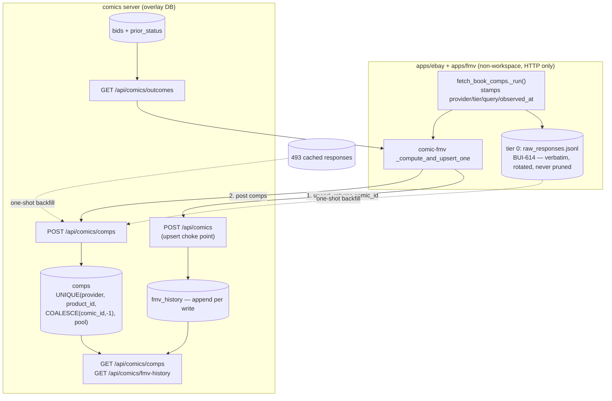

# feat: Comps Data Flywheel

## Summary

Persist the sold-comp data the pipeline already pays for. A `comps` table in the overlay DB
holds every parsed comp keyed on `comics.id` with its provider, query, tier, and observation
time; an `fmv_history` table appends a row at the one server endpoint every FMV writer passes
through; the completed-bids sweep stops silently destroying our own first-party comps. The 493
provider responses already cached on the Mini are imported once so the ledger starts with
16,820 real comps instead of empty. FMV computation is byte-identical throughout — this plan
writes the archive and never reads it back into a price. Implements BUI-610 from the origin
requirements doc.

---

## Problem Frame

`fmv` keeps `low`, `high`, and a comp **count**, under `UNIQUE(comic_id, grade)` — so 3,973
resolved comps across 796 rows are retained as 796 integers, and no book has more than one FMV
reading on record. Meanwhile 89 first-party comps have already been destroyed by the completed
purge, and the providers we depend on sit on a data source eBay has structurally closed. The
full framing and the live measurements this plan is built on are in the origin doc (see
`origin:` above).

---

## Requirements

Origin R1–R18 carry forward. Refinements forced by reading the code:

- **R1 (scope of "every comp") — the ledger's grain is a *priced* book, not a fetch.** comic-fmv
  posts comps after the `POST /api/comics` upsert, so a book that bails before the upsert
  (fetch-err, no target grade, the BUI-565 truncated-pool guard) contributes nothing to tier 1.
  That is deliberate: those paths return `comic_id: None`, and a comp with no identity and no
  price behind it belongs in tier 0, which already has it. A standalone `ebay-sold-comps`
  invocation likewise writes only tier 0 — it has no comic identity to key on.
- **R1 — slab comps are in, behind a `pool` discriminator.** `fetch_book_comps` returns
  `slab_comps` separately (the BUI-524 tier-4 inclusive pass). They are the graded market for
  the same book and are cheap to carry; one table with `pool IN ('raw','slab')` beats a second
  table or dropping them. They are stored, never blended — nothing reads them back here.
- **R11 (history append) — appends on every upsert, including no-change ones.** "We re-measured
  and nothing moved" is a fact worth a row, and a conditional append needs a comparison that
  can itself be wrong. Volume is bounded: a full `comic-fmv --force` sweep writes ~796 rows.
- **R14 (backfill corpus) — the cache is the corpus; the capture file is additive.** The tier-0
  capture is deployed but empty (no `comic-fmv` run since BUI-614 shipped), so the importer
  reads both and must tolerate either being absent.

---

## Key Technical Decisions

- **KTD1 — Two tiers, and the boundary is judgment.** Tier 0 (BUI-614) stays exactly as it is:
  verbatim provider responses, no identity, no parsing, never pruned. Tier 1 (`comps`) holds
  what the pipeline *treated as* a comp — same `parse_comp`/`parse_comp_sold_comps`, same
  `hard_exclude`, same dedupe — so a ledger row and a pool row are the same object and a future
  reader never has to ask which filters had run. Everything tier 1's judgment drops is still in
  tier 0. This is why R16's rotation compresses and never deletes.

- **KTD2 — The ledger lives in the overlay DB and is written over HTTP.** `apps/fmv` is not a
  workspace member and reaches the server over HTTP for every other write; a comps POST is the
  same edge, immediately after the upsert that already yields `comic_id`
  (`fmv_runner.py:998-999`). App-side storage was rejected: it would have no comic identity, and
  the repo's convention is that the server owns data. The table follows the plain-additive
  pattern of `rejected_writes`/`heartbeats`/`seller_scan_seen` — no FK-rebuild machinery, one
  nullable FK to `comics`.

- **KTD3 — Identity is nullable and never inferred.** `comic_id` is `INTEGER REFERENCES
  comics(id) ON DELETE SET NULL`, NULL for a backfilled response whose book could not be
  resolved. Uniqueness is `UNIQUE(provider, product_id, COALESCE(comic_id, -1), pool)` — the
  `COALESCE` is required because SQLite treats bare NULLs as distinct in indexes, so identity-
  free rows would otherwise duplicate on every re-observation. The same trick is already used
  for `COALESCE(variant,'')` on the comics indexes, with the reasoning documented there.
  `ON DELETE SET NULL`, not `CASCADE`: deleting a bad comics row must not delete market facts.

- **KTD4 — Re-observation updates bookkeeping and never rewrites a market fact.** A sold listing
  is immutable — item X cleared at $Y on date D — so the conflict resolution is *keep the first
  answer*: `ON CONFLICT DO UPDATE SET last_seen_at`, `seen_count = seen_count + 1`, and
  `conflict_count = conflict_count + 1` when the incoming price or sold date disagrees, plus one
  loud log naming both values. Silently overwriting would let a provider bug rewrite history
  with no trace; silently ignoring would make the disagreement invisible. Counting it is the
  minimum that cannot fail green.

- **KTD5 — Ledger failure is non-fatal to pricing and non-silent everywhere else.** The comps
  POST is wrapped like `_db_lookup`'s soft-fail: a failure logs, increments a per-run counter,
  and the book prices normally. Because the endpoint is a mutating `/api/comics/*` route, its
  4xx/5xx already lands in `rejected_writes` via `LedgerRoute` (BUI-601) with no new code. The
  run summary reports the count, so a run cannot end clean while its comps went nowhere — the
  add-batch summary lesson applied to a write nobody watches.

- **KTD6 — Per-comp provenance is stamped at parse time, not reconstructed.** Today `provider`,
  `tier`, `nkw`, and `cached` live on `queries_used` at the *book* level; which query surfaced a
  given comp is recoverable only from append order. `fetch_book_comps._run()` already has all
  four in scope at the `comps.append(comp)` site, so it stamps them onto the comp. Reconstructing
  provenance later from `queries_used` ordering is the kind of positional inference this repo
  has been burned by (BUI-174/187 added `_req_id` for exactly this reason).

- **KTD7 — `observed_at` is the response's fetch time, not the run's.** A cache hit must not be
  backdated to now. `fetch()`/`fetch_sold_comps()` already return `(data, cache_hit)`; they gain
  the cache entry's mtime on a hit and `now` on a live fetch, threaded onto each comp. Without
  this, a re-run of a stable book would restate three-month-old comps as observed today, which
  is precisely the staleness confusion the history table exists to remove.

- **KTD8 — First-party durability is a `prior_status` column on `bids`, not a second ledger.**
  `mark_bids_purged` erases the only fact `get_first_party_outcomes` needs, while leaving
  `winning_bid`, `resolved_at`, and the FMV link intact. The sweep records the status it
  replaces; the outcomes query admits `status IN ('WON','LOST') OR (status = 'REMOVED' AND
  prior_status IN ('WON','LOST'))`. A `first_party_comps` snapshot table modeled on `group_wins`
  was rejected for v1: it duplicates rows that already exist and its sync becomes a new thing
  that can fail green, whereas a column cannot drift from the row it lives on. The three BUI-371
  classification sites tombstone from `PENDING`, so they record `PENDING` and stay correctly
  excluded. **The 89 rows already swept are not recoverable** — their prior status was never
  written, `winning_bid` cannot distinguish WON from LOST, and inferring it would fabricate
  money-path data. The plan records the loss and stops the bleeding.

- **KTD9 — History appends at `POST /api/comics`, the single choke point.** comic-fmv, its
  CGC-proxy re-upsert (`fmv_runner.py:1155`), the cross-check re-upsert (`:1289`), and any
  hand edit all pass through `api_upsert_comic`. Appending there catches all of them; appending
  in the runner catches one. The append runs after the upsert commits, in its own try/except
  with a loud log — the `bid_decisions` KTD3 posture: an audit trail must never become a new way
  to fail a write. BUI-639 already makes a 422 reject the whole upsert, so a rejected write
  correctly appends no history row.

- **KTD10 — The backfill resolves identity by quoted-phrase recovery, and the alternative is
  already falsified.** Measured on all 493 cached responses: quoted-phrase recovery from the
  echoed query resolves 412 uniquely (83.6%), 31 ambiguous, 50 unresolved; `build_query`
  forward-generation with exact string match resolves only 270 (54.8%) because tiers 2–4 mutate
  the query. The unit must beat 412 or explain why, must never attach an ambiguous match, and
  must report all three counts — a silent partial import is a failed import.

- **KTD11 — Byte-identical FMV output is proven by replay, not by inspection.** BUI-614
  established the method: replay every cached response through the pre- and post-change modules
  with zero network calls and diff the computed bands. Every unit that touches `apps/ebay` or
  `apps/fmv` carries that check.

- **KTD12 — Tier 0 captures shape-invalid responses too, tagged.** BUI-628 raised this as an
  explicit BUI-610 decision: today `_capture_raw_response` fires only after
  `_verify_sold_comps_shape` / the `LH_Sold=1` assertion pass, so a response that violated our
  shape expectations — the single best evidence of provider drift — is discarded. The capture
  moves ahead of validation and carries the validation outcome (`ok` or the error string). This
  is safe precisely because nothing reads tier 0: an invalid body cannot reach a pool, a price,
  or the ledger, which only ever ingests parsed comps from a *successful* fetch. A network error
  with no body is still not captured — there is nothing to capture. Deciding this by default was
  the alternative BUI-628 warned against.

---

## High-Level Technical Design

| Surface | Writer | Failure posture |
|---|---|---|
| tier 0 capture | `apps/ebay` fetch path | log and continue (BUI-614, unchanged) |
| `comps` | comic-fmv, after the upsert | log + count + `rejected_writes`; run prices normally |
| `fmv_history` | `api_upsert_comic`, after commit | log loudly; upsert unaffected |
| `bids.prior_status` | `mark_bids_purged` | same transaction as the tombstone |

---

## Implementation Units

Units are ordered by dependency. U-IDs are stable identifiers, not a reading order — U4 and U5
are independent of Phase A and can ship in any order relative to it.

| Unit | Issue |
|---|---|
| U1 comps table + ingest endpoint | BUI-656 |
| U2 per-comp provenance | BUI-657 |
| U3 comic-fmv posts comps | BUI-658 |
| U4 `fmv_history` | BUI-659 |
| U5 purge-durable first-party comps | BUI-660 |
| U6 backfill | BUI-661 |
| U7 tier-0 rotation + invalid capture | BUI-628 (pre-existing) |
| U8 read endpoints | BUI-662 |

### Phase A — the ledger

### U1. `comps` table and the ingest endpoint

- **Goal:** A durable, idempotent home for parsed comps, keyed on `comics.id`, with a write
  endpoint that cannot rewrite a recorded market fact.
- **Requirements:** R1, R2, R3, R4; KTD2, KTD3, KTD4.
- **Dependencies:** none.
- **Files:** `plugins/gixen-overlay/src/gixen_overlay/db.py` (schema + `upsert_comps`),
  `plugins/gixen-overlay/src/gixen_overlay/models.py` (`CompsIngestRequest`),
  `plugins/gixen-overlay/src/gixen_overlay/routes.py` (`POST /api/comics/comps`),
  `plugins/gixen-overlay/tests/test_comps_ledger.py` (new),
  `plugins/gixen-overlay/tests/test_gixen_overlay_routes.py`.
- **Approach:** Columns: autoinc `id`, `comic_id` (nullable FK, `ON DELETE SET NULL`), `pool`
  (`raw`/`slab`, closed vocabulary checked at the write boundary), `provider`, `product_id`,
  `title`, `price`, `sold_date`, `grade` (nullable — parsed from the title), `buying_format`,
  `link`, `query`, `tier`, `from_cache`, `observed_at`, `provenance` (`live` /
  `backfill-cache` / `backfill-capture`), `first_seen_at`, `last_seen_at`, `seen_count`,
  `conflict_count`. Uniqueness per KTD3 via a `COALESCE`-expression unique index; indexes on
  `comic_id` and `observed_at`. `upsert_comps(conn, comic_id, comps)` does one
  `INSERT ... ON CONFLICT DO UPDATE` per comp inside the caller's transaction, bumping
  `last_seen_at`/`seen_count` always and `conflict_count` when `price` or `sold_date` disagrees
  with the stored row, logging each disagreement once with both values. The endpoint takes
  `{comic_id, comps: [...]}`, returns `{inserted, updated, conflicts}` so the caller can report
  what happened, and rejects an unknown `pool` or `provenance` with 422 (which `LedgerRoute`
  persists for free).
- **Patterns to follow:** `rejected_writes`/`heartbeats` as the plain-additive precedent;
  `COALESCE(variant,'')` on `idx_comics_tiyv` as the NULL-in-unique-index precedent;
  `group_wins`' closed vocabulary + provenance tagging.
- **Execution note:** implement the conflict branch test-first — "two different answers collapse
  into one" is the failure this table exists to prevent.
- **Test scenarios:**
  - Covers AE1. Same product id at the same price → `seen_count` 2, every other field unchanged,
    `conflict_count` 0. Same product id at a different price → stored price unchanged,
    `conflict_count` 1, one log naming both values.
  - Two comps with the same `product_id` and `comic_id` but different `pool` → two rows.
  - Two comps with the same `product_id` and NULL `comic_id`, posted twice → one row, not two
    (the `COALESCE` index property; assert by seeding NULL identity explicitly).
  - Same `product_id` under two different `comic_id`s → two rows (a listing surfaced for two
    books is two observations, not a conflict).
  - Unknown `pool` / unknown `provenance` → 422, nothing written, `rejected_writes` row exists.
  - Deleting a `comics` row leaves its comps present with `comic_id` NULL.
- **Verification:** no code path UPDATEs `price`, `sold_date`, `title`, or `link` on an existing
  row; the unique index rejects a duplicate identity-free comp.

### U2. Per-comp provenance in `apps/ebay`

- **Goal:** Each comp carries the provider, query, tier, cache status, and response fetch time
  that produced it — stamped where they are already in scope.
- **Requirements:** R7, R8; KTD6, KTD7, KTD11.
- **Dependencies:** none.
- **Files:** `apps/ebay/src/sold_comps.py` (`_cache_get`, `fetch`, `fetch_sold_comps`,
  `_fetch_with_fallback`, `fetch_book_comps._run`), `apps/ebay/tests/test_sold_comps.py`.
- **Approach:** `_cache_get` returns the entry's mtime alongside the data; `fetch`/
  `fetch_sold_comps` return `response_fetched_at` (mtime on a hit, `now` on a live fetch)
  through `_fetch_with_fallback` to `_run`, which stamps `provider`, `tier`, `query` (the `nkw`
  it just ran), `from_cache`, and `observed_at` onto each comp at the existing
  `comps.append(comp)` site — and onto `slab_comps` at its own append site. Fields are additive:
  `fmv_math.build_pool` reads `price`/`grade`/`sold_date` and ignores the rest, and the
  `ebay-sold-comps` → `comic-fmv` JSON contract tolerates extra keys the same way it already
  does. `queries_used` is unchanged — it stays the book-level trail.
- **Patterns to follow:** the `_req_id` correlation-key precedent (BUI-174/187) — carry identity
  on the object, never infer it from list position.
- **Test scenarios:**
  - A live fetch stamps `from_cache: False` and an `observed_at` within the run.
  - A cache hit stamps `from_cache: True` and the cache entry's mtime, not now (seed a cache
    file with an old mtime and assert the stamp matches it).
  - A book whose tier-2 broadened query adds comps → those comps carry `tier: "broadened"` and
    the broadened `nkw`, while tier-1 comps carry the base one.
  - A failover from sold-comps.com to SerpApi → each comp carries the provider that actually
    returned it, not the first one attempted.
  - Slab comps carry the same stamps.
  - Covers AE6. Replay every cached response through pre- and post-change modules: computed FMV
    bands identical, zero network calls.
- **Verification:** every comp emitted by `fetch_book_comps` carries all five fields; no comp's
  provenance is derived from its index in the list.

### U3. comic-fmv posts comps, and a failed post is visible

- **Goal:** The pool that produced a price is persisted beside it, and a failure to persist it
  cannot hide in a clean-looking run.
- **Requirements:** R1, R5, R6; KTD2, KTD5.
- **Dependencies:** U1, U2.
- **Files:** `apps/fmv/src/fmv_runner.py` (`_post_comps`, `_compute_and_upsert_one`, `run`'s
  summary), `apps/fmv/tests/test_fmv_runner.py`.
- **Approach:** A `_post_comps(server_url, comic_id, comps, slab_comps)` helper posts to
  `/api/comics/comps` immediately after `_extract_ids` yields a non-None `comic_id`
  (`fmv_runner.py:998-999`), soft-failing like `_db_lookup`: any exception or non-2xx logs a
  warning and increments a run-scoped counter, never raising into the per-book path. The
  CGC-proxy and cross-check re-upserts do **not** post again — the comps for that book are
  already stored and a second post would only bump `seen_count` misleadingly. `run`'s summary
  gains a comps-write line that is printed whenever the counter is non-zero, so an all-clean
  summary is only possible when every post landed.
- **Patterns to follow:** `_db_lookup` / `_get_json_or_warn` soft-fail posture; `add-batch`'s
  summary counts as the "a batch cannot end clean while rows carried failures" precedent.
- **Test scenarios:**
  - Covers AE3. Comps endpoint returns 500 for one book in a multi-book run → every book prices
    normally, the summary reports 1 comps-write failure, the exit code is unchanged.
  - A book that bails before the upsert (fetch-err, missing grade, BUI-565 truncated pool) posts
    nothing and is not counted as a failure.
  - A priced book posts exactly once even when the CGC-proxy rescue re-upserts it.
  - Covers AE6. Byte-identical FMV output across the change, proven by cached-response replay.
  - All posts succeed → summary carries no comps-write line (no noise on the happy path).
- **Verification:** no comps post can change a computed band or an exit code; a non-zero failure
  count always reaches stdout.

### Phase B — history

### U4. `fmv_history` append and the one-time snapshot

- **Goal:** Every FMV write leaves its predecessor readable instead of destroying it.
- **Requirements:** R11, R12, R13; KTD9.
- **Dependencies:** none (independent of Phase A; sequenced after it only by priority).
- **Files:** `plugins/gixen-overlay/src/gixen_overlay/db.py` (schema, `append_fmv_history`,
  migration), `plugins/gixen-overlay/src/gixen_overlay/routes.py` (`api_upsert_comic`),
  `plugins/gixen-overlay/tests/test_fmv_history.py` (new),
  `plugins/gixen-overlay/tests/test_gixen_overlay_routes.py`.
- **Approach:** Columns: autoinc `id`, `comic_id` (FK, `ON DELETE CASCADE`), `grade`, `low`,
  `high`, `comps`, `confidence`, `flag_reason`, `notes`, `recorded_at`, `source`
  (`upsert`/`backfill`, closed vocabulary). Append after the upsert commits, in its own
  try/except with a loud log. A guarded migration seeds one row per existing `fmv` row with
  `source='backfill'` and `recorded_at = fmv.updated_at` — recorded via `migration_state` so a
  restart cannot double-seed. No UPDATE or DELETE path exists on the table.
- **Patterns to follow:** `migration_state` for one-shot idempotency; `group_wins`' append-only
  + closed-vocabulary shape; the `bid_decisions` "audit append never blocks the write" posture.
- **Test scenarios:**
  - Covers AE7. A book priced, then re-priced → two history rows, oldest first stamped
    `backfill`… (in the migration case) and `upsert` for the recompute, each carrying the values
    written at that moment.
  - Two upserts with identical values → two rows (always-append, R11 refinement).
  - History append raises → the upsert response is still 2xx, the `fmv` row is written, one loud
    log.
  - A 422-rejected upsert (BUI-625 lot title) appends no history row.
  - The seeding migration runs twice → row count unchanged the second time.
  - Seeded rows carry `fmv.updated_at`, not the migration's clock.
  - Deleting a `comics` row cascades its history away (unlike comps, history is *about* the row).
- **Verification:** `fmv_history` has no UPDATE path; every 2xx `POST /api/comics` with a grade
  produces exactly one row.

### Phase C — durability, backfill, retention

### U5. Purge-durable first-party comps

- **Goal:** A completed-bids purge stops silently emptying the first-party comp pool.
- **Requirements:** R9, R10; KTD8.
- **Dependencies:** none.
- **Files:** `packages/gixen-cli/server/db.py` (`bids.prior_status` column + migration,
  `mark_bids_purged`), `packages/gixen-cli/tests/test_server_db.py`,
  `plugins/gixen-overlay/src/gixen_overlay/db.py` (`get_first_party_outcomes` status clause),
  `plugins/gixen-overlay/tests/test_gixen_overlay_db.py`,
  `plugins/gixen-overlay/tests/test_workspace_imports.py`.
- **Approach:** Add a nullable `prior_status` column to `bids`; `mark_bids_purged` sets it to
  the status it is replacing in the same UPDATE (`prior_status = status`), leaving its existing
  row-scoping filter untouched. The three BUI-371 classification sites tombstone from `PENDING`
  and record `PENDING` — no change needed there, and a test asserts they stay excluded.
  `get_first_party_outcomes`'s status clause becomes "resolved now, or resolved before the
  tombstone": `status IN ('WON','LOST') OR (status = 'REMOVED' AND prior_status IN
  ('WON','LOST'))`. The `calibration_report` shares that definition and inherits the fix — verify
  it does rather than assuming, since "a resolved auction is defined exactly once" is the
  documented reason both read the same helper.
- **Patterns to follow:** BUI-381's `group_wins` as the purge-durability precedent (and the
  reason a second table was considered); the row-scoping discipline already documented on
  `mark_bids_purged`.
- **Execution note:** the 89 already-swept rows are **not** recoverable — record the count on the
  issue and do not attempt to infer their prior status from `winning_bid`.
- **Test scenarios:**
  - Covers AE5. Seed WON and LOST bids with `winning_bid` and primary FMV links, run the
    completed sweep, and assert `get_first_party_outcomes` returns the same rows before and
    after.
  - A tombstone written by a BUI-371 classification site (from `PENDING`) records `prior_status
    = 'PENDING'` and is excluded from outcomes.
  - A pre-existing `REMOVED` row with `prior_status` NULL stays excluded (the migration does not
    fabricate history).
  - The live PENDING row sharing an item_id with a swept sibling is still untouched (the
    existing BUI-178 regression, re-asserted against the new column).
  - `calibration_report` sees the same restored rows.
- **Verification:** the first-party pool size is unchanged across a purge in a seeded fixture;
  no inference path assigns a status to a NULL `prior_status` row.

### U6. One-shot backfill from the cache and the capture file

- **Goal:** The ledger starts with the comps we have already paid for, honestly labeled.
- **Requirements:** R14, R15; KTD1, KTD10.
- **Dependencies:** U1.
- **Files:** `apps/fmv/scripts/backfill_comps_ledger.py` (new, alongside the existing one-shot
  measurement scripts), `apps/ebay/tests/` for any parsing helper it shares.
- **Approach:** Read every file in `~/.cache/ebay-sold-comps` and every record in the tier-0
  capture JSONL, tolerating either source being absent. Recover the query from the response
  itself (`search_parameters._nkw` for SerpApi, `keyword` for sold-comps.com), resolve
  `comic_id` by quoted-phrase recovery against `GET /api/comics`, and attach it only on a unique
  match — ambiguous and unresolved responses import with `comic_id` NULL. Parse comps with the
  live `parse_comp`/`parse_comp_sold_comps` + `hard_exclude` so backfilled rows are shape-
  identical to live ones (KTD1). Stamp `provenance` per source and `observed_at` from the capture
  record's timestamp where available, else the cache file's mtime; import the capture **first**
  so its real timestamps win `first_seen_at` on any response present in both. Post through
  `POST /api/comics/comps` — never direct SQL — so the ledger has exactly one writer. Print
  resolved / ambiguous / unresolved / inserted / updated counts and compare the resolution rate
  against the measured 412-of-493 floor.
- **Patterns to follow:** `apps/fmv/scripts/fmv_high_calibration.py` as the one-shot-script
  shape; the backup → apply → diff → count ritual for anything run against the live Mini.
- **Test scenarios:**
  - Covers AE2. A response whose quoted phrase matches two comics rows imports with `comic_id`
    NULL and increments the ambiguous count.
  - A response whose phrase matches one row imports with that `comic_id`.
  - A response present in both the capture and the cache imports once, with the capture's
    timestamp.
  - An empty/absent capture file → the cache import still runs and says so.
  - Re-running the whole backfill inserts nothing new (idempotent via U1's unique index) and
    reports 0 inserted.
  - A malformed/unparseable cached file is counted and skipped, never aborting the import.
- **Verification:** the run reports every count; the resolution rate is at or above the measured
  floor or the shortfall is explained on the issue; a second run is a no-op.

### U7. Tier-0 capture rotation and invalid-response capture

*Already filed as BUI-628, which raised both halves of this unit.*

- **Goal:** The raw capture can grow forever without filling a disk, nothing is ever deleted, and
  the responses most worth keeping stop being the ones thrown away.
- **Requirements:** R16, R17; KTD12.
- **Dependencies:** none.
- **Files:** `apps/ebay/src/sold_comps.py` (`_capture_raw_response`, `fetch`,
  `fetch_sold_comps`), `apps/ebay/tests/test_sold_comps.py`.
- **Approach:** *Rotation:* before appending, if `raw_responses.jsonl` exceeds a size threshold,
  rename it to `raw_responses.<UTC timestamp>.jsonl` and gzip it in place, then append to a
  fresh file. Rotation runs inside the existing swallow-everything try/except — a rotation
  failure must degrade to "keep appending to the current file", never to "lose the append".
  Size-based, not time-based: the failure being prevented is a full disk, and the write rate is
  bursty (a batch writes dozens of responses in minutes, then nothing for days). Nothing is ever
  pruned. Explicitly **not** TTL eviction — that is the exact property that makes `CACHE_DIR`
  useless as a historical record and the reason this file exists separately.
  *Invalid responses (KTD12):* move the capture call ahead of `_verify_sold_comps_shape` and the
  `LH_Sold=1` assertion, and record the validation outcome on the record (`ok`, or the error
  string). A body that arrived is captured whether or not we liked its shape; a network error
  with no body still captures nothing.
- **Patterns to follow:** the existing `_capture_raw_response` hedge posture — single
  `os.open(O_APPEND)` + `os.write`, everything wrapped, failures logged and swallowed.
- **Test scenarios:**
  - Below the threshold → no rotation, one file.
  - Crossing the threshold → the old file is gzipped under a timestamped name, a fresh file
    receives the append, and both files' records are readable together.
  - A rotation failure (unwritable directory) → the append still lands in the current file and
    the failure is logged.
  - Two concurrent appenders during a rotation → no record is lost (assert total record count
    across all segments).
  - A shape-invalid sold-comps.com body → captured with its validation error; the fetch still
    raises exactly as today and the response is still not cached.
  - A SerpApi response missing `LH_Sold=1` → captured with that error, fetch still raises.
  - A connection error with no body → nothing captured, no crash.
  - Covers AE6-adjacent: FMV output unaffected.
- **Verification:** no code path deletes a capture segment; total records across segments is
  conserved across a rotation; every response body that reached us is on disk exactly once.

### Phase D — read

### U8. Comps and history read endpoints

- **Goal:** The archive is queryable without opening SQLite by hand.
- **Requirements:** R18.
- **Dependencies:** U1, U4.
- **Files:** `plugins/gixen-overlay/src/gixen_overlay/db.py` (query helpers),
  `plugins/gixen-overlay/src/gixen_overlay/routes.py`,
  `plugins/gixen-overlay/tests/test_comps_ledger.py`,
  `plugins/gixen-overlay/tests/test_fmv_history.py`.
- **Approach:** `GET /api/comics/comps` — filters `comic_id` or (`title`, `issue`, optional
  `year`) mirroring `list_comics`' resolution, plus optional `grade` (band), `days`, `pool`,
  `provider`, and `limit`; newest-first by `observed_at`. `GET /api/comics/fmv-history` —
  `comic_id` or title/issue, optional `grade`, newest-first by `recorded_at`. Both read-only,
  both provider-neutral names, neither exposed to the pricing path. A book with no rows returns
  an empty list and says so distinctly from an unresolvable identity (400), so "no comps" is
  never confusable with "wrong book" — the fetch-err-versus-genuine-zero lesson.
- **Patterns to follow:** `api_comics_outcomes` as the identity-resolution + band-filter shape;
  the endpoint-naming convention (never `/locg/*`, never provider-named).
- **Test scenarios:**
  - Comps for a comic with rows at two grades and two providers → filters narrow correctly.
  - Unknown identity → 400; known identity with no comps → 200 and an empty list.
  - `days` filter uses `observed_at`, not `first_seen_at`.
  - History returns rows newest-first with the backfill row last.
  - Neither endpoint appears in any pricing-path call site (assert by grep in the contract test).
- **Verification:** both endpoints are read-only; "no rows" and "no such book" are distinguishable.

---

## Acceptance Examples

Origin AE1–AE7 carry forward and are mapped to units above (`Covers AE<N>` prefixes).
Plan-added:

- **AE8. Covers KTD3.** Given two backfilled comps with the same `product_id` and provider and
  no resolvable comic, when both are imported, the ledger holds one row — not two — because the
  unique index folds NULL identity through `COALESCE`.
- **AE9. Covers KTD8.** Given a `REMOVED` bid whose `prior_status` is NULL (swept before this
  change), it stays excluded from the first-party pool and nothing attempts to classify it.
- **AE10. Covers KTD5.** Given the comps endpoint is unreachable for an entire run, every book
  still prices, the summary reports the failure count, and `rejected_writes` holds one row per
  refused call.
- **AE11. Covers U7.** Given the capture file crosses the rotation threshold mid-batch, the
  batch's own appends are all present across the rotated and current segments.

---

## Scope Boundaries

Carried from origin: no portfolio view; no degraded-mode pricing from stored comps; no new
FMV-quality or pool-shape signal; first-party comp *semantics* untouched; status classification
ungated; the Collection Identity Spine neither depended on nor touched.

### Deferred to Follow-Up Work

- Degraded-mode pricing from the ledger when both providers fail (**BUI-663**) — the
  outage-resilience payoff, needing its own staleness rules, labeling, and soak before it goes
  near the money path.
- `GET /api/comics/portfolio` (cost basis versus current FMV) and the cost-basis backfill it
  needs (**BUI-664**) — 172 of 2,191 owned books qualify today.
- A dashboard price-history view over `fmv_history`.
- Comp-level analytics (per-provider yield, cache-hit rate over time, comp survival across
  recomputes) — the data lands here first; the questions can wait.
- Recovering the 89 already-swept first-party comps, if durable evidence of their outcome ever
  surfaces elsewhere.

---

## Risks & Dependencies

- **A silent archive is the failure mode this project is most likely to ship.** Everything here
  is non-blocking by design, which is exactly the shape of the nine documented fails-green
  incidents. Mitigation is layered and deliberate: `rejected_writes` persists every refusal for
  free, the run summary counts failures, and U3's tests assert the summary cannot read clean
  while a failure count is non-zero. Registering a `comps-ledger` job in `JOB_CONTRACTS`
  (BUI-602, which already supports declaring a contract with `wired: False`) is the natural next
  guard and is noted rather than built, since ingest cadence follows buying activity, not a clock.
- **Money-path regression risk is low but not zero.** U2 and U3 touch files the pricing path runs
  through. Mitigation: additive fields only, no change to any value `build_pool` reads, and the
  BUI-614 replay proof on every unit that touches those files.
- **`prior_status` is a `bids` schema change on the host.** It is additive and nullable, and the
  overlay's read of it lands in the same commit and the same CI run — the monorepo property the
  workspace-imports canary exists to protect. Version skew during deploy is benign: an old
  overlay ignores the column, a new overlay reading a NULL column behaves exactly as today.
- **Backfill identity is 83.6% at best.** ~16% of the cached corpus imports without a comic. That
  is the honest outcome and is preferable to a heuristic attachment on a money-adjacent table;
  the rows remain useful as market data and can be re-keyed later if a better resolver appears.
- **Volume.** 16,820 rows at import and roughly 5,000 comps per full re-price sweep; SQLite is
  untroubled. Tier 0 is the growth risk (~40.3 KB per response) and U7 addresses it.
- **Deploy:** the Mini runs `scripts/deploy.sh` (BUI-612), which reinstalls `apps/ebay` and
  `apps/fmv` with `--force --no-cache` and asserts every deployed component reports the merged
  HEAD SHA. U6 must not run against a stale install.

---

## Documentation / Operational Notes

- CONCEPTS.md gains **Comps Ledger**, **Tier-0 Capture**, and **FMV History**; the existing
  **First-Party Comp** entry gains the durability fact once U5 ships.
- `EBAY_SOLD_COMPS_CAPTURE_DIR` already exists (BUI-614); U7 adds the rotation threshold as the
  only new knob, defaulted so no operator action is required.
- Rollout order: U5 first if buying is active — every purge until it ships destroys first-party
  comps permanently. Otherwise U1→U2→U3 (the ledger starts filling), then U6 (backfill), then
  U4/U7/U8 in any order.
- U6 runs on the Mac Mini against the server-owned DB, after a `sqlite3 .backup` (never `cp` —
  the DB is WAL-mode) and with the row counts snapshotted before and after.

---

## Assumptions

- `comics.id` remains the FMV identity anchor for the life of this project; the Identity Spine
  explicitly excludes the overlay `comics` table from its scope.
- Extra keys on the `ebay-sold-comps` → `comic-fmv` JSON contract are tolerated by every reader,
  as they are today.
- eBay product ids stay a shared namespace across both providers (BUI-545's verification holds).
- One post per priced book is an acceptable ingest granularity — payloads stay at a few hundred
  comps and no batching layer is needed.
- Keeping the first recorded value on a conflict is the right rule because a sold listing is
  immutable; if a provider is ever found to correct its own data, this decision is revisited with
  the conflict counter as the evidence.

---

## Sources / Research

- Origin: `docs/brainstorms/2026-08-03-comps-data-flywheel-requirements.md` (BUI-610; seeded from
  `docs/ideation/2026-08-01-repo-improvements-ideation.md` survivor 6), which carries the full
  live-measurement trail.
- Schema and choke points: `plugins/gixen-overlay/src/gixen_overlay/db.py:28-160` (comics/fmv
  schema, the `COALESCE` unique-index precedent, `rejected_writes`, `heartbeats`,
  `migration_state`), `routes.py:300` (`api_upsert_comic`), `:214` (`api_comics_outcomes`),
  `db.py:1751` (`get_first_party_outcomes`).
- Destruction path: `packages/gixen-cli/server/db.py:1275` (`mark_bids_purged`),
  `server/main.py:2939-2956` (the sweep over every completed bid), `server/fallback.py:157`.
- Ingest and provenance sites: `apps/fmv/src/fmv_runner.py:754` (`_fetch_first_party_outcomes`),
  `:998-999` (upsert → ids), `:1155`/`:1289` (the two re-upserts that must not double-post);
  `apps/ebay/src/sold_comps.py:222` (`_cache_get`), `:243` (`_capture_raw_response`), `:815`
  (`fetch`), `:987` (`fetch_sold_comps`), `:1274`/`:1298` (the two parsers), `:1489-1580`
  (`_run`, the `comps.append` site and `queries_used`).
- Institutional learnings applied:
  `docs/solutions/architecture-patterns/durable-evidence-store-encode-unknowns-and-identity-precisely.md`,
  `docs/solutions/design-patterns/scope-status-writes-to-row-id-not-item-id.md`,
  `docs/solutions/conventions/write-transaction-per-cycle-isolation.md`,
  `docs/solutions/design-patterns/guard-strictness-must-match-consequence.md`,
  `docs/solutions/conventions/verify-ticket-premise-before-implementing.md`,
  `docs/solutions/conventions/bid-group-purge-is-hygiene-not-safety-net.md`.
- Sibling plans read for boundary checks:
  `docs/plans/2026-08-03-001-feat-collection-identity-spine-plan.md` (BUI-611) and
  `docs/plans/2026-08-02-001-feat-capital-commitment-layer-plan.md` (BUI-609, the hookspec and
  append-only-ledger precedents).
