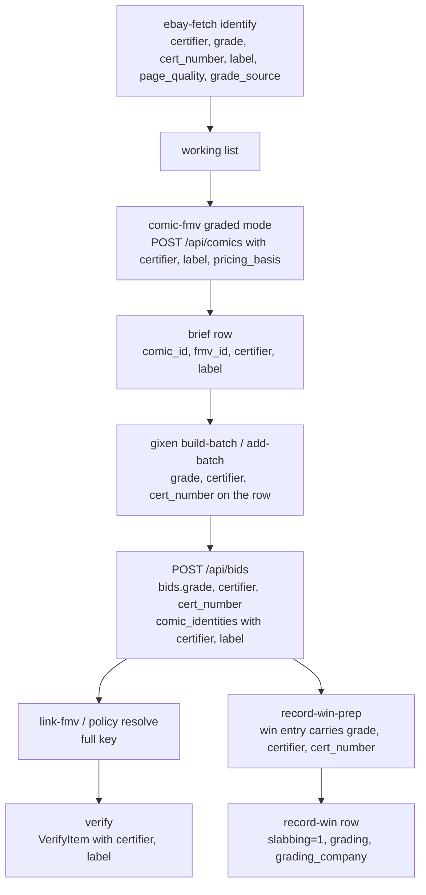
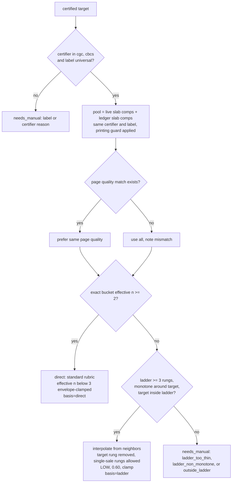

# feat: CGC slab support in the buy workflow

## Summary

Make certifier and label part of the price identity on the comics server, store the certified grade on the bid, and add a graded pricing mode to `comic-fmv` that prices blue-label slabs from slab sales with ladder interpolation when the exact grade is thin. Thread the new fields from identify through snipe, verify, and record-win, and let the scan tools surface slabs. Delivered in three phases so hand-priced slab buys work before the automated pricing lands.

---

## Problem Frame

The pipeline is raw-only at four gates and prices a slab from the raw market at its numeric grade (see origin). The slab fetch, parse, and ledger plumbing already exist as the CGC-proxy rescue, which runs slab-to-raw only. The spike on eight real listings showed vintage slabs have one eBay sale at the exact grade in the 90-day window, second printings hide in listing descriptions, and identify drops the grade on some slab titles. The plan has to add a certifier dimension without letting a slab price ever reach a raw bid or a raw price reach a slab bid.

---

## Requirements

Origin requirements R1 through R20 carry forward unchanged (see origin). The plan adds the requirements below, which the origin deferred to planning or which research surfaced.

**Identity and storage**

- R21. The price identity on the comics server is `(comic_id, grade, certifier, label)`. Raw rows carry certifier `none` and label `universal`; no row on `fmv`, `fmv_history`, `comps`, or `bids` carries NULL in a certifier or label column.
- R22. Every read path that resolves a price row by `(comic_id, grade)` today resolves by the full key. An absent certifier in a request means `none`, never "any".
- R23. The bid row stores the certified grade, certifier, and cert number at add time; certifier defaults to `none` so legacy bids stay inside every certifier filter.
- R24. The FMV history and comps ledger carry certifier and label so slab history and slab comps never blend with raw.
- R25. The migration preserves every `fmv` id, every `bid_fmvs` row, and every `bids.fmv_id`, asserted by direct counts on each inbound path, and is idempotent and crash-safe.

**Pricing**

- R26. Ladder interpolation for a slab target may anchor on rungs holding a single sale. The raw path's two-sale rung minimum is unchanged.
- R27. Stored slab comps for the same identity up to 365 days old join the live pool for a slab target, weighted down by age; the exact-tier gate and the ladder rungs use the weighted counts and medians. The raw path never reads the ledger for a price.
- R28. An interpolated slab price stores a pricing basis the cache path and policy checks can read, so a cache hit reproduces LOW confidence and the 0.60 factor. A raw row written by an older client keeps its interpolated haircut through the same column.
- R29. The graded mode probes the server's price-row shape before any write and refuses every certified target when the shape lacks certifier, so a new client never overwrites a raw row on an old server.
- R30. The exact tier is strictly exact. A 9.6 target never pools 9.8 sales; the ladder interpolates between them.
- R31. A certifier other than CGC or CBCS, or a label other than Universal, is `needs_manual` with a reason naming the certifier or label.

**Verification and discovery**

- R32. Verify matches a bid's linked price on the full key and reports a distinct verdict when the row at the bid's grade exists only for a different certifier.
- R33. One flag gates all four scan-tool reject sites, and a slab match row carries certifier, grade, and label hint parsed from the title.
- R34. Listing type BIN renders the band and confidence with no max bid, offer, or watch, and still writes the price and comps.
- R35. Until the graded pricing mode ships, `comic-fmv` short-circuits any certified row to `needs_manual` with reason `graded_mode_unavailable` before any fetch or write, so a slab is never priced from the raw market in the interim.

---

## Key Technical Decisions

- **Certifier and label live on `fmv`, `fmv_history`, and `comps`, not on `comics`.** One `comics` row per book keeps the collection, wish-list, and bid-group semantics intact (a slab and a raw copy of one book are the same collectible for ownership and the same comic for a bid group). Forking `comics` identity is the BUI-579 shape that needed remediation. The origin's "a slab 9.6 and a raw 9.6 are different books to the pricing path" is satisfied at the `fmv` layer.

- **Raw is an explicit sentinel.** Columns are `certifier TEXT NOT NULL DEFAULT 'none'` and `label TEXT NOT NULL DEFAULT 'universal'` with CHECK constraints. SQLite treats NULLs as distinct in unique indexes, so a NULL certifier would allow duplicate rows, and the BUI-777 variant lesson shows an absent query parameter cannot express NULL. Vocabularies are module constants shared with the pydantic validators, matching `FMV_PROVENANCES`: certifier `none | cgc | cbcs | other`; label `universal | signature_series | qualified | restored | conserved | other`; page quality `white | ow_w | ow | c_ow | cream | unknown`.

- **Widening `UNIQUE(comic_id, grade)` is a table rebuild, not an index swap.** The constraint is inline in the `CREATE TABLE fmv` literal, so the `_migrate_year_nullable` pattern applies: gate on `PRAGMA table_info`, save `fmv` and `bid_fmvs` rows in Python memory, rebuild, restore preserving ids, re-create indexes under a new name. Raw SQL only inside the host savepoint. `upsert_fmv`'s `ON CONFLICT` clause names the new key.

- **The certified grade is stored on `bids`.** Record-win builds win entries from the bid row and a title re-identify, and neither carries a grade today. Deriving it from the `bids -> fmv` link fails whenever the link is absent or wrong (the verify ladder exists because it often is). `bids` grows `grade`, `certifier TEXT NOT NULL DEFAULT 'none'`, and `cert_number`. The default keeps every pre-migration bid inside the `certifier = 'none'` filters (seller reliability, first-party outcomes) instead of silently emptying them. Updates go through `update_bid_grades`, keyed on `item_id` plus `PENDING`, which the BUI-67 partial unique index already makes one row.

- **Graded mode is a separate branch in `comic-fmv` that reuses the ladder math and bypasses the raw machinery.** It reuses `bucket_medians`, `bucket_counts`, `_cgc_ladder_price_and_clamp`, and `monotonicity_violations`, and skips `build_pool` widening, `_apply_cgc_proxy_rescue`, `_apply_cgc_cross_check`, the ungraded anchor, and the first-party merge. Each of those five would price a slab off the wrong market (the rescue would price a slab at 0.5 times itself).

- **Exact tier semantics follow the existing clamp rules, on weighted counts.** A bucket with effective n below `OUTLIER_ROBUST_BUCKET_N` (3) is bounded above by its neighbors' envelope. So the origin's "two or more sales" tier is direct-but-clamped from effective n 2 up to 3 and unclamped from 3 up. Confidence follows the standard rubric on the exact pool's effective n and CV.

- **Single-sale rungs anchor slab ladders, and a lone exact sale is never the price.** `min_bucket_n` is passed as 1 for a slab target (the raw path keeps `MIN_BRACKET_COMPS`). When the exact bucket holds fewer than two weighted sales, the target rung is removed from the ladder before `_cgc_ladder_price_and_clamp` runs, so the result is the neighbor interpolation and the lone sale is recorded only in notes. Calling the helper with the target rung present would return that single sale bounded from above, not an interpolation. The result is always LOW and 0.60, bounded by the envelope clamp, never extrapolated outside the observed rungs, and refused below three remaining rungs or on a non-monotone ladder around the target. This is the mechanism the origin chose knowing the rungs are one sale each (see origin Key Decisions).

- **Pricing basis is a column, not a notes token.** `fmv.pricing_basis TEXT CHECK IN ('direct', 'interpolated', 'ladder', 'proxy')`. The stored-label collapse trap (LOW stores as `low`, which `recomputed_cap` reads as 0.70) means confidence cannot carry the 0.60 signal, and notes prefixes fail open on a reword (BUI-769). Existing rows backfill from the `interpolated` and `CGC proxy` notes tokens; unmatched rows get `direct`. The server derives the column from those same tokens on every upsert that omits the field, not only in the one-shot backfill, so a raw row written by an older client during the server-first deploy window keeps its haircut. The client cache path reads the column first and the notes token second for raw rows.

- **The ledger becomes a pricing input for slab targets only.** Live comps and stored `pool='slab'` comps for the same `(comic_id, certifier, label)` merge, deduped on `product_id`. Age is `sold_date`, else `first_seen_at`; a comp with neither is excluded. Weight 1.0 up to 90 days old, 0.5 from 91 to 365, excluded beyond. Weights apply everywhere the pool is counted: the exact-tier gate uses effective n (the weight sum), rung medians and counts are weighted, and the band quartiles already accept weights. The raw path keeps the ledger as archive-only (CONCEPTS "Comps Ledger").

- **Printing guard runs on price outliers only and never on bare "reprint".** A slab comp priced below half its rung's median triggers one Browse API fetch of that listing's description. The comp is dropped if the text carries an ordinal printing token (`2nd`, `second printing`, `3rd` and so on) or `facsimile`. Bare `reprint` is measured unsafe (BUI-645: reprint-titled first prints). The class sits below the pool, so the drop raises the band; that is correct here because the two prices are two different books, and the oracle is run on the spike corpus before the guard is wired.

- **Deploy-order guard is a read-side probe before any write.** An old server drops the unknown `certifier` key (pydantic ignores it) and upserts on `(comic_id, grade)`, so a response-echo check would fire after the raw row was already overwritten. Instead, the graded branch follows the BUI-777 `_db_lookup_by_identity` pattern: before any fetch or upsert, one run-level `GET /api/comics` must return rows carrying a `certifier` key; if the key is absent, every certified target is marked `skipped_schema_mismatch` and nothing is fetched or written. The same probe protects the cache path, where an old server ignores the certifier query parameter and would hand a slab target the raw row. The response echo stays as a second assertion, never the gate.

- **Verify keys on the full identity and gains a verdict.** `VerifyItem` carries certifier and label; `_verify_one` matches junction rows on the full key; a row at the right grade but wrong certifier returns `no_fmv_at_certifier` with guidance naming both. Without this, a raw row wrongly linked to a slab bid verifies `fully_linked`.

- **Scan tools gate four sites behind one flag.** `seller_scan` main, `comic_identity.hard_reject`, `identity.reject_reasons`, and `wishlist_sellers` via `should_reject` all key on the same `include_graded` argument. The title-key builders strip `CGC`, `CBCS`, `SS` tokens so match scores are not depressed.

- **Item specifics win over title for certifier and grade; a mismatch is a note.** eBay's `Certification` aspect names the certifier and `Grade` / `CGC Grade` / `CBCS Grade` name the grade. Only a recognized certifier value (`cgc`, `cbcs`, or a known third party mapping to `other`) sets `grade_source: certified`; `Uncertified`, `None`, `Not Graded`, `Raw`, and blank count as absent, because raw listings routinely carry them. When the title disagrees, the specifics value is used and the row carries a mismatch note. "CGC ready" or "CGC it" in a title with no certification aspect is raw with `grade_source: missing`.

- **One token module, shared by identify and sold-comps.** `ebay_fetch.py` and `sold_comps.py` are the same package, and `sold_comps` already imports from `ebay_fetch`, so the certifier, label, page-quality, and numeric-grade tables live in a new `apps/ebay/src/grade_tokens.py` that both import. Duplicating the tables with a parity test was the wrong shape; the cross-package duplication rule applies to `apps/fmv` and the overlay, not inside `apps/ebay`.

---

## High-Level Technical Design

Identity threading across the buy flow. Each hop names the fields it must carry; the flow analysis found the grade drops at the win-prep hop today.

Graded pricing decision, per book:

---

## Implementation Units

Phases: A lands identity and storage so a slab can be hand-priced and bought through the pipeline, with certified rows punted to manual until B. B lands the automated pricing. C lands discovery in the scan tools. U8's documentation lands alongside each phase.

### Phase A: identity and storage

### U1. Slab fields in identify

- **Goal:** `ebay-fetch --identify` and `--json` emit certifier, numeric grade, cert number, label, and page quality for a slab listing, with `grade_source: certified`.
- **Requirements:** origin R1, R2, R3; plan R31 vocabulary.
- **Dependencies:** none.
- **Files:** new `apps/ebay/src/grade_tokens.py`, `apps/ebay/src/ebay_fetch.py` (`extract_grade`, `parse_item`, `identify_row`, `IDENTIFY_COLUMNS`, `GRADE_SPECIFICS_KEYS`), `apps/ebay/src/sold_comps.py` (import `parse_grade` tables from the new module; behavior unchanged), `apps/ebay/tests/test_grade_tokens.py`, `apps/ebay/tests/test_ebay_fetch.py`.
- **Approach:** Move `_NUMERIC_GRADE_RE` and `_LETTER_PATTERNS` from `sold_comps.py` into `grade_tokens.py` and add the certifier, label, and page-quality tables there: label tokens `SS`, `Signature Series`, `signed` (with the existing `(?<!not\s)` guard), `autograph`, `signature`, `Qualified`, `(Q)`, `Restored`, `(R)`, `Conserved`; page-quality tokens `W`, `WHITE PAGES`, `OW/W`, `OWW`, `OW-W`, `OW`, `C/OW`, `CR/OW`, `CREAM`. Both modules import from it; `sold_comps` already imports from `ebay_fetch`, so a third module avoids a cycle. In `ebay_fetch`, add `CERTIFICATION_SPECIFICS_KEYS` (`Certification`, `Professional Grader`, `Certification Number`) alongside the grade keys. Precedence for certifier and grade: item specifics, then title. Only a recognized certifier value sets `grade_source: certified`; `Uncertified`, `None`, `Not Graded`, `Raw`, and blank count as absent. Bare `CGC` stops being a grade token; a recognized certification aspect or a `cgc|cbcs` title token plus a numeric grade sets `grade_source: certified`. A specifics-versus-title grade mismatch keeps the specifics value and appends a note. New identify columns: Cert (certifier plus label) and PQ.
- **Patterns to follow:** `extract_grade`'s three-tier precedence; the ordered tuple tables in `sold_comps.py`; `TestExtractGrade` class-per-function style; `sold_comps`' existing `from ebay_fetch import ...` for the import direction.
- **Test scenarios:**
  - Covers AE1. "Amazing Spider-Man #50 CGC AA SS 4.5 OWW 1967" with no grade aspect yields grade 4.5, certifier cgc, label signature_series, page quality ow_w, source certified.
  - "Invincible #1 ... 2003 CGC 9.4" yields 9.4, certifier cgc, label universal.
  - Specifics `Grade: 8.0 Very Fine`, `Professional Grader: Certified Guaranty Company (CGC)`, `Certification Number: 4786366002` yield 8.0, cgc, cert number, source certified.
  - Specifics grade 7.0 with title "CGC 7.5" yields 7.0 and a mismatch note.
  - "CGC ready, would grade 9.6" with no certification aspect yields no certifier and `grade_source: missing`.
  - Specifics `Certification: Uncertified` with `Grade: 9.4` yields no certifier and today's seller-stated source; the same with `Professional Grader: Not Graded`.
  - "ASM #300 CGC 9.8 Signed Todd McFarlane" yields label signature_series; "not signed" does not.
  - `sold_comps.parse_grade` results on the existing corpus are unchanged after the move.
  - Title "CBCS 9.8" yields certifier cbcs; "PGX 9.8" yields certifier other.
  - A raw listing's output is byte-identical to today's except for the new columns showing blank.
  - Edge: "9.8" adjacent to a price ("$9.80") or dimension is not a grade (mirror the `_NUMERIC_GRADE_RE` lookarounds).
- **Verification:** the eight spike listings identify with the expected certifier, grade, and label; existing identify tests pass unchanged.

### U2. Price identity migration on the comics server

- **Goal:** `fmv`, `fmv_history`, and `comps` carry certifier and label (comps also page quality); `fmv` gains `pricing_basis`; the unique key becomes `(comic_id, grade, certifier, label)`.
- **Requirements:** R21, R24, R25, R28.
- **Dependencies:** none.
- **Files:** `plugins/gixen-overlay/src/gixen_overlay/db.py` (`create_tables`, new `_migrate_fmv_certifier_rebuild`, `_migrate_add_fmv_pricing_basis_column`, `_migrate_add_comps_certifier_columns`, `_migrate_add_fmv_history_certifier_columns`, `upsert_fmv`, `upsert_comic` merge, `append_fmv_history`, `upsert_comps`), `plugins/gixen-overlay/tests/test_gixen_overlay_db.py`, new `plugins/gixen-overlay/tests/test_fmv_certifier_migration.py`.
- **Approach:** Vocabulary constants `FMV_CERTIFIERS`, `FMV_LABELS`, `COMP_PAGE_QUALITIES`, `FMV_PRICING_BASES` next to `FMV_PROVENANCES`, rendered to CHECK clauses. The `fmv` rebuild follows `_migrate_year_nullable`: gate on `PRAGMA table_info` lacking `certifier`, set a `migration_state` marker, save every current `fmv` column (build the column list from `PRAGMA table_info(fmv)`, not a literal, so `flag_reason`, `ungraded_anchor`, `ungraded_anchor_n`, and `provenance` survive and a later additive column cannot be dropped), save `bid_fmvs` rows and every `bids.id, fmv_id` pair (the `ON DELETE SET NULL` cascade nulls them on drop), rebuild with the new literal, restore all three preserving ids, clear the marker; a marker present at startup raises. `upsert_fmv` gains certifier and label parameters, its `ON CONFLICT` clause and its trailing id lookup both use the full key (the current `WHERE comic_id=? AND grade=?` lookup would return either row once two coexist). `upsert_fmv` derives `pricing_basis` from the `interpolated` and `CGC proxy` notes tokens whenever the request omits it; the one-shot backfill applies the same rule, unmatched rows get `direct`. `upsert_comic`'s yearless-to-yeared merge keys its `fmv_lookup` on the full key so a raw and a slab row never collapse. `list_comics` returns `certifier`, `label`, and `pricing_basis` and filters `certifier = 'none'` when the parameter is absent. `comps` unique index `idx_comps_identity` is unchanged (pool already separates raw and slab); backfill certifier on existing `pool='slab'` rows from the title via the slab regex, leaving unparseable rows `other`.
- **Execution note:** write the migration tests first against a legacy-shaped DB with linked bids, then the migration.
- **Patterns to follow:** `_migrate_year_nullable` and its `test_year_nullable.py`; `_migrate_add_fmv_provenance_column`; `_migrate_lowercase_title_indexes` for the drop-and-create-under-a-new-name rule; the additive-column PRAGMA guard.
- **Test scenarios:**
  - Legacy DB with 3 `fmv` rows, 2 `bid_fmvs` rows, 2 bids with `fmv_id`, opened with `PRAGMA foreign_keys=ON`: after `create_tables`, all counts unchanged, every `fmv.id` preserved, every `bids.fmv_id` resolves (direct query per inbound path, no JOIN), every row has certifier `none` and label `universal`.
  - A legacy row with `provenance='hand'`, `flag_reason='too_sparse'`, and a non-NULL `ungraded_anchor` keeps all three after the rebuild.
  - Upserting `(comic 1, 9.6, cgc)` beside an existing raw 9.6 row returns the slab row's id, and the API response echoes that id.
  - An upsert without `pricing_basis` whose notes carry `interpolated` stores `interpolated`; `list_comics` returns `certifier`, `label`, and `pricing_basis`, and an absent certifier parameter returns only `none` rows.
  - Running `create_tables` twice is a no-op the second time.
  - A stale `migration_state` marker at startup raises before any write.
  - Inserting a slab row `(comic 1, 9.6, cgc, universal)` beside raw `(comic 1, 9.6, none, universal)` succeeds; inserting a second raw row at that key conflicts and upserts in place.
  - `pricing_basis` backfill: a row whose notes contain `interpolated` becomes `interpolated`; `CGC proxy` becomes `proxy`; others `direct`.
  - Yearless-to-yeared `upsert_comic` merge with a raw and a slab row at the same grade keeps both.
  - `fmv_history` append carries certifier and label; two appends at the same grade and different certifiers are distinct rows.
  - Edge: a `comps` slab row whose title lacks `cgc|cbcs` backfills certifier `other`.
- **Verification:** run the migration against a `sqlite3 .backup` copy of the Mac Mini DB and diff the three inbound bid paths before and after; zero differences.

### U3. Certifier-aware API, policy, and verify

- **Goal:** every request model and read path on the comics server carries and filters on the full price identity, and the snipes and history rows expose it.
- **Requirements:** R22, R32, origin R7, R16, R17, R18.
- **Dependencies:** U2.
- **Files:** `plugins/gixen-overlay/src/gixen_overlay/models.py` (`UpsertComicRequest`, `LinkFmvRequest`, `VerifyItem`, `CompItem`), `routes.py` (`api_upsert_comic`, `api_list_comics`, `_resolve_fmv_for_link`, `_link_issue_to_bid`, the BUI-715 re-resolve, `_verify_one`, `api_seller_reliability`, `_first_party_outcomes`, snipes and history row builders), `policy.py` (`_resolve_post_identities`, `_resolve_patch_links`, `_check_duplicate_comic` message), `plugin.py` (`on_bid_write_committed`), tests `test_routes_comics.py`, `test_policy.py`, `test_verify.py`, `test_flag_reason_contract.py`, new `test_fmv_query_certifier_contract.py`.
- **Approach:** Add `certifier` and `label` with vocabulary validators defaulting to `none` and `universal` on every model that names a grade. `_resolve_fmv_for_link` adds both to each of its three strategies, which removes the raw-versus-slab ambiguity (the volume ambiguity in the title strategies is pre-existing and out of scope). `_link_issue_to_bid`, the title-derived auto-link fired on every bid write, passes the certifier parsed from the eBay title (`none` without a `cgc|cbcs` token) into both its queries, and its no-grade `any_valued` fallback filters on certifier too. `GET /api/comics` treats an absent certifier as `none`. Seller reliability adds `AND certifier = 'none'`, which the `bids` default keeps true for legacy rows. First-party outcomes filter on the joined `fmv` row's certifier so a slab win never enters a raw pool. Snipes and history rows add `certifier` and `label` beside `cond_grade`, in parity. Verify: a junction row at the right grade and wrong certifier yields `no_fmv_at_certifier`; `needs_manual` guidance lists the new reasons (`label_signature_series`, `label_qualified`, `label_restored`, `label_conserved`, `certifier_other`, `no_certifier_pool`, `ladder_too_thin`, `ladder_non_monotone`, `outside_ladder`), added to `FMV_FLAG_REASONS`. The upsert response echoes `certifier` and `label`. `duplicate_comic` stays `comic_id`-keyed and its message names both certifiers.
- **Patterns to follow:** `fmv_provenance` validator; `TOMBSTONE_STATUSES_SQL` centralization for shared filters; the snipes/history parity rule in `docs/solutions/ui-bugs/purged-snipes-shown-as-won-2026-06-01.md`.
- **Test scenarios:**
  - Covers AE5. Link-fmv for `{comic_id, grade 9.8, certifier cbcs}` with only a cgc row at 9.8 returns 404, never the cgc row.
  - Upsert with `certifier: cgc` creates a row beside the raw row and the response echoes `certifier: cgc`.
  - Upsert with `certifier: psa` 422s; `fmv_flag_reason: ladder_too_thin` is accepted.
  - Covers AE6. `over_fmv` on a bid whose identity is `(comic 1, 9.2, cgc)` sums the slab row's high, not the raw row's.
  - Seller reliability ignores a bid with certifier cgc even when `seller_grade` and `photo_grade` are set.
  - Verify: bid linked to a raw row, `VerifyItem` says cgc, verdict `no_fmv_at_certifier` with guidance naming cgc and none.
  - Snipes and history rows for one certified bid both carry `certifier: cgc`; a raw bid carries `none` on both.
  - First-party outcomes for `(comic 1, 9.2)` exclude a WON bid whose certifier is cgc.
  - Contract canary: `FMV_FLAG_REASONS` equals the producer set in `fmv_runner`.
  - A raw-titled bid on a book whose raw row is unpriced and whose slab row is priced auto-links to nothing, never to the slab row.
  - A legacy bid with no certifier still counts in seller reliability.
  - AST contract test (the `test_fmv_history.py` pattern): every SQL string in the overlay that filters `fmv` by grade also filters by certifier.
- **Verification:** the AST contract test passes; the flow analysis' ten grade-keyed lookups, including the dynamic clause in `list_comics` and the two in `_link_issue_to_bid`, carry the full key.

### U4. Certified fields on the bid and in gixen-cli

- **Goal:** `bids` stores grade, certifier, and cert number; `gixen add`, `build-batch`, and `add-batch` carry them; the server's identity resolution and `--verify` send them.
- **Requirements:** R23, origin R16.
- **Dependencies:** U3 for the server side of link and verify.
- **Files:** `packages/gixen-cli/server/db.py` (`_COLUMN_MIGRATIONS`, `_BIDS_TABLE_SQL`, `insert_bid`, `update_bid_grades`), `server/main.py` (`AddBidRequest`, `api_add_bid`), `cli.py` (`add` options), `add_batch.py` (`build_bid_payload`, `build_batch`, `add_one_row`, verify payload), `tests/test_server_db.py`, `tests/test_cli_build_batch.py`, `tests/test_add_batch.py`, `tests/test_server_api.py`.
- **Approach:** Three `ALTER TABLE bids ADD COLUMN` migrations (`grade REAL`, `certifier TEXT NOT NULL DEFAULT 'none'`, `cert_number TEXT`) plus the same columns in `_BIDS_TABLE_SQL` so rebuilds keep them. `gixen add` gains `--certifier`, `--cert-number`; `--grade` is stored on the row as well as used for the link. Working-list rows carry `certifier`, `cert_number`, `label`; `build_batch` copies them into the row when present; `build_bid_payload` sends them and adds `certifier` and `label` to each `comic_identities` entry. Certified rows never send `seller_grade` or `photo_grade`. `update_bid_grades` fills grade and cert number NULL-only and sets certifier when given, through its existing `item_id` plus `PENDING` key. `--verify` sends certifier and label per row.
- **Patterns to follow:** the `seller_grade`/`photo_grade` trio of tests; "only send what was given".
- **Test scenarios:**
  - Fresh DB has the three columns; migration is idempotent; columns survive `_rebuild_bids_table`.
  - `build_batch` with a working-list row `{certifier: cgc, cert_number: "4172733006", grade: 7.0}` emits them on the row; a raw row emits none of them.
  - `build_bid_payload` for a certified row includes `certifier`, `cert_number`, `grade`, and `comic_identities: [{comic_id, grade, certifier: cgc, label: universal}]`, and omits `seller_grade` and `photo_grade`.
  - `POST /api/bids` stores the three fields; a re-add (upsert) does not clear them.
  - A pre-migration bid reads certifier `none` after the migration, on a fresh DB and after a rebuild.
  - `add-batch --verify` payload carries certifier per row.
- **Verification:** `gixen add <item> 100 --grade 7.0 --certifier cgc --cert-number N --comic-id K` lands a row with all three fields and a link to the cgc price row.

### U5. Record-win writes slab fields

- **Goal:** a certified win records into the collection as slabbed with its grade and grading company, and the LOCG CSV carries them.
- **Requirements:** origin R19.
- **Dependencies:** U4.
- **Files:** `packages/gixen-cli/record_win_prep.py` (`_build_win_entry`), `plugins/gixen-overlay/src/gixen_overlay/routes.py` (`api_record_win_commit`, `RecordWinCommitRequest`), `packages/locg-cli/src/locg/commands.py` (`_build_win_row`, `cmd_collection_record_win`), `collection_io.py` (`_row_to_csv_dict`), `.claude/commands/comic/collection-add.md` (Step 2 `resolved_reviews` shape), tests `test_record_win_prep.py`, `test_collection_commands.py`, `test_collection_io.py`.
- **Approach:** The win entry gains `grade`, `certifier`, `cert_number` read from the bid row; the `resolved_reviews` shape accepts the same three. `_build_win_row` writes `slabbing: 1`, `grading: <grade as LOCG string>`, `grading_company: <CGC|CBCS>` when certifier is cgc or cbcs, and today's defaults otherwise. Grade formatting uses the `VALID_GRADES` strings (`9.0` stays `"9.0"`). `_row_to_csv_dict` emits the row's values instead of constants. The `grading_company` vocabulary is the two names LOCG's form accepts, confirmed against a real export before the mapping is fixed.
- **Patterns to follow:** `test_record_win_series_from_index`; the additive rule from `locg-bulk-import-recipe-2026-05-22.md` (LOCG does not wipe blanks on matched rows).
- **Test scenarios:**
  - A WON bid with grade 7.0, certifier cgc, cert number N produces a win entry with all three.
  - `_build_win_row` for that entry writes slabbing 1, grading `"7.0"`, grading_company `CGC`.
  - A raw win writes slabbing 0 and blank grading, identical to today.
  - Grade 9.0 serializes as `"9.0"`, not `"9"`.
  - CSV export of a slabbed row carries Slabbing 1, Grading, Grading Company; a raw row carries 0 and blanks.
  - Edge: certifier `other` writes slabbing 1, grading, and blank grading company.
- **Verification:** a recorded slab win appears in the export with the three columns filled.

### U11. Certified rows punt until the graded mode ships

- **Goal:** between Phase A and Phase B, `comic-fmv` never prices a certified row from the raw market.
- **Requirements:** R35; origin R7, R15.
- **Dependencies:** U1.
- **Files:** `apps/fmv/src/fmv_runner.py` (`run` routing before `_split_by_db_cache`), `.claude/commands/comic/buy.md` (Step 3 needs-manual list), `apps/fmv/tests/test_fmv_runner.py`.
- **Approach:** A batch row with `certifier` in the vocabulary other than `none` is bucketed `needs_manual` with `flag_reason: graded_mode_unavailable` before any lookup, fetch, or upsert, and rendered on the brief line like any other needs-manual row. buy.md Step 3 lists the reason with the instruction to hand-price. U7 replaces this branch with the graded mode and retires the reason from the vocabulary.
- **Patterns to follow:** the `skipped_rejected` short-circuit in `run`.
- **Test scenarios:**
  - A batch with one certified and one raw row: the certified row is `needs_manual` `graded_mode_unavailable` with no fetch and no upsert call; the raw row prices as today.
  - The certified row's brief line has null `max_bid`, `comic_id`, and `fmv_id`.
- **Verification:** running the spike batch after Phase A yields eight needs-manual rows and zero writes.

### Phase B: pricing

### U6. Graded fetch and slab comp parsing

- **Goal:** `ebay-sold-comps` fetches a certified target with graded listings included and returns slab comps carrying certifier, label, and page quality, with the printing guard applied.
- **Requirements:** origin R7, R12, R13; plan R31.
- **Dependencies:** U1 for the shared token tables.
- **Files:** `apps/ebay/src/sold_comps.py` (`fetch_book_comps`, `_is_slab_comp`, new `parse_slab_fields`, `LOCAL_EXCLUDE_RE`, new `_printing_guard`), `apps/ebay/src/ebay_fetch.py` (a description fetch helper reused by the guard), `apps/ebay/tests/test_sold_comps.py`.
- **Approach:** A book with `certifier` in `{cgc, cbcs}` sets `include_graded` and a new `graded_target` flag. In graded mode `build_query` drops the four exclusion terms and adds the target certifier as a positive term (`cgc` or `cbcs`), so the provider's 240-result cap holds slab sales across grades instead of a raw-dominated mix. The fetch runs the base tier only (no year-drop broaden, no vintage inclusive pass), routes every `_is_slab_comp` hit into `slab_comps` with `certifier`, `label`, `page_quality` parsed from the title via `grade_tokens`, and returns raw comps separately for the ungraded anchor display only. `LOCAL_EXCLUDE_RE`'s `signature series`, `signed`, `autograph`, and `restored` terms move behind the label parse in graded mode so those comps are labeled, not deleted (the raw path keeps the exclusion). PGX and PSA stay excluded. The printing guard runs after the pool is grouped by grade: a slab comp priced below 0.5 times its rung's median gets one Browse API description fetch; ordinal printing or facsimile tokens drop it and record `printing_dropped=<n>`. A fetch that returns no text (404, purged listing, network failure) keeps the comp and records `printing_unverified=<n>`, so the guard never fails into a drop. The comp ledger item projection gains the three fields.
- **Patterns to follow:** `TestInclusiveTier` monkeypatched fetch; the BUI-754 corpus rule (every parser test title is a real surviving comp; extend the corpus, no synthetic titles); `comic-identify-annual-classifier-regex-safety.md` for anchored token regexes.
- **Test scenarios:**
  - `build_query` for a graded cgc target omits the four exclusion terms and adds `cgc`; a cbcs target adds `cbcs`.
  - A $215 comp whose description fetch returns 404 is kept and counted in `printing_unverified`.
  - Covers AE3. Six "CGC 9.8" comps where two are priced $215 against a $1,200 rung: the guard fetches exactly two descriptions, drops both when the text says "Second Printing", and reports two drops; a $215 comp whose text says nothing is kept.
  - A comp titled "... reprint ..." with a normal price is never fetched or dropped.
  - `parse_slab_fields("... CGC SS 9.8 ...")` yields label signature_series; "... CGC 9.6 Qualified ..." yields qualified; "... CBCS 9.8 ..." yields certifier cbcs; "... CGC 8.0 OW/W ..." yields page quality ow_w.
  - In graded mode a Signature Series comp is returned with its label; in raw mode the same title is still hard-excluded.
  - Graded mode runs one query per book and never the year-drop or inclusive tiers.
  - Provider failure in graded mode returns the standard `error` shape.
  - Corpus rows added for the eight spike titles and the two $215 second-printing titles.
- **Verification:** the spike batch re-run returns slab comps with certifier and label populated on every row and reports two printing drops on Ultimate Fallout #4; ladder depth per book is compared against the 2026-09-19 spike to measure what the positive certifier term buys.

### U7. Graded pricing mode in comic-fmv

- **Goal:** `comic-fmv` prices a certified target from the slab pool per the decision diagram, persists certifier, label, and pricing basis, and reproduces the result on cache hits.
- **Requirements:** origin R5, R8, R9, R10, R11, R14, R15, R20; plan R26, R27, R28, R29, R30, R34.
- **Dependencies:** U3, U6, U11 (replaces its short-circuit).
- **Files:** `apps/fmv/src/fmv_math.py` (new `graded_fmv`, new `bucket_weighted_medians` and `bucket_effective_n`, reuse of `_cgc_ladder_price_and_clamp` and `monotonicity_violations`), `apps/fmv/src/fmv_runner.py` (`run` routing, new `_compute_graded_one`, new `_probe_certifier_support`, `_split_by_db_cache`, `_db_lookup`, `_hand_price_candidates`, `_fmv_from_db_row`, `_fetch_ledger_comps`, `_upsert_fmv`, `_brief_row`, `_print_table`), `apps/fmv/src/fmv_cli.py` (batch keys), `apps/fmv/tests/test_fmv_math.py`, `test_fmv_runner.py`, `test_golden_fmv_math.py` and its fixture.
- **Approach:** Before any certified row is looked up, one run-level `GET /api/comics` probe checks that returned rows carry a `certifier` key (the BUI-777 `"variant" in r` pattern); when absent, every certified row is `skipped_schema_mismatch` with nothing fetched or written. A book with `certifier` set then routes to `_compute_graded_one`, which never calls `build_pool`, the proxy rescue, the cross check, the anchor, or the first-party merge. The pool is live slab comps plus ledger `pool='slab'` comps for the same `(comic_id, certifier, label)` (filtered client-side in `_fetch_ledger_comps`, the one function allowed to read that endpoint), deduped on `product_id`, aged by `sold_date` else `first_seen_at`, weighted 1.0 up to 90 days and 0.5 to 365 days, excluded beyond or when undated. Non-universal labels and certifier `other` short-circuit to `needs_manual` before any fetch. Page-quality preference filters the pool when at least two same-quality comps exist, else uses all and adds a note. Exact bucket at effective n of 2 or more prices directly (the clamp bounds effective n below 3) with `pricing_basis: direct` and the standard rubric on effective n and CV; otherwise the target rung is removed from the ladder and `_cgc_ladder_price_and_clamp` runs with `min_bucket_n=1` on weighted rung medians, refusing below three remaining rungs, on non-monotone neighbors, or outside the observed ladder, with `pricing_basis: ladder`, LOW, factor 0.60, and the lone exact sale recorded in notes. `_db_lookup` and the hand-priced guard carry certifier and label. `_fmv_from_db_row` reads `pricing_basis`, falling back to the notes token on raw rows, to restore LOW and 0.60. Ledger-advisory on a provider outage reads `pool='slab'` filtered by certifier. `_upsert_fmv` sends certifier, label, and pricing basis and asserts the response echoes certifier as a second check. Brief rows and the table carry certifier and label; a BIN row shows the band with `max_bid` null and a `BIN` note. `grade_confidence` is ignored for certified rows. The U11 short-circuit and its `graded_mode_unavailable` reason are removed.
- **Execution note:** add the golden fixture rows for the graded mode before wiring the runner, so the math is pinned independently of the fetch.
- **Patterns to follow:** `cgc_proxy_fmv` output shape; `_apply_cgc_proxy_rescue`'s batch mapping by `_req_id`; `TestCgcLadderPrice`; `_interpolated_from_notes` as the thing `pricing_basis` replaces.
- **Test scenarios:**
  - Covers AE2. Six 9.8 comps after the guard: direct pricing, basis `direct`, confidence from the rubric.
  - Covers AE4. Two 7.0 comps at $2,000: direct, clamped by the 6.5 and 7.5 rungs, basis `direct`. One 4.5 comp with 4.0 and 5.5 rungs of one sale each: basis `ladder`, LOW, factor 0.60, band inside the neighbors' envelope; with the 4.5 sale priced below the 4.0 rung, the result is the interpolation, not the lone sale (golden row).
  - Effective n: one live 7.0 sale plus one 120-day ledger sale is effective n 1.5, so the row is `ladder`, not `direct`; two live sales plus one 120-day sale is 2.5, `direct`, clamped.
  - An undated ledger comp is excluded; a 200-day comp joins at 0.5; a live duplicate by `product_id` counts once.
  - Probe: a server whose `GET /api/comics` rows lack `certifier` makes every certified row `skipped_schema_mismatch` with zero fetch and zero POST calls, while raw rows in the same batch price normally.
  - Target 9.4 with rungs 8.5, 9.2, 9.6, 9.8: interpolated between 9.2 and 9.6, never pooled with 9.6.
  - Target 9.8 with rungs up to 9.6 only: `needs_manual` `outside_ladder`.
  - Two rungs only: `needs_manual` `ladder_too_thin`; 9.6 priced above 9.8: `ladder_non_monotone`.
  - Label signature_series or certifier other: `needs_manual` with the label reason and no fetch call.
  - Page quality: four ow_w comps and two white comps with a white target price from the two white; one white comp falls back to all six with a note.
  - Cache hit on a `pricing_basis: ladder` row reproduces LOW and `max_bid = 0.60 * high`; a raw row with no `pricing_basis` and an `interpolated` notes token still reproduces 0.60 (golden row).
  - A hand-priced raw row at 9.6 does not skip a cgc 9.6 target, and vice versa.
  - A raw book's golden outputs are unchanged.
  - Provider outage on a slab target: ledger-advisory from slab comps only, or `fetch-err` when fewer than three.
  - BIN certified row: band present, `max_bid` null, note `BIN`.
- **Verification:** the spike batch prices six blue-label books (direct or ladder) and punts the Signature Series one on label; no raw golden fixture changes.

### U8. Skills, spec, and vocabulary (cross-cutting; lands with each phase it documents)

- **Goal:** the skill prose and the math spec describe the graded mode, and every hardcoded flag-reason list (buy.md Step 3, fmv.md, verify.md's verdict table, the overlay's `needs_manual` guidance string) includes the new reasons.
- **Requirements:** all origin requirements as documentation; plan R34.
- **Dependencies:** U1 through U7 and U11; the Phase A slice (U1, U11 punt text) lands with Phase A, the rest with Phase B.
- **Files:** `.claude/commands/comic/buy.md` (Steps 1, 2.5, 3, 4, 5, 6), `identify.md`, `fmv.md`, `verify.md`, `grade.md` (skip rule), `snipe-add.md` (flags table), `collection-add.md`, `docs/conventions/fmv-math-spec.md` (new section 7b), `CONCEPTS.md` (Page Quality, Pricing Basis), `CLAUDE.md` (the deploy-order probe and the scan tools' `include_graded` flag; no new environment variable), a new `docs/solutions/` doc for the spike and printing-guard learnings with `mechanized_by: test`.
- **Approach:** Step 2.5 skips certified rows and never offers "grade anyway" for them. Step 3's working-list shape adds the new fields and drops `grade_confidence` for certified rows. Step 4 renders BIN certified rows with a band and no max bid. Step 5's working-list keys add certifier, cert number, label. Step 6 documents `no_fmv_at_certifier`. The hardcoded `flag_reason` set in buy.md and fmv.md lists the new reasons. The spec section states the exact and ladder rules, the ledger weighting, and that the discount factors of section 7a never apply to a slab target.
- **Patterns to follow:** `docs/solutions/conventions/relocating-skill-sections-leaves-stale-inbound-references.md`; the mechanized-by contract.
- **Test scenarios:** Test expectation: none for prose. The solutions doc's `mechanized_by: test` names the U6 and U7 tests.
- **Verification:** `./scripts/solutions-lint` passes; a fresh `claude -p "/comic:buy <slab URL>"` run reaches Step 3 with certifier on the working list.

### Phase C: discovery

### U9. Scan tools surface slabs

- **Goal:** seller-scan and wishlist-sellers include slab listings behind one flag, with certifier, grade, and label hint on the match row.
- **Requirements:** origin R4; plan R33.
- **Dependencies:** U1 for the token tables.
- **Files:** `apps/ebay/src/comic_identity.py` (`hard_reject`, `should_reject`, `reject_reasons`, `_title_key`, `_strip_grades`), `apps/ebay/src/seller_scan.py` (main filter, match row), `apps/ebay/src/wishlist_sellers.py` (stopwords, match row, verifier prompt), `.claude/commands/comic/seller-scan.md`, `wishlist-sellers.md`, tests `test_comic_identity.py`, `test_seller_scan.py`, `test_wishlist_sellers.py`.
- **Approach:** One `include_graded` argument threads to all four reject sites; default off so scheduled runs do not change until the operator flips it. Title keys strip `CGC`, `CBCS`, `SS`, and page-quality tokens before matching. The match row gains `certifier`, `grade`, `label_hint`, `grade_source: title`. The Haiku verifier prompt states the listing is a slab. The skill docs warn that the first run with the flag on surfaces the whole slab backlog because slabs were never marked seen.
- **Patterns to follow:** the `_REBOOTABLE_MASTHEADS` boundary-anchored regex (BUI-351); `test_seller_scan.py` fixture style.
- **Test scenarios:**
  - With the flag off, a "CGC 9.8" title is rejected at every one of the four sites.
  - With the flag on, the same title passes and the match row carries certifier cgc, grade 9.8, label_hint universal.
  - `_title_key("Ultimate Fallout #4 CGC 9.8 OW/W")` equals `_title_key("Ultimate Fallout #4")`.
  - A "CGC SS 9.8" title yields label_hint signature_series.
  - A lot titled with slabs is still rejected by the lot rule.
- **Verification:** a scan of a known slab seller with the flag on lists the slab matches; with the flag off the output is unchanged.

---

## Scope Boundaries

Carried from origin: no pricing of Signature Series, Qualified, Restored, or Conserved slabs; no offer placement, BIN watching, or manual-purchase recording; no GPA, GoCollect, Heritage, or cert-lookup integrations; no scheduled comp collection; no flipped-slab dedupe.

### Deferred to Follow-Up Work

- Curve-fit pricing across the whole ladder, evaluated against ladder interpolation once the ledger holds enough slab history.
- Cert-number dedupe of flipped slabs, which needs cert numbers on comps and a source for them.
- A `record manual purchase` step for BIN slabs bought by hand.
- Raising `POLICY_EXPOSURE_CEILING` once slab bids enter, decided from the decisions ledger after real buys.
- Making the envelope clamp visible in notes when it fires (BUI-369) now applies to slab rows too.
- A certifier column on the `/comics` dashboard tab. The snipes and history rows already carry the field after U3; the display has no origin requirement and waits for an operator ask.
- Rebuilding `fmv_history` to backfill certifier on pre-migration rows, if slab history is ever read.

---

## Acceptance Examples

Origin AE1 through AE6 carry forward and are cited in the units above. Plan-level additions:

- AE7. **Covers R29.** Given a new `comic-fmv` and a server without the certifier column, when a batch with a slab runs, then the pre-write probe fails, no fetch and no POST happen for the slab, the row reports `skipped_schema_mismatch`, and the raw row at that grade is unchanged.
- AE8. **Covers R32.** Given a bid linked to a raw 9.6 row and a verify item saying cgc 9.6, the verdict is `no_fmv_at_certifier`, not `fully_linked`.
- AE9. **Covers R27.** Given one live 7.0 sale and two stored 7.0 slab comps aged 120 and 400 days, the exact bucket has effective n 1.5 (weights 1.0 and 0.5), the 400-day comp is absent, and the row is priced from the ladder, not directly.
- AE11. **Covers R35.** Given Phase A deployed and Phase B not, when a certified row enters `comic-fmv`, then it is `needs_manual` `graded_mode_unavailable` with no fetch and no write.
- AE10. **Covers R26, R30.** Given a 9.4 target with one sale each at 9.2 and 9.6, the price is interpolated between them at LOW with factor 0.60, and no 9.6 sale enters the exact bucket.

---

## System-Wide Impact

- **Money path.** Ten failure modes from the flow analysis (five raw-off-slab, five slab-off-raw) each map to a unit: the deploy probe (U7), link resolution, the title auto-link, and first-party filtering (U3), merge collapse and the upsert id lookup (U2), cache and hand-price lookups (U7), pool widening and proxy rescue bypass (U7), and the interim punt (U11).
- **Data lifecycle.** The `fmv` rebuild touches every price row; the U2 verification against a backup copy is the gate before deploy. `fmv_history` gains columns and is not rebuilt.
- **Endpoint parity.** Snipes, history, seller reliability, first-party outcomes, and verify all read `bids` or `fmv`; U3 changes them together.
- **Deploy order.** Server units (U2, U3) deploy before client units. Phase A clients (U1, U4, U5, U11) deploy together after the server. Phase B needs U6 before U7. The U7 probe makes a client-before-server deploy safe for slab rows, and the server-side `pricing_basis` derivation makes it safe for raw rows written by an older client.
- **Operator surface.** The scan flag is off by default; the first on-run surfaces the slab backlog.

---

## Risks & Dependencies

- **Ledger weighting is a new estimator input.** Mitigation: slab-only, deduped, bounded at 365 days, pinned by golden tests; the raw path is untouched.
- **Single-sale rungs.** A lone odd sale moves a vintage price. Mitigation: envelope clamp, LOW, 0.60, and the origin's acceptance of this trade.
- **Printing guard spends Browse API calls.** Bounded to price outliers in slab pools; the oracle is run on the spike corpus before wiring.
- **LOCG `grading_company` vocabulary is unverified.** U5 confirms it against a real export before fixing the mapping.
- **Label parsing from titles is lossy.** An SS slab titled without `SS` prices as universal; accepted alongside flipped slabs (see origin).
- **Flipped slabs grow with the ledger window.** The same physical slab can reappear under several product ids across a year, each at full or half weight. Accepted per origin; the cert-number dedupe is deferred.
- **Exact-tier confidence at effective n of 2.** The rubric can grant MEDIUM on a two-sale clamped pool. Implementation pins the resulting factor in the golden fixture; if 0.80 on two sales reads as too loose after the post-deploy probe, the fix is a slab-specific cap in `graded_fmv`, not a rubric change.

---

## Open Questions

**Deferred to implementation**

- The exact weight schedule for ledger comps beyond the 1.0 / 0.5 / excluded default, once the golden fixtures show its effect on the spike books.
- Whether the printing guard's description fetch should cache by `product_id` across runs.
- Whether `fmv_history` needs a rebuild to backfill certifier on old rows or a default suffices.

---

## Documentation / Operational Notes

- Deploy server units first, run `./scripts/deploy.sh`, then re-run the spike batch with `--force` as the post-deploy probe (a shipped guard is not a running guard).
- Record the spike numbers and the printing-guard oracle result in the new `docs/solutions/` doc with `mechanized_by: test`.
- Stamp `docs/plans/2026-06-26-001-feat-multi-seller-wishlist-scan-plan.md` and `docs/plans/2026-05-24-002-per-132-matcher-false-positives.md` as superseded on the slab-reject point when U9 lands.

---

## Sources & Research

- Origin: `docs/brainstorms/2026-09-20-cgc-slab-support-requirements.md`.
- Spike, 2026-09-19: eight listings via `ebay-sold-comps --include-graded`; vintage exact-grade n=1, ladders 7 to 10 rungs at one sale each, two second printings at $215 in a $1,200 pool.
- Migration patterns: `_migrate_year_nullable`, `_migrate_add_fmv_provenance_column`, `_migrate_lowercase_title_indexes` in `plugins/gixen-overlay/src/gixen_overlay/db.py`; `docs/solutions/database-issues/sqlite-fk-rename-savepoint-pragma-2026-05-19.md`; `docs/solutions/architecture-patterns/durable-evidence-store-encode-unknowns-and-identity-precisely.md`.
- Ladder math: `cgc_ladder_price`, `_cgc_ladder_price_and_clamp`, `OUTLIER_ROBUST_BUCKET_N` in `apps/fmv/src/fmv_math.py`; `docs/solutions/best-practices/fmv-outlier-robust-bucket-n-guard.md`; `docs/solutions/best-practices/fmv-grade-curve-interpolation-overbid-guards.md`; `docs/solutions/best-practices/modern-cgc-proxy-factor-is-unmeasurable.md`.
- Stored-label collapse: `docs/solutions/logic-errors/stored-label-collapse-reverse-mapping-2026-08-03.md`.
- Pool-shape rules: `docs/solutions/best-practices/size-the-oracle-ceiling-before-designing-a-classifier.md`; BUI-645 reprint measurement; BUI-770 Q75 sharpening.
- Identity precedent: BUI-28, BUI-777 (`routes.py` variant lookup), BUI-579 remediation.
- Record-win: `docs/solutions/integration-issues/locg-bulk-import-recipe-2026-05-22.md`; `packages/locg-cli/src/locg/commands.py` `_build_win_row`.
- Title corpus: `apps/ebay/tests/test_sold_comps.py` (BUI-754).
